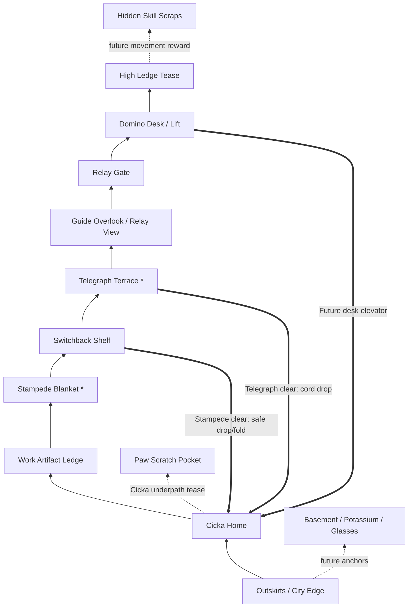

# Sketchbook Ridge Proper Map Plan

> Follow-up to [`topology-spike.md`](./topology-spike.md).
> Issue #54 proved the current Ridge can change visually, but the route is still
> a short prop line. This document defines the first real Ridge map before the
> next implementation pass.

## Decision

Use **Sketchbook Neighborhood Spine With Folded Shortcuts**.

The map should feel like a lived-in paper neighborhood made from desks, pins,
scraps, small resident spaces, bridges, lifts, and soft drop shafts. The player
moves toward the Relay Spire by helping tiny residents and seeing routes
change. The current proof-of-concept uses Cicka Home as a memory place, but the
newer linear story route should distribute that function into local **Cicka
Resting Spots** inside the required Ridge Areas.

Core promise:

```text
First walk: "Relay is ahead, and this sketchbook neighborhood is waking up."
Blocked route: "Cicka noticed something; a tiny resident here needs help."
After clear: "The route changed, and this place remembers what I did."
At Relay: "I can reach the Spire, but the sketchbook is not ready to send yet."
Later: "Old scraps now mean something about Danilo."
```

## Map Design Rules

- **No hallway row.** The player should rarely move right for more than one
  screen without a climb, drop, lift, fork, shortcut tell, or artifact clue.
- **Readable neighborhood flow is core.** Main route alternates calm horizontal
  movement with object-like traversal: chunky paper stairs, ladders or cords,
  bridges, elevators, safe drops, and wide crossings.
- **No main-path slopes in v0.** Slopes and visual ramps fight the readable grid;
  prefer stairs, shelves, cords, lifts, bridges, and soft drops unless a future
  sliding/descent mechanic deliberately earns slope behavior.
- **Lucky Luna influence is local.** Use descent pockets where the player falls
  through readable shafts and steers horizontally. Do not replace the whole game
  with a hazard-descent gauntlet.
- **Cicka is present, not only returned to.** Each required Ridge Area
  should include a small local **Cicka Resting Spot**, while authored Cicka
  field appearances can guide attention at barricades, wells, bridges, and
  other route beats through posture and staging.
- **One primary destination:** Relay Gate is the visual long-term goal. It
  appears early, disappears behind local terrain, then reappears from a higher
  angle.
- **Living Proof Gate:** Relay Spire can be physically reached before it can
  send. It should require enough visible world changes, mini-game proofs, and
  Cicka familiarity rather than a boss, precision climb, or arbitrary checklist.
  The path to the Spire should naturally provide enough resident help and cat
  familiarity for the first ending; extra residents can deepen optional return
  play.
- **Resident count is a tuning variable.** Start the prose plan with 2-3
  required main-path Ridge Areas / Resident Beats and a small optional cast. Add
  more only if the Level Designer and Story/Tone pass agree the Ridge needs more
  inhabited texture without turning into errands.
- **Required resident beats carry Cicka familiarity.** Every required Resident
  Help Beat should include authored Cicka field presence, but her role can vary:
  first as attention cue, later as observer of a changed object, and eventually
  as quiet trust marker.
- **Ridge Area is a design unit, not a Phaser Scene.** One required
  Ridge Area can include a Resident Beat, multiple residents, a small conflict,
  interiors, optional interactions, and alternate solutions while still
  remaining part of the Exploration Map.
- **Mini-games attach; they do not hold up the spine.** The first ending path
  should work through conversations, collection, authored traversal, Ridge
  Areas, Resident Beats, and visible world changes. Mini-Game Entrances can add
  optional alternate path unlocks, proofs, shortcuts, rewards, or pure side fun.
- **Not every resident is progression.** Optional residents, NPCs, props, and
  tiny hangout spaces may offer mini-games, alternate flavor, jokes, or vibes
  without solving a barricade.
- **Backtracking must transform.** A Resident Help Beat or cleared mini-game
  changes a Cicka Resting Spot, a local route blocker, a shortcut, or how old
  artifacts read.
- **Mobile-safe main path.** Main route uses chunky stairs, ladders or cords,
  bridges, wide shelves, elevators, soft drops, and forgiving crossings.
  Optional secrets can use trickier movement later.
- **Artifacts teach Danilo spatially.** Major work/project artifacts are on
  main or near-main routes. Small skill scraps hide in side pockets.
- **No minimap dependency.** The player should remember route as landmarks:
  Outskirts, Cicka Home, Stampede Blanket, Telegraph Terrace, Domino Desk,
  Relay Gate.

## Weighted Options

| Option | Score | Shape | Pros | Risks |
| --- | ---: | --- | --- | --- |
| Sketchbook Neighborhood Spine With Folded Shortcuts | 98 | Mostly forward inhabited route with local resident problems, route changes, and folded shortcuts | Best mobile/portfolio fit; keeps Cicka present; makes topology feel lived-in | Must avoid generic fetch quests or explicit objective text |
| Vertical Folded Ridge With Cicka Switchback | 88 | Stacked shelves, safe drops, lifts, and return folds around Cicka | Good cure for hallway feel; route mastery still matters | Can read as platformer-first and too Cicka-home-centric |
| Folded Ridge With Cicka Switchback | 84 | Main trail climbs away, shortcuts fold back to Cicka | Strong "aha"; mobile-safe; fits paper theme | Can still feel like rightward trail if too flat |
| Lucky Luna Descent Ridge | 82 | Progress mostly through vertical drop shafts and horizontal steering | Mobile-native, fresh movement toy | Big control/level-design shift; can fight current side-view runtime |
| Three-Layer Mini Mountain | 80 | Lower Outskirts, middle trail, upper Relay route | Best long-term map fantasy; many re-read paths | Can overgrow before core loop works |
| Page Rooms Network | 72 | Linked sketchbook spreads instead of natural ridge | Very thematic; easy to make each area distinct | Risks feeling like menu rooms |
| Wide Main Trail Plus Branches | 48 | Longer version of current line with side pockets | Easy implementation | Still hallway syndrome |

Chosen plan uses a mostly forward neighborhood spine as the main structure, then
adds vertical folds, lifts, drops, and optional descent pockets where they make
the place feel authored. It treats jump as non-core for the v0 main route and
uses route changes and authored traversal interactions before adding any new
player ability.

## Movement Model

Baseline Ridge v0 controls should stay side-view and mobile-native:

- walk
- interact
- explicit climb / descend / enter / inspect prompts where authored traversal
  needs confirmation
- optional sprint only if it stays comfortable on touch
- no required jump button on the main Exploration Map route

Traversal ingredients:

| Ingredient | First use | Purpose |
| --- | --- | --- |
| Wide shelves / bridge crossings | Work Artifact -> Stampede | Adds traversal texture without precision stress |
| Chunky paper stairs | Outskirts -> Cicka Home | Keeps entry calm and readable without slope physics |
| Ladders / cords | Cicka Home -> Work Artifact, Telegraph | Adds vertical movement as readable object traversal |
| Soft drop shafts | Stampede return, later Telegraph return | Lucky Luna-inspired vertical fun; no fall damage |
| Elevators / lifts | Domino Desk, later Outskirts lift | Route compression and spectacle |
| Switchback shelves | Cicka -> Guide | Lets player see old places from above |
| Underpath crawl/low route | Future Cicka secret | Personality and secret language |
| Future mobility items | Later optional pockets | May add jump-like toys only after the no-jump route grammar works |

Main route should be **mostly forward with readable bends, lifts, drops, and
resident-caused route changes**, not abstract platforming.

## Topology Visual

The old standalone inventory canvas was removed after this plan became the
current map target.
draws the same plan as an in-game map-screen style canvas with first-walk,
shortcut, and future-route layers.

```text
Legend:
  --> first-walk route
  ==> unlocked shortcut
  ~~> future / teased route
  [*] mini-game
  {A} artifact zone

                                  UPPER PAPER RIDGE

                         [High Ledge / Glide Tease]
                                   |
                                   v
              [Domino Desk / Lift] ==> elevator/drop ==> [Cicka Home]
                       ^
                       |
              [Relay Gate / Proof Slots]
                       ^
                       |
              [Guide Overlook / Relay View]
                       ^
                       |
        [Telegraph Terrace*] ==> cord drop ==> [Cicka Home]
                       ^
                       |
              [Switchback Shelf]
               ^              |
               |              +== Stampede clear: safe drop/fold ==> [Cicka Home]
               |
        [Stampede Blanket*]
               ^
               |
        [Work Artifact Ledge]
               ^
               |
        [Cicka Home / Desk Nest] ~~> [Cicka Underpath Tease]
               ^
               |
        [Outskirts / City Edge]
               |
        ~~> [Basement Hatch / Potassium / Glasses later]
```

Same map as a route graph:



## Screen Beats

Target first version: **10-12 screens**, not 3-5. One screen means roughly one
camera width of playable space.

| Beat | Purpose | Contents |
| --- | --- | --- |
| 1. Outskirts / City Edge | Entry and future Overworld merge | city edge, Basement hatch space, Potassium hint space, distant Relay silhouette above |
| 2. Cicka Home | Emotional anchor | desk-nest, pinboard, empty memento space, Cicka interaction |
| 3. Work Artifact Ledge | Learn Danilo through object | short climb; easy major artifact slot: Saturn/Vega or Hummingbird placeholder |
| 4. Stampede Blanket | First opt-in action | wide bridge/shelf approach; visible future drop/fold back to Cicka |
| 5. Blueprint Bridge | First required art/drawing soft gate / Resident Help Beat | closed or unsafe crossing; Cicka field presence draws attention to a blank plan; finished bridge sketch becomes the route |
| 6. Switchback Shelf | First spatial memory test | trail bends upward/back over Cicka; Cicka Home visible below |
| 7. Telegraph Terrace | Future mini-game teaser | vertical climb/elevator-looking cord; later cord drop to Cicka |
| 8. Guide Overlook | Reorientation | Relay Spire visible again from above; Guide points without exposition dump |
| 9. Lucky Luna Drop Pocket | Movement texture | optional safe descent shaft to a scrap, then easy return |
| 10. Relay Gate | Destination promise | locked gate, proof slots, view back across route |
| 11. Domino Desk / Lift | Route-compression promise | desk/elevator silhouette; future lift returns to Cicka |
| 12. High Ledge Tease | Future movement promise | visible unreachable scrap, no required jump verb |
| 13. Optional Underpath Tease | Cicka secret language | paw marks below Cicka/Stampede, not usable yet |

## First-Walk Route

The first walk should take **2-3 minutes** at normal speed, with no precision
challenge. Sprinting can shorten it, but should not be required.

Flow:

```text
Outskirts -> climb to Cicka Home -> climb/bridge to Work Artifact Ledge
  -> Stampede -> taped bridge/help beat -> switchback above Cicka -> Telegraph Terrace
  -> Guide Overlook -> Relay Gate -> Domino Lift Tease
```

The player should see old route space again from the Switchback Shelf before
the first shortcut opens. This creates the mental model:

> This neighborhood can fold, remember, and change after I help it.

## Shortcut Plan

| Unlock | Route change | Why it matters |
| --- | --- | --- |
| Blueprint Bridge helped | Bridge sketch becomes the main-route crossing | Teaches "help resident -> route changes" with a tiny local art beat |
| Stampede clear | Safe drop/fold from Switchback back to Cicka Home | First "aha"; Cicka is reachable after first mini-game |
| Telegraph clear | Cord/drop shaft from Telegraph Terrace to Cicka Home | Lucky Luna-style descent; makes terrace feel above home |
| Domino future | Desk lift/elevator returns from Domino to Cicka Home | Vertical route compression and puzzle identity |
| Cicka translator future | Cicka reveals underpath scratches | Secrets become relationship-driven, not map-marker-driven |

Shortcut rule:

> Main trail teaches geography once. Shortcuts respect that geography after.

## Artifact Placement

Major artifacts are visible and easy; minor scraps are optional.

| Artifact type | Placement | Example |
| --- | --- | --- |
| Major job artifact | Main route, before/after Stampede | Saturn office sticker, Hummingbird feather |
| Project artifact | Small side shelf near main route | broken UI tile, deploy stamp, puzzle part |
| Skill/tool scrap | Optional pocket or high ledge | keycap, tiny CLI flag, syntax scrap |
| Laptop key | Later gated route near Basement/Outskirts | not in first map rebuild |
| Glasses re-read clue | Existing Basement/Overworld anchor | used later to reinterpret artifacts |

## Rhythm

Use alternating pressure:

```text
safe entry -> personal home -> curiosity object -> mini-game energy
  -> quiet switchback -> orientation view -> teaser -> narrow fold
  -> puzzle promise -> awe/destination
```

Avoid:

- continuous empty walking
- continuous combat/interaction prompts
- identical shelves
- symmetric left/right choices
- putting every Danilo fact beside Cicka

## Environment Fill Plan

Empty space should become **micro-landmarks**, not decoration. Each gap between
major locations needs one clear job:

- teach direction
- preview a shortcut
- hide a small scrap
- create calm after a busy beat
- make Danilo's sketchbook feel inhabited

Filler budget:

| Gap | Fill | Purpose |
| --- | --- | --- |
| Outskirts -> Cicka Home | torn city edge, paper stairs, Basement hatch silhouette, Potassium warning tape | transition old Overworld into Ridge without replacing it yet |
| Cicka Home -> Work Artifact Ledge | desk legs, pinned notes, Saturn/Hummingbird placeholder object, Cicka paw mark | personal object discovery, not resume modal |
| Work Artifact -> Stampede | wide shelf or bridge, loose pages, swarm flecks getting denser, picnic crumbs | anticipation before mini-game |
| Stampede -> Taped Bridge | closed/taped bridge or missing plank, tiny resident silhouette, Cicka staring at the unsafe edge | first Resident Help Beat and visible before/after route proof |
| Stampede -> Switchback Shelf | folded-paper bridge, safe drop preview, Cicka Home visible below | first mental-map "aha" setup |
| Switchback -> Telegraph Terrace | hanging cord, timing tick marks, small rest shelf | vertical climb with future mechanic signal |
| Telegraph -> Guide Overlook | windy paper bridge, Relay silhouette reappears | orientation after climb |
| Guide -> Relay Gate | quieter open shelf, proof-slot shapes, signal lines | destination pressure and awe |
| Relay -> Domino Desk | desk clutter, coffee rings, elevator rails | route-compression promise |
| Optional Drop Pocket | falling paper scraps, safe shaft, hidden keycap/syntax scrap | Lucky Luna texture without making it required |

Environment rules:

- Put at least one **recognizable prop silhouette** per screen.
- Put at most one **interaction prompt** per screen unless it is Cicka Home.
- Use foreground/background layers to show depth, but keep playable platforms
  darker and simpler than scenery.
- Repeat route motifs: paw marks mean Cicka noticed something; tape means
  patched route; signal lines mean Relay direction; coffee rings mean desk
  territory.
- Never fill gaps with generic rocks when a sketchbook object can do the same
  navigation job.

## NPC Plan

Yes, the route should have NPCs, but sparse. NPCs are **landmark spice**, not
dialogue hubs.

V1 cast for the vertical map:

| NPC | Location | Map function | Interaction size |
| --- | --- | --- | --- |
| Cicka | Cicka Home, later paw marks / underpath | emotional anchor, secret language | one-line reactions, no menu |
| Ridge Guide | Guide Overlook | reorientation, "Relay is above/near" confirmation | one short bark |
| TODO: AI | Telegraph Terrace | future training/sparring identity | inert silhouette first |
| Potassium Compliance Officer | Outskirts/Potassium hint later | connects existing Potassium secret to Ridge | sign/NPC cameo |
| Printer Oracle | later manual-page pocket | paper/manual clue giver | rare, dramatic hint |

NPC placement rules:

- No NPC should exist only to explain controls.
- No dialogue trees in first map rebuild.
- If an NPC gives info, the environment must already imply that info.
- Cicka remains most important. Other NPCs should not compete with her as the
  emotional guide or turn her into a quest board.
- Static silhouettes are enough for first blockout if their function is clear.

## Fun-First Dream Map

This section ignores implementation details and describes the map we want to
feel toward.

Working title: **The Folded Desk Ridge**.

The world is a vertical sketchbook mountain built on top of an old desk. The
lower layer still remembers the old portfolio city. The middle layer is where
Danilo's work, projects, and mini-games spill out as physical objects. The top
layer is the Relay Gate, where the whole sketchbook tries to send itself.

Player fantasy:

> I am climbing through Danilo's half-restored sketchbook. I keep finding
> objects that feel like jokes at first, then Cicka and the route make them
> personal.

### Dream Map Sketch

```text
                                      ┌───────────────────────────┐
                                      │  MOON-PAPER HIGH LEDGE    │
                                      │  hidden syntax scraps     │
                                      │  unreachable feather      │
                                      └─────────────┬─────────────┘
                                                    │
                                                    │ future glide / lift
                                                    v
                         ┌────────────────────────────────────────────┐
                         │  DOMINO DESK                              │
                         │  coffee rings, rails, deterministic toys  │
                         │  Printer Oracle later                     │
                         └───────┬───────────────────────┬──────────┘
                                 │                       │
                                 │ elevator promise      │ locked lift drops
                                 v                       v
                  ┌───────────────────────────┐     ┌─────────────────────┐
                  │  RELAY GATE               │     │  CICKA HOME          │
                  │  proof slots, signal ink  │<====│  desk nest, mementos │
                  │  view back over map       │     │  cat, pinboard       │
                  └─────────────┬─────────────┘     └──────────┬──────────┘
                                │                              ^
                                │ climb                        │ all roads
                                v                              │ fold home
                  ┌───────────────────────────┐                │
                  │  GUIDE OVERLOOK           │                │
                  │  Ridge Guide, far Relay   │                │
                  │  wind, paper bridge       │                │
                  └─────────────┬─────────────┘                │
                                │                              │
                                │ cord climb                   │
                                v                              │
                  ┌───────────────────────────┐                │
                  │  TELEGRAPH TERRACE        │================┘
                  │  TODO: AI, bag, tick marks │  clear -> cord drop
                  └─────────────┬─────────────┘
                                │
                                │ switchback left over Cicka
                                v
        ┌────────────────────────────────────────────────────────────┐
        │  SWITCHBACK SHELF                                         │
        │  Cicka Home visible below, paw scratches, paper fold tell │
        └─────────────┬──────────────────────────────┬───────────────┘
                      │                              │
                      │ first clear                  │ optional descent
                      v                              v
          ┌─────────────────────┐       ┌────────────────────────────┐
          │  STAMPEDE BLANKET   │       │  LUCKY LUNA DROP POCKET    │
          │  picnic, ink swarm  │       │  fall shaft, steer, scrap  │
          └──────────┬──────────┘       └──────────────┬─────────────┘
                     │                                 │
                     │ wide bridge / loose pages       │ returns near
                     v                                 │ Stampede
          ┌─────────────────────┐                      │
          │  WORK ARTIFACT LEDGE│<─────────────────────┘
          │  Saturn / feather   │
          │  project relics     │
          └──────────┬──────────┘
                     │
                     │ paper stairs, desk legs
                     v
          ┌─────────────────────┐
          │  CICKA HOME          │
          │  first safe place    │
          └──────────┬──────────┘
                     │
                     │ old city edge turning into paper
                     v
          ┌────────────────────────────────────────────┐
          │  OUTSKIRTS                                │
          │  Basement hatch, Potassium tape, glasses  │
          │  boring portfolio buildings breaking down │
          └────────────────────────────────────────────┘
```

### What Fills The Map

#### Outskirts

The old Overworld is not deleted. It is decomposing into the Ridge.

Visuals:

- building facades are half-erased, like someone rubbed out a portfolio menu
- Basement hatch sits under a crooked `TODO?` sign
- Potassium warning tape crosses a banana peel arrow
- a small city curb becomes paper stairs
- one boring modal building has cracked open, revealing an artifact instead of
  a panel

Player feeling:

> This used to be a portfolio menu. Something stranger is replacing it.

#### Cicka Home

This is not a hub. It is a place the player wants to check on.

Visuals:

- desk nest, cardboard box, warm laptop vent, pinboard
- empty memento spaces visible from start
- Cicka sits low, with tail pointing at suspicious things
- under the desk: paw scratches hint at a future underpath
- after each clear, one physical thing changes here

Fill:

- Stampede clear: settled ink scrap pinned sideways
- Potassium clear: banana-law receipt tucked behind tape
- Saturn artifact: ringed sticker on pinboard
- Hummingbird artifact: tiny feather taped near Cicka

Player feeling:

> I came back and the room remembered what I did.

#### Work Artifact Ledge

This is first Danilo-learning space.

Visuals:

- ringed Saturn office sticker on a leaning door plate
- Hummingbird feather caught in a binder clip
- broken UI tile, old deploy stamp, loose keycap
- small side shelf with hidden syntax scrap

NPC:

- no NPC here; let objects speak first

Player feeling:

> This is not a resume. These are pieces of a person.

#### Stampede Blanket

First energetic beat.

Visuals:

- picnic blanket stretched across loose paper pages
- ink flecks become denser as player approaches
- crumbs, little route arrows, one overdramatic safety sign
- paper fold shortcut is visible but asleep

After clear:

- fold becomes a real drop/bridge back toward Cicka
- swarm dots become calmer doodles
- Cicka Home gets memento

Player feeling:

> I protected one calm patch, and now the Ridge trusts me with a shortcut.

#### Switchback Shelf

First true map-design moment.

Visuals:

- player is above Cicka Home and can see it below
- paper path bends back left instead of continuing right
- paw scratches point toward a future low route
- a safe drop is visible but not fully open until Stampede clear

Player feeling:

> Oh. This map folds over itself.

#### Telegraph Terrace

Future timing/combat signal, but first version can be a strong landmark.

Visuals:

- hanging cord, heavy bag, three timing tick marks
- TODO: AI stands nearby, unfinished legs taped on
- terrace feels windy and exposed
- cord drop back to Cicka is visible as future shortcut

NPC:

- TODO: AI does not explain. It poses like a training partner waiting for patch
  notes.

Player feeling:

> Something will happen here later. I already know where it is.

#### Guide Overlook

Reorientation beat.

Visuals:

- the Ridge Guide leans on a folded map
- Relay Gate is visible from a new angle
- wind lines and signal strokes point upward
- small bench-like paper shelf gives a pause after climb

NPC:

- Ridge Guide gives one line max. Example: "You are above the desk now."

Player feeling:

> I am not lost. I understand the mountain better than before.

#### Lucky Luna Drop Pocket

Optional movement candy.

Visuals:

- vertical shaft of falling scraps
- no enemies required at first
- player falls, steers left/right, collects one hidden keycap/syntax scrap
- bottom path loops back near Work Artifact or Stampede

Player feeling:

> Falling can be fun here. This is not only climbing.

#### Relay Gate

Destination promise.

Visuals:

- tall paper gate with proof slots
- signal lines climb toward the top
- route behind player is visible as layered shelves
- one slot reacts to Stampede proof, but gate remains unsolved

Player feeling:

> I know where the ending lives, and I know why I am not ready yet.

#### Domino Desk

Route-compression promise.

Visuals:

- giant desk edge, domino tiles, rails, coffee rings
- small elevator cage behind clutter
- Printer Oracle paper jam silhouette later
- deterministic arrows and path lines

Player feeling:

> This place will make the map fold even harder later.

### Secret Families

Use a few recurring secret languages:

| Secret tell | Meaning |
| --- | --- |
| Cicka paw marks | Cicka noticed a hidden route or object |
| Coffee rings | desk/Domino territory; puzzle or lift nearby |
| Yellowed tape | patched shortcut or future route |
| Signal lines | Relay direction or proof progress |
| Loose keycaps | skill/tool scraps, optional |
| Feather / ringed sticker | major work artifact nearby |

### Pacing Walkthrough

First 10 minutes should feel like:

```text
1. Spawn in old city edge.
2. Notice Relay above before understanding it.
3. Climb to Cicka Home and meet safe place.
4. Find one major work artifact on ledge.
5. Reach Stampede and play/preview first mini-game.
6. Clear Stampede.
7. World changes: Cicka Home memento + paper fold opens.
8. Climb switchback and see Cicka below.
9. Use shortcut/drop back home.
10. Understand: this map is a folded place, not a menu.
```

That is the first real "grok."

## Implementation Slice

Do not start the next code issue until the core route is written as prose:
story beats, level beats, tiny residents, Cicka field presences, route blockers,
and visible before/after world changes. Design from the middle/end backward so
the opening is not overfit to the current prototype.
Write the canonical ending sequence outline first, then work backward into the
final required Dance Festival Area / Opening Dance Shuttle Beat, the middle
Concert Area / Concert Crossing Beat, and only then the first Bridge Area /
Blueprint Bridge tutorial beat.
The ending outline should include the Guitar Farewell as an established comfort
interaction, not a one-off ending prop: the player finds or receives the guitar
earlier, carries it through later route beats, and plays for Cicka near Relay
before the threshold farewell. Local Cicka Resting Spots can stay mostly visual
in v0 with no dedicated prompt; repeatable sitting, petting, lap-resting, or
guitar interactions can wait for a later affection pass.
Current middle route area: **Concert Area**, containing **Concert Crossing
Beat**, where a blocked concert/traffic crossing opens after the player helps
with a small Guitar-Hero-like performance problem and earns the guitar. Keep
the final Guitar Farewell separate from arcade difficulty; the concert teaches
the item, while the ending uses it as comfort.
Give Concert Crossing a non-arcade fallback so the main route can ship through
dialogue, collection, practice, or auto-play before the rhythm mini-game is fully
polished.

Current final route area: **Dance Festival Area**, containing **Opening Dance
Shuttle Beat**. Two fictional residents like each other but are too nervous to
step onto the dance floor or talk directly. The night dance festival is real,
but the player participates in afternoon setup and leaves before the festival
fully begins. The dance belongs in a town square, community hall, or festival
street at the foot of the Relay hill. The physical blocker is practical:
festival barriers, lantern lines, chair stacks, stage/speaker cables, and a
locked service-road gate block the hill route until setup passes inspection.
The resident being helped should have a daily purpose tied to that route.
Current locked direction: the nervous dancer is the hill-shuttle driver, and
the romantic partner is the shy **Last-Stop Operations Helper**, whose visible
plaza-table work connects shuttle questions, setup checks, volunteer handoffs,
service-road clearance, and the night dance. Keep these as role-first character
labels for now; proper names can wait until a later character pass. Accepted
arrival premise: **Opening Dance Setup + Last Daylight Shuttle**. Conversation
choices can create different tones, orders, or recoverable awkward paths, but
should not permanently block the first ending. Introduce the beat through a
practical wayfinding loop: the player asks how to reach Relay, notices the
blocked service road and shuttle sign, then learns the emotional layer through
delayed setup and the last daylight shuttle window before the road closes for
the night festival.
Reveal the relationship through a triangulated discovery flow: the driver and
Last-Stop Operations Helper give truthful but incomplete practical answers,
then nearby locals help the player understand that they are avoiding each other.
Do not let the player solve the beat by directly confronting them with their
feelings. The Last-Stop Operations Helper's readiness favor is **Operations
Handoff Check**: the player helps prove the plaza setup is safe enough for the
**Dance Teacher** to keep watch once the night dance starts. The point is
not replacing her planning; it is showing that she did enough and can enjoy the
event. The driver's readiness favor is **One-Step Practice**: the player helps
him privately learn one tiny dance step before the setup handoff, last daylight
ride, and later night-dance promise can happen. After both favors, the connector
is **Folded Song Request**: a tiny paper invitation where the driver requests a
simple, cute, guitar-friendly song and asks her for one dance later without a
public confession. Do not lock the beat to bachata or any other specific dance
genre; the exact requested song can remain unshown and unheard by the player.
The physical route solve is
**Setup Clearance Walkthrough**: final visible setup details clear the service
lane enough for the steward to open the gate and the driver to offer the last
daylight ride. Present it as a **Prompt-Driven Playable Montage**: a few
symbolic one-action snaps plus a visible sky/plaza time shift, not full manual
chores or a pure cutscene. The default snaps are: secure the lantern line, clear
or tape the service-lane obstruction, and flip the shuttle sign to "Last
daylight ride." These can collapse further if the beat needs to move faster.
Cicka's role is quiet threshold observer near the
operations table, shuttle step, or service gate. This is the Opening Dance
**Dance Festival Resting Spot**; she can loaf with the
**Unnamed Counterpart Cat** as implied continuity foreshadowing, but the scene
should use only silhouette/color specificity such as a pale or light-ink
contrast to Cicka. Do not name him, give him dialogue, confirm parentage, or
spend Micka before the post-ending return.
Avoid magical or abstract "dance makes route open" causality. Keep the main
solution conversational/collection-based; a dance rhythm mini-game can be
optional later. The couple can be emotionally inspired by Danilo and Milena's
story, but should not be literal stand-ins.

Guitar Farewell can include a brief **Living Proof Montage**: Blueprint Bridge
being used, Concert Crossing continuing, Opening Dance beginning at night as an
emotional echo under the player's guitar, and earlier Cicka Resting Spots
carrying accumulated marks. Keep it wordless or nearly wordless so the focus
stays on Cicka.

Relay time should progress from sunset for **Sit and Play Prompt** to **Relay
Blue Hour** for **Send the Sketchbook Prompt**. The montage can show the night
festival beginning elsewhere, but Relay should not become full night before the
farewell.

The shuttle ride from Last-Stop Plaza to Relay should be a **Short Threshold
Transition**, not a controllable driving segment: the driver can say "All aboard
the last ride," the vehicle starts over a brief blackout, the player respawns at
Relay Spire under sunset, and control resumes at Cicka's overlook spot.

The final Relay Spire interaction should be a **Sit and Play Prompt** near
Cicka. It starts the Guitar Farewell without rhythm UI, fail state, or final
skill check.

After the Guitar Farewell, control returns at the Relay sign/spire for a **Send
the Sketchbook Prompt**. This starts the Cicka Threshold Farewell while keeping
the guitar as comfort rather than the send button.

Cicka's departure should be physical and mostly silent: walk together, pause,
look back, final mark, then page-fold/light departure. The initial version
should use no translated farewell line; a tiny raw meow/chirp sound can remain
optional if it supports the staging.

Immediate post-ending play should use the **Open Ridge Return State**:
replayable, quiet, and minimally absence-marked. The canonical final mark
persists at the Relay threshold, one quieter echo appears at the Concert
Resting Spot, and Micka remains delayed until the later post-ending trigger
rather than appearing immediately. The echo should be an empty usual spot with
one small paw/page mark, not the guitar left behind.

Current first route area: **Bridge Area**, containing **Blueprint Bridge**.
Help a resident finish a tiny bridge drawing/blueprint, then the finished
sketch becomes the crossing.
Direct bridge drawing or physics bridge-building can be a future optional toy,
not the required v0 route.

Next code issue after that prose plan should be:

**Rebuild Ridge as Sketchbook Neighborhood blockout**

Preserve the authoring and QA spine: Ridge Blockout Source, source contract,
compiler/generated facts, map-loading path, and previewer/debugger layers.
Treat the current jump-centered traversal runtime and folded-desk arrangement as
replaceable proof-of-concept scaffolding.

Build:

- introduce a mostly forward neighborhood route with readable bends and folds
- keep main route mobile-safe with wide shelves, chunky stairs, cords, bridges,
  lifts, and soft drops
- place Bridge Resting Spot, Concert Resting Spot, and Dance Festival Resting
  Spot as progress-memory spaces, not hubs or v0 prompt nodes
- give each resting spot two tiny visual states: pre-resolution attention cue
  and immediate post-resolution calm/memory read; the Guitar Farewell montage
  can revisit those changed states instead of introducing them
- keep changed resting-spot states optional to notice or revisit; they must not
  become checklist gates or route requirements
- add at least one Cicka field-presence hint at a local route blocker
- add at least one Resident Help Beat that visibly changes a route
- make Stampede route at least one vertical beat away
- add switchback shelf where Cicka Home is visible below
- add one optional Lucky Luna-style safe drop pocket
- move Guide/Telegraph/Domino/Relay into real route beats
- keep current Stampede Trail Card working
- keep old Overworld default unchanged
- keep artifacts as placeholders only

Acceptance:

- first walk from Outskirts to Relay Gate takes 2-3 minutes at normal movement
- seeded Stampede or resident-help route change reduces return travel within
  20-30 seconds
- player can describe map from landmarks without minimap
- seeded Stampede shortcut visibly reduces travel, not just decorates
- desktop and mobile smoke pass

## Image Generation

Do not generate final art yet.

Useful image-gen later:

- one loose concept image for "lived-in sketchbook neighborhood"
- one landmark sheet: Cicka Home, Stampede Blanket, Telegraph Terrace, Domino
  Desk, Relay Gate
- one overhead-ish mood map after topology is accepted

For now, editable topology diagrams beat pretty images because the shape is
still changing.
