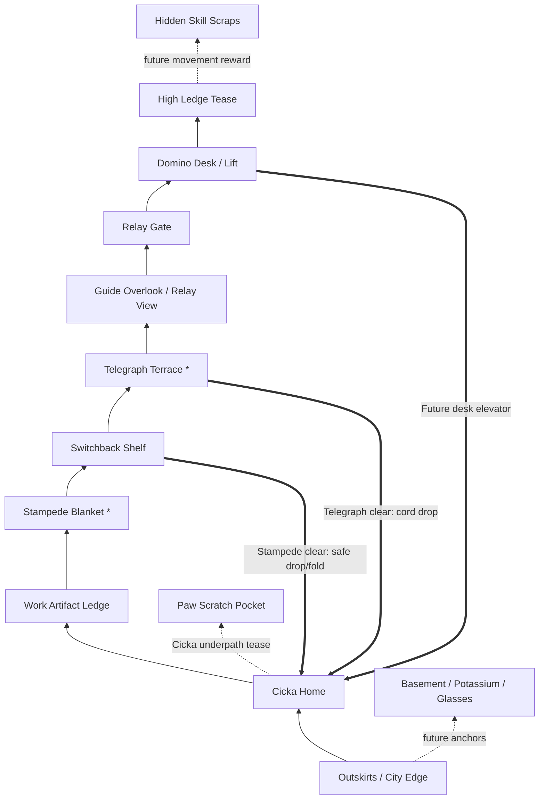

# Sketchbook Ridge Proper Map Plan

> Follow-up to [`topology-spike.md`](./topology-spike.md).
> Issue #54 proved the current Ridge can change visually, but the route is still
> a short prop line. This document defines the first real Ridge map before the
> next implementation pass.

## Decision

Use **Vertical Folded Ridge With Cicka Switchback**.

The map should feel like a small vertical paper mountain made from desks, pins,
scraps, elevators, and soft drop shafts. Cicka Home sits near the lower middle
as the emotional return anchor. The player climbs away from Cicka to learn the
Ridge, then earns shortcuts, drops, and lifts that fold routes back toward her.

Core promise:

```text
First walk: "Relay is above me, but I need to learn this paper mountain."
After clear: "Oh, this drop/lift folds back to Cicka."
Later: "Old scraps now mean something about Danilo."
```

## Map Design Rules

- **No hallway row.** The player should rarely move right for more than one
  screen without a climb, drop, lift, fork, shortcut tell, or artifact clue.
- **Verticality is core.** Main route alternates horizontal shelves with vertical
  movement: stairs, ramps, elevators, safe drops, and broad jumps.
- **Lucky Luna influence is local.** Use descent pockets where the player falls
  through readable shafts and steers horizontally. Do not replace the whole game
  with no-jump controls.
- **Cicka return max:** after any mini-game, Cicka Home must be reachable in
  20-30 seconds with unlocked shortcuts.
- **One primary destination:** Relay Gate is the visual long-term goal. It
  appears early, disappears behind local terrain, then reappears from a higher
  angle.
- **Backtracking must transform.** A cleared mini-game changes either Cicka
  Home, the path home, or how old artifacts read.
- **Mobile-safe main path.** Main route uses slopes, stairs, wide shelves,
  elevators, soft drops, and forgiving jumps. Optional secrets can use trickier
  movement later.
- **Artifacts teach Danilo spatially.** Major work/project artifacts are on
  main or near-main routes. Small skill scraps hide in side pockets.
- **No minimap dependency.** The player should remember route as landmarks:
  Outskirts, Cicka Home, Stampede Blanket, Telegraph Terrace, Domino Desk,
  Relay Gate.

## Weighted Options

| Option | Score | Shape | Pros | Risks |
| --- | ---: | --- | --- | --- |
| Vertical Folded Ridge With Cicka Switchback | 96 | Stacked shelves, safe drops, lifts, and return folds around Cicka | Best cure for hallway feel; Cicka stays central; route mastery still matters | Needs camera/world-height work |
| Folded Ridge With Cicka Switchback | 84 | Main trail climbs away, shortcuts fold back to Cicka | Strong "aha"; mobile-safe; fits paper theme | Can still feel like rightward trail if too flat |
| Lucky Luna Descent Ridge | 82 | Progress mostly through vertical drop shafts and horizontal steering | Mobile-native, fresh movement toy | Big control/level-design shift; can fight current side-view runtime |
| Three-Layer Mini Mountain | 80 | Lower Outskirts, middle trail, upper Relay route | Best long-term map fantasy; many re-read paths | Can overgrow before core loop works |
| Page Rooms Network | 72 | Linked sketchbook spreads instead of natural ridge | Very thematic; easy to make each area distinct | Risks feeling like menu rooms |
| Wide Main Trail Plus Branches | 48 | Longer version of current line with side pockets | Easy implementation | Still hallway syndrome |

Chosen plan uses vertical shelves as the main structure, then borrows Lucky
Luna's falling pleasure for local descent pockets. It keeps current
walk/sprint/jump controls and adds elevators/drop routes before adding any new
player ability.

## Movement Model

Baseline controls stay side-view:

- walk / sprint
- jump
- interact
- optional drop-through input later if platform tech supports it cleanly

Traversal ingredients:

| Ingredient | First use | Purpose |
| --- | --- | --- |
| Wide jumps | Work Artifact -> Stampede | Adds active traversal without precision stress |
| Paper stairs/ramps | Outskirts -> Cicka Home | Keeps entry calm and readable |
| Soft drop shafts | Stampede return, later Telegraph return | Lucky Luna-inspired vertical fun; no fall damage |
| Elevators / lifts | Domino Desk, later Outskirts lift | Route compression and spectacle |
| Switchback shelves | Cicka -> Guide | Lets player see old places from above |
| Underpath crawl/low route | Future Cicka secret | Personality and secret language |

Main route should be **up, across, down, up**, not just right.

## Topology Visual

The old standalone inventory canvas was removed after this plan became the
current map target.
draws the same plan as an in-game map-screen style canvas with first-walk,
shortcut, and future-route layers.

```text
Legend:
  --> first-walk route
  ==> unlocked shortcut
  ~~> future / teased route
  [*] mini-game
  {A} artifact zone

                                  UPPER PAPER RIDGE

                         [High Ledge / Glide Tease]
                                   |
                                   v
              [Domino Desk / Lift] ==> elevator/drop ==> [Cicka Home]
                       ^
                       |
              [Relay Gate / Proof Slots]
                       ^
                       |
              [Guide Overlook / Relay View]
                       ^
                       |
        [Telegraph Terrace*] ==> cord drop ==> [Cicka Home]
                       ^
                       |
              [Switchback Shelf]
               ^              |
               |              +== Stampede clear: safe drop/fold ==> [Cicka Home]
               |
        [Stampede Blanket*]
               ^
               |
        [Work Artifact Ledge]
               ^
               |
        [Cicka Home / Desk Nest] ~~> [Cicka Underpath Tease]
               ^
               |
        [Outskirts / City Edge]
               |
        ~~> [Basement Hatch / Potassium / Glasses later]
```

Same map as a route graph:



## Screen Beats

Target first version: **10-12 screens**, not 3-5. One screen means roughly one
camera width of playable space.

| Beat | Purpose | Contents |
| --- | --- | --- |
| 1. Outskirts / City Edge | Entry and future Overworld merge | city edge, Basement hatch space, Potassium hint space, distant Relay silhouette above |
| 2. Cicka Home | Emotional anchor | desk-nest, pinboard, empty memento space, Cicka interaction |
| 3. Work Artifact Ledge | Learn Danilo through object | short climb; easy major artifact slot: Saturn/Vega or Hummingbird placeholder |
| 4. Stampede Blanket | First opt-in action | broad jump/shelf approach; visible future drop/fold back to Cicka |
| 5. Switchback Shelf | First spatial memory test | trail bends upward/back over Cicka; Cicka Home visible below |
| 6. Telegraph Terrace | Future mini-game teaser | vertical climb/elevator-looking cord; later cord drop to Cicka |
| 7. Guide Overlook | Reorientation | Relay Spire visible again from above; Guide points without exposition dump |
| 8. Lucky Luna Drop Pocket | Movement texture | optional safe descent shaft to a scrap, then easy return |
| 9. Relay Gate | Destination promise | locked gate, proof slots, view back across route |
| 10. Domino Desk / Lift | Route-compression promise | desk/elevator silhouette; future lift returns to Cicka |
| 11. High Ledge Tease | Future movement promise | visible unreachable scrap, no required jump verb |
| 12. Optional Underpath Tease | Cicka secret language | paw marks below Cicka/Stampede, not usable yet |

## First-Walk Route

The first walk should take **2-3 minutes** at normal speed, with no precision
challenge. Sprinting can shorten it, but should not be required.

Flow:

```text
Outskirts -> climb to Cicka Home -> climb/jump to Work Artifact Ledge
  -> Stampede -> switchback above Cicka -> Telegraph Terrace
  -> Guide Overlook -> Relay Gate -> Domino Lift Tease
```

The player should see Cicka Home again from the Switchback Shelf before the
first shortcut opens. This creates the mental model:

> I climbed above Cicka, and this paper mountain can probably fold back down.

## Shortcut Plan

| Unlock | Route change | Why it matters |
| --- | --- | --- |
| Stampede clear | Safe drop/fold from Switchback back to Cicka Home | First "aha"; Cicka is reachable after first mini-game |
| Telegraph clear | Cord/drop shaft from Telegraph Terrace to Cicka Home | Lucky Luna-style descent; makes terrace feel above home |
| Domino future | Desk lift/elevator returns from Domino to Cicka Home | Vertical route compression and puzzle identity |
| Cicka translator future | Cicka reveals underpath scratches | Secrets become relationship-driven, not map-marker-driven |

Shortcut rule:

> Main trail teaches geography once. Shortcuts respect that geography after.

## Artifact Placement

Major artifacts are visible and easy; minor scraps are optional.

| Artifact type | Placement | Example |
| --- | --- | --- |
| Major job artifact | Main route, before/after Stampede | Saturn office sticker, Hummingbird feather |
| Project artifact | Small side shelf near main route | broken UI tile, deploy stamp, puzzle part |
| Skill/tool scrap | Optional pocket or high ledge | keycap, tiny CLI flag, syntax scrap |
| Laptop key | Later gated route near Basement/Outskirts | not in first map rebuild |
| Glasses re-read clue | Existing Basement/Overworld anchor | used later to reinterpret artifacts |

## Rhythm

Use alternating pressure:

```text
safe entry -> personal home -> curiosity object -> mini-game energy
  -> quiet switchback -> orientation view -> teaser -> narrow fold
  -> puzzle promise -> awe/destination
```

Avoid:

- continuous empty walking
- continuous combat/interaction prompts
- identical shelves
- symmetric left/right choices
- putting every Danilo fact beside Cicka

## Environment Fill Plan

Empty space should become **micro-landmarks**, not decoration. Each gap between
major locations needs one clear job:

- teach direction
- preview a shortcut
- hide a small scrap
- create calm after a busy beat
- make Danilo's sketchbook feel inhabited

Filler budget:

| Gap | Fill | Purpose |
| --- | --- | --- |
| Outskirts -> Cicka Home | torn city edge, paper stairs, Basement hatch silhouette, Potassium warning tape | transition old Overworld into Ridge without replacing it yet |
| Cicka Home -> Work Artifact Ledge | desk legs, pinned notes, Saturn/Hummingbird placeholder object, Cicka paw mark | personal object discovery, not resume modal |
| Work Artifact -> Stampede | wide jump, loose pages, swarm flecks getting denser, picnic crumbs | anticipation before mini-game |
| Stampede -> Switchback Shelf | folded-paper ramp, safe drop preview, Cicka Home visible below | first mental-map "aha" setup |
| Switchback -> Telegraph Terrace | hanging cord, timing tick marks, small rest shelf | vertical climb with future mechanic signal |
| Telegraph -> Guide Overlook | windy paper bridge, Relay silhouette reappears | orientation after climb |
| Guide -> Relay Gate | quieter open shelf, proof-slot shapes, signal lines | destination pressure and awe |
| Relay -> Domino Desk | desk clutter, coffee rings, elevator rails | route-compression promise |
| Optional Drop Pocket | falling paper scraps, safe shaft, hidden keycap/syntax scrap | Lucky Luna texture without making it required |

Environment rules:

- Put at least one **recognizable prop silhouette** per screen.
- Put at most one **interaction prompt** per screen unless it is Cicka Home.
- Use foreground/background layers to show depth, but keep playable platforms
  darker and simpler than scenery.
- Repeat route motifs: paw marks mean Cicka noticed something; tape means
  patched route; signal lines mean Relay direction; coffee rings mean desk
  territory.
- Never fill gaps with generic rocks when a sketchbook object can do the same
  navigation job.

## NPC Plan

Yes, the route should have NPCs, but sparse. NPCs are **landmark spice**, not
dialogue hubs.

V1 cast for the vertical map:

| NPC | Location | Map function | Interaction size |
| --- | --- | --- | --- |
| Cicka | Cicka Home, later paw marks / underpath | emotional anchor, secret language | one-line reactions, no menu |
| Ridge Guide | Guide Overlook | reorientation, "Relay is above/near" confirmation | one short bark |
| TODO: AI | Telegraph Terrace | future training/sparring identity | inert silhouette first |
| Potassium Compliance Officer | Outskirts/Potassium hint later | connects existing Potassium secret to Ridge | sign/NPC cameo |
| Printer Oracle | later manual-page pocket | paper/manual clue giver | rare, dramatic hint |

NPC placement rules:

- No NPC should exist only to explain controls.
- No dialogue trees in first map rebuild.
- If an NPC gives info, the environment must already imply that info.
- Cicka remains most important. Other NPCs should not compete with her as the
  return anchor.
- Static silhouettes are enough for first blockout if their function is clear.

## Fun-First Dream Map

This section ignores implementation details and describes the map we want to
feel toward.

Working title: **The Folded Desk Ridge**.

The world is a vertical sketchbook mountain built on top of an old desk. The
lower layer still remembers the old portfolio city. The middle layer is where
Danilo's work, projects, and mini-games spill out as physical objects. The top
layer is the Relay Gate, where the whole sketchbook tries to send itself.

Player fantasy:

> I am climbing through Danilo's half-restored sketchbook. I keep finding
> objects that feel like jokes at first, then Cicka and the route make them
> personal.

### Dream Map Sketch

```text
                                      ┌───────────────────────────┐
                                      │  MOON-PAPER HIGH LEDGE    │
                                      │  hidden syntax scraps     │
                                      │  unreachable feather      │
                                      └─────────────┬─────────────┘
                                                    │
                                                    │ future glide / lift
                                                    v
                         ┌────────────────────────────────────────────┐
                         │  DOMINO DESK                              │
                         │  coffee rings, rails, deterministic toys  │
                         │  Printer Oracle later                     │
                         └───────┬───────────────────────┬──────────┘
                                 │                       │
                                 │ elevator promise      │ locked lift drops
                                 v                       v
                  ┌───────────────────────────┐     ┌─────────────────────┐
                  │  RELAY GATE               │     │  CICKA HOME          │
                  │  proof slots, signal ink  │<====│  desk nest, mementos │
                  │  view back over map       │     │  cat, pinboard       │
                  └─────────────┬─────────────┘     └──────────┬──────────┘
                                │                              ^
                                │ climb                        │ all roads
                                v                              │ fold home
                  ┌───────────────────────────┐                │
                  │  GUIDE OVERLOOK           │                │
                  │  Ridge Guide, far Relay   │                │
                  │  wind, paper bridge       │                │
                  └─────────────┬─────────────┘                │
                                │                              │
                                │ cord climb                   │
                                v                              │
                  ┌───────────────────────────┐                │
                  │  TELEGRAPH TERRACE        │================┘
                  │  TODO: AI, bag, tick marks │  clear -> cord drop
                  └─────────────┬─────────────┘
                                │
                                │ switchback left over Cicka
                                v
        ┌────────────────────────────────────────────────────────────┐
        │  SWITCHBACK SHELF                                         │
        │  Cicka Home visible below, paw scratches, paper fold tell │
        └─────────────┬──────────────────────────────┬───────────────┘
                      │                              │
                      │ first clear                  │ optional descent
                      v                              v
          ┌─────────────────────┐       ┌────────────────────────────┐
          │  STAMPEDE BLANKET   │       │  LUCKY LUNA DROP POCKET    │
          │  picnic, ink swarm  │       │  fall shaft, steer, scrap  │
          └──────────┬──────────┘       └──────────────┬─────────────┘
                     │                                 │
                     │ broad jump / loose pages        │ returns near
                     v                                 │ Stampede
          ┌─────────────────────┐                      │
          │  WORK ARTIFACT LEDGE│<─────────────────────┘
          │  Saturn / feather   │
          │  project relics     │
          └──────────┬──────────┘
                     │
                     │ paper stairs, desk legs
                     v
          ┌─────────────────────┐
          │  CICKA HOME          │
          │  first safe place    │
          └──────────┬──────────┘
                     │
                     │ old city edge turning into paper
                     v
          ┌────────────────────────────────────────────┐
          │  OUTSKIRTS                                │
          │  Basement hatch, Potassium tape, glasses  │
          │  boring portfolio buildings breaking down │
          └────────────────────────────────────────────┘
```

### What Fills The Map

#### Outskirts

The old Overworld is not deleted. It is decomposing into the Ridge.

Visuals:

- building facades are half-erased, like someone rubbed out a portfolio menu
- Basement hatch sits under a crooked `TODO?` sign
- Potassium warning tape crosses a banana peel arrow
- a small city curb becomes paper stairs
- one boring modal building has cracked open, revealing an artifact instead of
  a panel

Player feeling:

> This used to be a portfolio menu. Something stranger is replacing it.

#### Cicka Home

This is not a hub. It is a place the player wants to check on.

Visuals:

- desk nest, cardboard box, warm laptop vent, pinboard
- empty memento spaces visible from start
- Cicka sits low, with tail pointing at suspicious things
- under the desk: paw scratches hint at a future underpath
- after each clear, one physical thing changes here

Fill:

- Stampede clear: settled ink scrap pinned sideways
- Potassium clear: banana-law receipt tucked behind tape
- Saturn artifact: ringed sticker on pinboard
- Hummingbird artifact: tiny feather taped near Cicka

Player feeling:

> I came back and the room remembered what I did.

#### Work Artifact Ledge

This is first Danilo-learning space.

Visuals:

- ringed Saturn office sticker on a leaning door plate
- Hummingbird feather caught in a binder clip
- broken UI tile, old deploy stamp, loose keycap
- small side shelf with hidden syntax scrap

NPC:

- no NPC here; let objects speak first

Player feeling:

> This is not a resume. These are pieces of a person.

#### Stampede Blanket

First energetic beat.

Visuals:

- picnic blanket stretched across loose paper pages
- ink flecks become denser as player approaches
- crumbs, little route arrows, one overdramatic safety sign
- paper fold shortcut is visible but asleep

After clear:

- fold becomes a real drop/bridge back toward Cicka
- swarm dots become calmer doodles
- Cicka Home gets memento

Player feeling:

> I protected one calm patch, and now the Ridge trusts me with a shortcut.

#### Switchback Shelf

First true map-design moment.

Visuals:

- player is above Cicka Home and can see it below
- paper path bends back left instead of continuing right
- paw scratches point toward a future low route
- a safe drop is visible but not fully open until Stampede clear

Player feeling:

> Oh. This map folds over itself.

#### Telegraph Terrace

Future timing/combat signal, but first version can be a strong landmark.

Visuals:

- hanging cord, heavy bag, three timing tick marks
- TODO: AI stands nearby, unfinished legs taped on
- terrace feels windy and exposed
- cord drop back to Cicka is visible as future shortcut

NPC:

- TODO: AI does not explain. It poses like a training partner waiting for patch
  notes.

Player feeling:

> Something will happen here later. I already know where it is.

#### Guide Overlook

Reorientation beat.

Visuals:

- the Ridge Guide leans on a folded map
- Relay Gate is visible from a new angle
- wind lines and signal strokes point upward
- small bench-like paper shelf gives a pause after climb

NPC:

- Ridge Guide gives one line max. Example: "You are above the desk now."

Player feeling:

> I am not lost. I understand the mountain better than before.

#### Lucky Luna Drop Pocket

Optional movement candy.

Visuals:

- vertical shaft of falling scraps
- no enemies required at first
- player falls, steers left/right, collects one hidden keycap/syntax scrap
- bottom path loops back near Work Artifact or Stampede

Player feeling:

> Falling can be fun here. This is not only climbing.

#### Relay Gate

Destination promise.

Visuals:

- tall paper gate with proof slots
- signal lines climb toward the top
- route behind player is visible as layered shelves
- one slot reacts to Stampede proof, but gate remains unsolved

Player feeling:

> I know where the ending lives, and I know why I am not ready yet.

#### Domino Desk

Route-compression promise.

Visuals:

- giant desk edge, domino tiles, rails, coffee rings
- small elevator cage behind clutter
- Printer Oracle paper jam silhouette later
- deterministic arrows and path lines

Player feeling:

> This place will make the map fold even harder later.

### Secret Families

Use a few recurring secret languages:

| Secret tell | Meaning |
| --- | --- |
| Cicka paw marks | Cicka noticed a hidden route or object |
| Coffee rings | desk/Domino territory; puzzle or lift nearby |
| Yellowed tape | patched shortcut or future route |
| Signal lines | Relay direction or proof progress |
| Loose keycaps | skill/tool scraps, optional |
| Feather / ringed sticker | major work artifact nearby |

### Pacing Walkthrough

First 10 minutes should feel like:

```text
1. Spawn in old city edge.
2. Notice Relay above before understanding it.
3. Climb to Cicka Home and meet safe place.
4. Find one major work artifact on ledge.
5. Reach Stampede and play/preview first mini-game.
6. Clear Stampede.
7. World changes: Cicka Home memento + paper fold opens.
8. Climb switchback and see Cicka below.
9. Use shortcut/drop back home.
10. Understand: this map is a folded place, not a menu.
```

That is the first real "grok."

## Implementation Slice

Next code issue should be:

**Rebuild Ridge as Folded Ridge topology blockout**

Build:

- expand Ridge world height and introduce stacked shelves
- keep main route mobile-safe with wide platforms/slopes/stairs/elevators
- place Cicka Home near lower-middle, not first prop in a row
- make Stampede route at least one vertical beat away
- add switchback shelf where Cicka Home is visible below
- add one optional Lucky Luna-style safe drop pocket
- move Guide/Telegraph/Domino/Relay into real route beats
- keep current Stampede Trail Card working
- keep old Overworld default unchanged
- keep artifacts as placeholders only

Acceptance:

- first walk from Outskirts to Relay Gate takes 2-3 minutes at normal movement
- Cicka Home is reachable within 20-30 seconds after seeded Stampede clear
- player can describe map from landmarks without minimap
- seeded Stampede shortcut visibly reduces travel, not just decorates
- desktop and mobile smoke pass

## Image Generation

Do not generate final art yet.

Useful image-gen later:

- one loose concept image for "paper mountain desk ridge"
- one landmark sheet: Cicka Home, Stampede Blanket, Telegraph Terrace, Domino
  Desk, Relay Gate
- one overhead-ish mood map after topology is accepted

For now, editable topology diagrams beat pretty images because the shape is
still changing.
