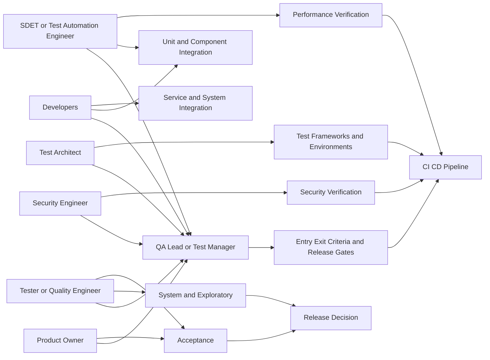
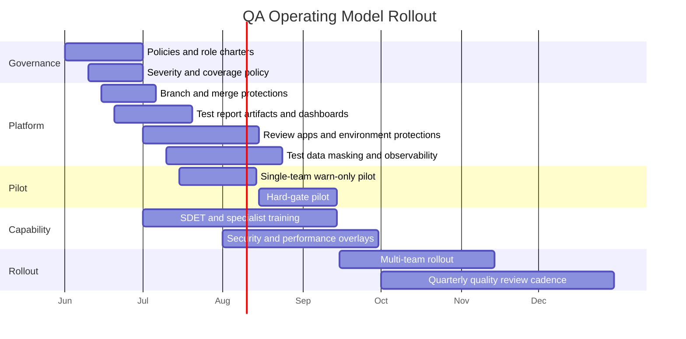

# Operating Model for Adding Skills, Rules, Team Members, and System Roles Across Software QA Testing Levels

## Executive Summary

A durable QA/testing organization should not treat the user’s seven requested areas as seven separate silos. The standards baseline is: **unit/component, component integration, system, system integration, and acceptance** are the formal testing levels; **exploratory, performance, and security** are cross-cutting test approaches or test types that should be applied where risk justifies them, rather than being isolated late-stage activities. ISTQB explicitly says most test types can be performed at every test level; it also places exploratory testing alongside user-oriented critique activities and non-functional testing in the testing quadrants. citeturn6view0turn6view4turn10view0

For an open-ended organization with unspecified size, stack, and budget, the most defensible target state is a **hybrid federated model**: shared quality ownership inside delivery teams, plus selective independence for system, acceptance, performance, and security governance. ISTQB’s “whole team” approach supports shared responsibility for quality, while the same syllabus also warns that some contexts require higher test independence; using multiple levels of independence is usually best. citeturn8view0turn7view0

The highest-priority additions are not headcount first; they are **governance and instrumentation first**. In practical order: define level-specific entry/exit criteria, establish risk-based coverage and defect rules, enforce branch and deployment gates in CI/CD, standardize test reporting artifacts, stand up representative environments and masked/synthetic test data, and add observability so failures can be diagnosed quickly. Those priorities align with ISTQB on entry/exit criteria, measurable coverage, traceability, risk-based testing, and metrics; with ISO/IEC/IEEE 29119 on test processes and documentation templates; with OWASP on integrating security into the SDLC and CI/CD; and with GitHub/GitLab documentation on protected branches, status checks, approval rules, environments, and review apps. citeturn5view1turn5view2turn11view3turn12view0turn13search2turn13search6turn29view0turn19view0turn18view1turn9view4turn18view0turn18view2

The recommended role mix is also staged. The minimum scalable control layer is: **QA lead/test manager**, **embedded tester or quality engineer**, **SDET/test automation engineer**, **test architect** as a fractional or shared role, **product owner/business representative** for acceptance, **developer ownership** for unit and component integration, and **security engineer** as a shared specialist. That shape is consistent with ISTQB’s separation between test management and testing roles, with advanced ISTQB tracks for test management, technical test analysis, test automation engineering, and security testing, and with OWASP’s guidance to build security into each SDLC phase. citeturn32view1turn35view1turn34view0turn35view0turn9view2turn29view0

## Source Baseline and Design Principles

The report uses a standards-first baseline. ISO/IEC/IEEE 29119 defines internationally agreed concepts, processes, and documentation for software testing; Part 2 defines test processes, Part 3 defines documentation templates, Part 4 defines test design techniques, and Part 6 gives guidance for agile projects. ISTQB CTFL v4.0.1 supplies the practical operating vocabulary for test levels, roles, skills, traceability, risk-based testing, metrics, entry/exit criteria, and defect management. citeturn13search3turn13search6turn13search2turn20search4turn20search0turn32view1turn5view1turn12view0

The critical organizational tension is between **shared ownership** and **independent challenge**. ISTQB’s whole-team guidance says any team member with the necessary knowledge and skills can perform tasks and that everyone is responsible for quality; it also says testing with multiple levels of independence is usually best, because independent testers tend to find different classes of failures, though too much separation can create bottlenecks and adversarial behavior. The implication is not “centralize QA” or “eliminate QA,” but “embed quality work and centralize quality governance selectively.” citeturn8view0turn7view0

The second principle is **risk-based prioritization instead of equal treatment of all tests**. ISTQB defines risk-based testing as selecting, prioritizing, and managing test activities using risk analysis and risk control. Product-risk analysis should influence scope, levels, types, techniques, coverage, effort, and prioritization. That is the basis for the prioritized matrices and policy thresholds below. citeturn10view0turn10view2turn10view3

The third principle is **automation allocation by feedback speed and system granularity**. ISTQB’s test pyramid explicitly supports allocating test automation effort by level; higher-level tests are slower and fewer, while lower-level tests carry more automation volume. That should drive investment toward fast unit/component and API/integration coverage first, with a smaller but high-value set of system/UI and acceptance checks. citeturn11view0

The fourth principle is **security and performance pulled left, but not reduced to scanners**. OWASP WSTG says security should be integrated into each SDLC phase and explicitly recommends integrating DAST, SAST, and SCA/dependency tracking into CI/CD for baseline analysis. It also argues that effective programs test people, process, and technology, not just the application binary. ISTQB’s performance syllabus says performance testing aligns with the standard test process, should start early, and includes static and dynamic work across unit, integration, system, system integration, and acceptance activities. citeturn29view0turn22view0turn9view1turn27view0

The fifth principle is **privacy-safe test data and observability as first-class systems**. GDPR Article 32 requires technical and organizational measures appropriate to risk, including pseudonymisation/encryption where appropriate and regular testing/evaluation of security measures. NIST SP 800-122 says PII should be protected from inappropriate access, use, and disclosure and that safeguards should be tailored to context. OpenTelemetry defines the core observability signals as traces, metrics, and logs; that gives a vendor-neutral basis for test diagnosis and for release-readiness evidence. citeturn17view1turn17view2turn9view5

The organization-shape choice should therefore be made explicitly.

| Operating model | Best fit | Strengths | Main failure mode | Recommendation |
|---|---|---|---|---|
| Embedded whole-team quality | Small teams, fast-moving product development | Fast feedback, shared ownership, less handoff | Independence erodes; system/security/performance get deferred | Use for daily execution, not as sole control model |
| Central QA/service team | Heavily regulated or fragmented organizations | Consistency, specialist concentration, stronger independence | Bottlenecks, delayed feedback, “quality is QA’s job” behavior | Use only where regulatory or safety demands dominate |
| Hybrid federated model | Most product organizations | Combines team ownership with specialist governance and independent challenge | Needs role clarity and disciplined gating | **Recommended default** |

This comparison is a synthesis of ISTQB’s whole-team and independence guidance plus its distinction between management and engineering testing roles. citeturn8view0turn7view0turn32view1

## Prioritized Blueprint by Testing Level

The most useful way to map the organization is to treat testing levels as the backbone, then layer exploratory, performance, and security as overlays wherever product risk demands them. That matches ISTQB’s formal levels, its statement that most test types occur at multiple levels, and its quadrant model with exploratory/UAT on the business-facing critique side and non-functional testing on the technology-facing critique side. OWASP and the ISTQB performance syllabus then supply the specialized overlays. citeturn6view0turn6view4turn4view0turn10view0turn29view0turn27view0

| Testing level | Organizational purpose | Priority skills | Priority rules | Core roles | Critical system components | Recommended starter KPIs |
|---|---|---|---|---|---|---|
| **Unit** | Fast defect prevention in components, mostly by developers | **P1:** coding + xUnit-style test design, mocking, branch/statement coverage, static analysis. **P2:** CI authoring. **P3:** mutation testing or advanced profiling where justified | Commit must build; unit tests required on PR; risk-tier code coverage thresholds; no open blocker static findings on changed code | Developer primary; SDET enables; QA lead sets policy | Unit test framework, coverage collector, static analysis, CI test reports/artifacts | Unit pass rate, branch/statement coverage, test duration, failed-test age |
| **Integration** | Validate interfaces and interactions between components and services | **P1:** API/contract testing, data setup, service virtualization, schema/versioning knowledge. **P2:** environment debugging. **P3:** chaos/failure injection | Contract tests required for changed interfaces; backward-compatibility rule; representative test data; interface defect triage SLA | Developer + SDET primary; tester/QA engineer supports; test architect governs patterns | API/contract framework, stubs/mocks/service virtualization, ephemeral integration env, test data tooling | Contract pass rate, interface-defect reopen rate, integration-suite duration, environment failure rate |
| **System** | Validate end-to-end behavior and non-functional characteristics in a representative environment | **P1:** end-to-end test design, critical-journey selection, observability use, domain knowledge. **P2:** environment diagnosis and failure analysis. **P3:** synthetic monitors | Entry requires representative environment, telemetry, and smoke pass; exit requires critical-journey pass and residual-risk review | Tester/QA engineer primary; QA lead governs; Dev/SDET fix and automate regressions | System test framework, staging or production-like env, observability, environment config management | Critical-journey pass rate, escaped-system defects, MTTF or reliability trend, mean diagnosis time |
| **Acceptance** | Demonstrate business readiness for deployment | **P1:** domain knowledge, acceptance test design, stakeholder communication. **P2:** BDD/Given-When-Then specification skills. **P3:** lightweight UAT automation where stable | Acceptance criteria must be agreed before build complete; PO/business sign-off or documented risk acceptance; release notes and known-risk review mandatory | Product owner/business reps primary; tester facilitates; QA lead governs sign-off mechanics | Acceptance-test repository, release candidate env, traceability to requirements/stories | Acceptance pass rate, UAT defect leakage, story acceptance rework rate, sign-off cycle time |
| **Exploratory** | Discover unknown risks, usability issues, edge cases, and requirement holes | **P1:** analytical thinking, curiosity, domain fluency, session-charter writing. **P2:** note-taking and reproducibility discipline. **P3:** pair/mob exploration | Session charter, timebox, and debrief required; defects and new risks logged from every session; exploratory findings feed regression backlog | Tester primary; PO, Dev, support, ops, and security join as needed | Session-based templates, screen/log capture, observability access, lightweight defect workflow | Findings per session, reproducibility rate, new-risk discovery rate, regression-conversion rate |
| **Performance** | Validate responsiveness, throughput, resource use, and stability under load | **P1:** workload modeling, performance metrics, environment capacity knowledge. **P2:** scripting and monitoring tool skill. **P3:** profiling/DB/network tuning | Workload model and acceptance criteria required; production-like instrumentation mandatory; performance gate on high-risk paths/releases | SDET or performance engineer primary; test architect and Dev/Infra collaborate; QA lead governs release criteria | Load/performance harness, monitored environment, time-synced telemetry, test data volume management | p95/p99 response time, throughput, resource utilization, error rate under load, stability over duration |
| **Security** | Verify technical controls, discover vulnerabilities, and manage security risk | **P1:** threat modeling, ASVS/WSTG mapping, authz/authn/session testing. **P2:** SAST/DAST/SCA/secret scanning workflow. **P3:** manual adversarial testing and abuse-case design | Security baseline on every PR/MR; risk-based manual testing on sensitive or critical changes; no exploitable critical findings without formal exception; evidence retained | Security engineer primary for policy and high-risk validation; Dev, tester, SDET execute shared controls; QA lead/test manager integrate into release governance | SAST/DAST/SCA/secret scanners, SARIF or equivalent reporting, protected environments, evidence repository | Open critical/high vuln count, security test coverage of high-risk features, mean time to remediate, false-positive ratio |

Several rows above are recommendations rather than quoted standards. The priorities are derived from: ISTQB’s role split, generic tester skills, whole-team plus independence balance, test levels, risk-based testing, test pyramid, entry/exit criteria, metrics, and defect reporting; the performance syllabus’s lifecycle placement and metric set; and OWASP’s SDLC-integrated security guidance plus ASVS and WSTG coverage models. citeturn32view1turn9view0turn8view0turn7view0turn6view0turn10view2turn11view0turn5view1turn12view0turn1982?

A more explicit security overlay is useful, because OWASP ASVS gives a risk-scaled verification model that maps cleanly to release governance. OWASP’s developer guide says most applications should target **ASVS Level 2**, while Level 1 is a portfolio-wide or first-step baseline and Level 3 is for high-value, high-assurance, or high-safety systems. citeturn31view0

| Change/risk category | Minimum security posture |
|---|---|
| Low-risk internal changes, low-assurance systems | ASVS Level 1 baseline automated checks + targeted WSTG scenarios where exposed interfaces change |
| Most production applications | **ASVS Level 2 baseline** + WSTG scenarios for changed auth, session, access control, input validation, business logic, API, and configuration surfaces |
| High-value, regulated, safety-critical, or high-abuse systems | ASVS Level 3 controls for scoped features + manual adversarial testing and threat-model refresh before release |

### Team-role relationships

The recommended relationship model is a hub-and-spoke governance structure: product teams own daily quality work; QA leadership, test architecture, and security provide standards, enablement, and independent challenge. That reflects ISTQB’s management and testing roles, the whole-team approach, and calibrated independence. citeturn32view1turn8view0turn7view0

## Roles, Skills, and Capability Build

ISTQB’s baseline role split is simple: the **test management role** owns planning, monitoring, control, and completion; the **testing role** owns analysis, design, implementation, and execution. A modern organization usually decomposes those two into more specific roles, but the decomposition should preserve that distinction. Advanced ISTQB tracks then provide more detailed skill clusters for technical testing, automation, management, performance, and security. citeturn32view1turn34view0turn35view0turn35view1turn9view1turn9view2

| Role | Primary mandate | Must-have skills | Useful progression path |
|---|---|---|---|
| **Tester / Quality Engineer** | System, exploratory, acceptance facilitation, risk identification | Test design, domain knowledge, clear defect reporting, exploratory charters, traceability, stakeholder communication | CTFL baseline, domain training, exploratory coaching, BDD/UAT facilitation |
| **SDET / Test Automation Engineer** | Build maintainable automation across unit, API, UI, performance harnesses | Software engineering, CI/CD, test architecture patterns, artifact/reporting, environment debugging | CTFL → CTAL-TAE, language-specific engineering depth, observability and pipeline ownership |
| **QA Lead / Test Manager** | Policy, planning, gates, metrics, triage, release-risk reporting | Risk-based testing, stakeholder management, metrics, defect process, team development, test strategy | CTFL → CTAL-TM, facilitation and organizational leadership |
| **Test Architect** | Cross-team framework and tooling standards; environment and automation architecture | Abstraction design, framework modularity, flake reduction, data strategy, environment and observability architecture | Senior SDET/technical QA → architecture leadership → CTAL-TTA or equivalent technical specialization |
| **Product Owner / Business Representative** | Acceptance ownership and business-risk prioritization | Acceptance criterion quality, release-value judgment, domain policy knowledge | PO training, BDD/refinement facilitation, compliance awareness where relevant |
| **Developer** | Unit/component integration quality and defect prevention | Unit testing, contract thinking, static analysis, quality responsibility | Language/test-framework mastery, secure coding, performance basics |
| **Security Engineer** | Security requirements, threat modeling, high-risk verification, exception review | ASVS/WSTG use, SAST/DAST/SCA, authn/authz/session testing, vulnerability management | OWASP-aligned verification depth, secure SDLC coaching, incident-to-defect feedback loops |

The generic skills foundation should be hired and trained explicitly, not assumed. ISTQB lists testing knowledge, thoroughness, curiosity, attention to detail, communication, analytical thinking, critical thinking, creativity, technical knowledge, and domain knowledge as particularly relevant tester skills. Exploratory testing becomes more effective when the tester is experienced, has domain knowledge, and has strong analytical and creative skills. citeturn9view0turn10view1

A practical hiring and training plan for an open-ended organization is shown below.

| Phase | Hiring emphasis | Training emphasis | Expected outcome |
|---|---|---|---|
| **Foundation phase** | QA lead/test manager, strongest embedded tester, fractional security engineer | CTFL-level common vocabulary; defect reporting; entry/exit criteria; risk-based testing; basic secure SDLC | Common language, no-policy chaos removed |
| **Automation phase** | One strong SDET/test automation engineer; fractional test architect | Automation architecture, CI/CD integration, report artifacts, environment reliability, observability basics | Repeatable PR/MR gates and lower manual regression cost |
| **Specialist phase** | Add performance/security specialization based on product risk, not by default | Performance workload modeling; ASVS/WSTG mapping; threat modeling; production-like environment practices | Non-functional testing stops being a late surprise |
| **Scale phase** | More embedded testers or quality engineers per product area | Cross-training for developers and POs; communities of practice; quarterly skill assessment | Federated capability rather than central bottleneck |

The training stack should mirror the operating model: **CTFL for all quality stakeholders**, **CTAL-TM for QA leadership**, **CTAL-TAE for SDETs/automation owners**, **CTAL-TTA for technical testing depth**, **ISTQB performance/security tracks for specialists**, and OWASP WSTG/ASVS/SAMM exposure for teams building or governing security verification. citeturn32view1turn35view1turn35view0turn34view0turn9view1turn9view2turn23view0turn23view1turn23view2

## Policies and Templates

The policy set below is intentionally concrete. ISO/IEC/IEEE 29119-3 provides documentation templates; ISTQB says entry/exit criteria should be defined for each test level, measurable coverage criteria should be used, defects should be classified with severity and priority, and test reports should summarize progress, risks, and completion status. citeturn13search2turn5view1turn5view2turn11view3turn12view0

### Entry and exit criteria template

**Policy statement.** Every testing level and overlay must have explicit entry criteria, exit criteria, owner, evidence artifacts, and exception authority. In agile work, entry criteria can map to Definition of Ready and exit criteria to Definition of Done. citeturn5view1turn5view2

| Level | Entry criteria template | Exit criteria template | Owner | Exception authority |
|---|---|---|---|---|
| Unit | Changed code compiles; local/static analysis clean enough to run; test harness available; acceptance criteria and edge conditions understood | All required unit tests pass; no blocker changed-code findings; coverage threshold for risk tier met; defect(s) logged for uncovered known gaps | Dev lead | Engineering manager |
| Integration | Interface contract or schema available; dependent services stubbed or reachable; representative test data prepared | Contract/integration suite passes; no unresolved Sev-1/Sev-2 interface defects; backward compatibility assessed; evidence artifact stored | SDET or Dev owner | QA lead + Dev lead |
| System | Release candidate deployed to representative environment; smoke test green; observability enabled; test data seeded | Critical journeys pass; critical known defects either fixed or risk-accepted; regression target met; traceability/status report published | Tester / QA engineer | QA lead / test manager |
| Acceptance | Story or release acceptance criteria approved; release notes and known-risk list ready; business users available | PO/business sign-off or written risk acceptance; critical business scenarios pass; operational readiness reviewed if needed | Product owner | Release authority |
| Exploratory | Charter, timebox, scope, and environment access defined; logging/screen capture available | Debrief completed; findings categorized into defects, risks, and follow-up test ideas; reproducibility evidence attached where relevant | Tester | QA lead |
| Performance | Workload model, success thresholds, and environment instrumentation defined; no blocking functional defects | Response time, throughput, resource, error-rate, and endurance targets met or explicitly risk-accepted; bottlenecks documented | SDET / performance owner | QA lead + engineering |
| Security | Threat model or change-risk assessment complete; ASVS/WSTG scope listed; legal/privacy guardrails confirmed | No open exploitable critical findings without exception; high findings have owner/date; evidence retained; release decision documents residual risk | Security engineer | Security authority + release authority |

### Defect severity and triage matrix

ISTQB says a defect report should include enough information to reproduce the problem and should classify both **severity** and **priority**. The matrix below makes those two concepts operational. citeturn12view0

| Severity | Definition | Typical examples | Triage target | Release rule |
|---|---|---|---|---|
| **Sev-1 Critical** | Production outage, exploitable security defect, irreversible data loss/corruption, regulatory blocker, full stop on core business flow | Checkout unavailable; auth bypass; destructive migration | Same business day | Cannot release without formal executive/security exception |
| **Sev-2 High** | Major loss of function with no acceptable workaround; serious performance collapse on critical path | Payment intermittently fails; p95 latency breaches contractual limit; bulk import corrupts subset of records | 1 business day | Default is stop-release for affected scope |
| **Sev-3 Medium** | Important defect with workaround; limited business impact; localized integration or UI error | Refund status wrong but recoverable; admin only failure with workaround | 3 business days | May release with owner/date and known-risk entry |
| **Sev-4 Low** | Cosmetic, minor usability issue, non-blocking edge-case defect | Copy error; layout issue; non-critical validation message inconsistency | Next scheduled triage | Never blocks by itself |

**Priority policy.** Priority is assigned by business urgency, release timing, customer exposure, and dependency impact, not severity alone. A Sev-3 defect in a revenue feature may be P1; a Sev-2 defect in an unused admin path may be P2. That distinction is consistent with ISTQB’s separate treatment of severity and priority. citeturn12view0

### Test coverage policy

ISTQB says measurable coverage criteria should be defined and that coverage criteria can function as key performance indicators. It also says product-risk analysis should influence scope, techniques, and coverage, and the test pyramid should guide automation effort allocation. The thresholds below are therefore **recommended starter defaults**, not universal standards. citeturn11view3turn10view2turn11view0

| Coverage dimension | Policy |
|---|---|
| **Requirements/story coverage** | All committed stories/features must trace to at least one verification method; critical requirements need explicit positive and negative tests |
| **Risk coverage** | All high product risks must map to one or more tests or reviews; untested high risks require explicit acceptance |
| **Code coverage for changed business logic** | High-risk or critical services: target **≥85% statement/line and ≥75% branch** on changed modules; standard services: **≥75% statement/line and ≥60% branch** |
| **Interface coverage** | All public APIs/events/schemas changed in a release must have contract tests and backward-compatibility checks |
| **Critical journey coverage** | Release-blocking smoke set must cover **100% of tier-1 user journeys** required for go-live |
| **Exploratory coverage** | Every major release gets at least one exploratory charter for changed critical journeys, edge cases, and dependency boundaries |
| **Performance coverage** | Every tier-1 journey must have declared success thresholds for response time, throughput, and error rate where performance is business-relevant |
| **Security coverage** | Sensitive/high-value features require ASVS/WSTG mapping for changed surface area, with explicit tests for authn, authz, session, input validation, business logic, and configuration as applicable |

**Policy guardrail.** A percentage target does not justify release by itself. Coverage without risk relevance is weak evidence. Release decisions should combine risk coverage, critical-journey results, defect posture, and residual-risk acceptance. That is directly aligned with ISTQB risk-based testing and test completion reporting. citeturn10view2turn12view0

### Merge and deployment gate policy

CI/CD tools can enforce parts of the testing policy mechanically. GitHub protected branches can require reviews, status checks, deployments, and branch restrictions before merge; required status checks must be successful, skipped, or neutral. GitLab approval rules define required approvers, and review apps provide temporary per-branch or per-merge-request environments. GitHub environments can require reviewers and other deployment protection rules. citeturn19view0turn18view1turn9view4turn18view0turn18view2turn9view3

| Gate type | Enforced rule | Default owner |
|---|---|---|
| Merge gate | PR/MR required for protected branches; required checks pass; unique job names; required approvers for owned areas | Engineering + QA lead |
| Test evidence gate | JUnit/XML or equivalent reports uploaded; artifact retained; security reports published where applicable | SDET / platform |
| Environment gate | Protected environment requires reviewer(s) for staging/production; environment secrets scoped per environment | Platform/DevOps |
| Business gate | Acceptance sign-off or documented risk acceptance for release | Product owner |
| Security gate | Changed sensitive scope requires security approval or exception | Security engineer |
| Release gate | Unresolved Sev-1/Sev-2 posture and residual-risk summary reviewed | QA lead / release authority |

## Roadmap, CI/CD, and Migration

The roadmap below assumes no known stack and no fixed budget. It therefore emphasizes policies and reusable platform capability before large staffing moves. That sequencing is consistent with ISTQB’s process orientation, GitHub/GitLab’s pipeline controls, and OWASP’s security-in-SDLC approach. citeturn13search6turn19view0turn18view1turn18view0turn29view0

| Milestone | Main outputs | Primary owners | Effort | Main risks | Mitigation |
|---|---|---|---|---|---|
| **Quality baseline defined** | Test policy, severity matrix, coverage policy, level ownership, defect workflow | QA lead/test manager, engineering manager, product owner | Medium | Policy too abstract | Use one pilot product and concrete examples |
| **Pipeline evidence in place** | Standard test report artifacts, branch protection, required checks, approval rules, environment protections | SDET, platform/DevOps, QA lead | Medium | Teams bypass or duplicate checks | Central reusable workflow templates and unique check names |
| **Environment and data foundations** | Shared staging baseline, review app or dynamic env pattern, masked/synthetic test data, observability wired in | Test architect, platform/DevOps, security engineer | High | Environment flakiness; privacy risk | Disposable envs where possible; data classification and masking rules |
| **Pilot level mapping** | One value stream using explicit gates for unit/integration/system/acceptance plus exploratory, perf, security overlays | QA lead, Dev lead, PO, security engineer | High | Local resistance | Start in warn-only mode, then ratchet to hard gates |
| **Capability expansion** | Hire or assign SDET, shared security engineer, fractional test architect; train testers/devs/POs | QA lead, engineering leadership | Medium | Over-hiring before standards mature | Add headcount only after pilot bottlenecks are real and measured |
| **Portfolio rollout** | Replicate templates and dashboards across teams; quarterly quality reviews | QA lead/test manager, platform, product leadership | High | Fragmentation across teams | Community of practice and standards catalog |

A staged timeline makes the rollout safer. The decisive pattern is: **baseline → warn-only gates → pilot → hardened gates → scale**.

### CI/CD and environment integration checklist

GitHub Actions can build and test every pull request; GitHub artifacts can be checksum-validated; GitHub protected branches and environments can require checks, reviews, and protected deployments; GitLab can display JUnit, security, code quality, SARIF, load-performance, and other reports in merge requests and pipelines; GitLab review apps can provide temporary preview environments. Those vendor capabilities are enough to implement the checklist below in a stack-agnostic way. citeturn24view2turn24view3turn19view0turn18view2turn24view0turn24view1turn18view0

| Area | Minimum integration control | Why it matters |
|---|---|---|
| Source control | Protected branches or equivalent; PR/MR-only merges for trunk/release branches | Prevents bypassing test and approval rules |
| CI trigger | Fast build + unit tests on every PR/MR; integration tests on relevant change paths | Shifts feedback earlier |
| Required checks | Required status checks with unique names; fail merge on required check failure | Turns test policy into system-enforced policy |
| Approval rules | CODEOWNERS or MR approval rules for owned components and sensitive scopes | Maintains review accountability |
| Test evidence | Publish JUnit/XML or equivalent test reports as artifacts; store screenshots/logs for failures | Makes failures reviewable and auditable |
| Security evidence | Publish SAST/DAST/SCA/secret reports; surface findings in MR/PR when platform supports it | Moves security from ad hoc to continuous |
| Performance evidence | Store load/perf reports; gate high-risk releases on declared thresholds | Prevents late non-functional surprises |
| Environments | Use protected staging/prod environments with reviewer approval; prefer per-branch preview envs where feasible | Improves confidence and reduces environment contention |
| Secrets | Scope secrets by environment; deny access before approval if platform supports it | Reduces accidental exposure |
| Test data | Use masked/synthetic data by default; purge temporary datasets; log data lineage for sensitive tests | Reduces privacy and compliance risk |
| Observability | Collect traces, metrics, and logs in non-prod tests; correlate test runs to telemetry | Cuts mean diagnosis time |
| Configuration | Version environment config and test config as code | Supports reproducibility and rollback |
| Time sync | Synchronize clocks and tool timestamps for performance and distributed diagnostics | Avoids misleading correlation in failures |

### Migration and rollout plan

The people-side rollout should be managed as a change program, not just a tooling program.

| Change step | Action | Owner | Success signal |
|---|---|---|---|
| **Clarify responsibility** | Publish a simple RACI for each level and overlay | QA lead | Teams stop asking who signs off what |
| **Pilot before mandate** | Run one pilot value stream first in warn-only mode | QA lead + Dev lead + PO | Gate failures become diagnosable and actionable |
| **Ratchet gradually** | Move from reporting → soft fail → hard fail | Platform + QA lead | Merge/deploy friction stays acceptable |
| **Train by role** | Train developers on unit/integration/secure coding; testers on exploratory/system/traceability; POs on acceptance quality | Functional managers | Role-specific skill growth is visible |
| **Create feedback loops** | Weekly defect triage, monthly quality council, quarterly capability review | Test manager | Policies evolve from data, not anecdotes |
| **Protect team trust** | Measure flakiness and false positives as first-class defects in the test system itself | Test architect + SDET | Teams trust gates instead of fighting them |

## Sample Test Cases and KPIs

The examples below use a generic commerce-like flow because the actual domain and stack are unspecified. The KPI set is intentionally lean and aligned to ISTQB’s progress, product quality, defect, risk, and coverage metric categories, plus the specialized performance and security measures from ISTQB performance and OWASP guidance. citeturn12view0turn27view0turn31view0turn22view0

| Level | Representative sample test case | Primary evidence | Starter KPI set |
|---|---|---|---|
| **Unit** | `calculateDiscount()` applies loyalty tier and caps discount at policy limit for edge amounts and rounding cases | Assertion results, changed-code coverage | Pass rate; changed-code branch coverage; median test duration; failed-test age |
| **Integration** | Payment service retries once on transient `503`, preserves idempotency key, and emits correct callback event | Contract test report, API logs | Contract pass rate; interface defect count; flake rate; retry-related defect leakage |
| **System** | Guest checkout from cart to order confirmation to order-history view works in staging with tax, inventory, and email integrations active | End-to-end run, logs, screenshots, traces | Critical-journey pass rate; end-to-end flake rate; escaped defects found after system sign-off |
| **Acceptance** | User story: “As a customer, I can apply one valid promo code to an eligible cart and see final total before purchase” using Given/When/Then examples | Signed-off acceptance scenarios and result record | Story acceptance pass rate; acceptance rework rate; time from RC to PO sign-off |
| **Exploratory** | Charter: “Probe promo, refund, and partial-cancel edge cases across mobile and desktop with interrupted sessions” | Charter notes, debrief summary, defects/risks | Findings per session; reproducibility rate; regression-conversion rate; new-risk discovery count |
| **Performance** | Checkout API at target load maintains p95 under threshold, throughput at target volume, and no resource saturation over 2-hour endurance run | Load report + metrics/traces/logs | p95/p99 latency; throughput; CPU/memory/DB utilization; error rate; stability over duration |
| **Security** | Order-details endpoint rejects IDOR attempts, rate-limits abuse, sanitizes input, and logs security-relevant events | SAST/DAST/manual test evidence mapped to WSTG/ASVS | Open critical/high findings; mean time to remediate; % high-risk features with ASVS/WSTG coverage; exception count |

For **exploratory testing**, ISTQB’s session-based model is the right minimum structure: use a timebox, a charter, and a debrief, especially when specifications are incomplete or time is tight. citeturn6view5

For **performance testing**, the primary metric family should be response time, throughput, resource utilization, and error behavior under realistic workloads; acceptance criteria should be defined per stakeholder need and tied to objectives and SLAs where relevant. citeturn25view0turn27view0

For **security testing**, feature-level coverage should be mapped to WSTG scenario families and ASVS requirement sets rather than to scanner counts alone. WSTG’s structure covers information gathering, configuration/deployment, identity, authentication, authorization, session management, input validation, cryptography, business logic, client-side, and API testing; ASVS provides the rigor level and control categories. citeturn22view0turn23view0turn31view0

## Open Questions and Limitations

Because org size, stack, architecture style, regulatory obligations, and budget were intentionally left open, the report is **stack-agnostic and capability-oriented**. That is appropriate for governance, role design, and phased rollout, but framework selection and exact numeric thresholds still need a pilot based on actual system criticality, deployment frequency, and defect history. citeturn10view2turn11view0turn29view0

Some source material is broad by design. ISO/IEC/IEEE 29119 standard pages available publicly summarize scope and documentation/process intent, but the full standards text is not fully reproduced on those index pages. The templates and policies in this report therefore use ISO/ISTQB concepts faithfully, while the exact document names and thresholds are recommended implementations rather than verbatim standard content. citeturn13search2turn13search6turn20search4

Where the report proposes concrete thresholds, staffing waves, and rollout stages, those are recommended defaults inferred from the cited standards and vendor controls, not claims that any single standard mandates those exact numbers or staffing shapes. The highest-confidence standard-backed conclusions are the following: define level-specific criteria, drive scope through risk, combine whole-team ownership with calibrated independence, instrument CI/CD and environments as policy engines, protect test data, and integrate security and performance into the SDLC instead of deferring them to the end. citeturn5view1turn10view0turn8view0turn7view0turn29view0turn27view0turn17view1turn17view2