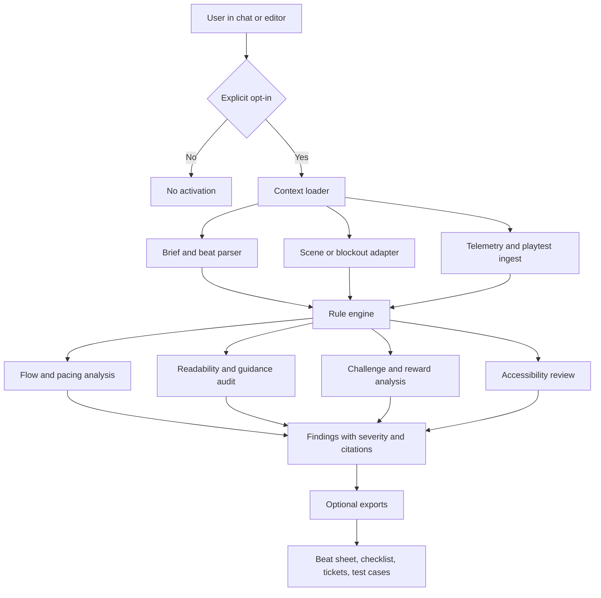
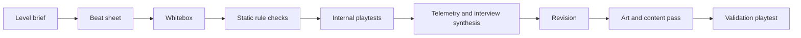

# Optional Level Design Subagent for Game Development

## Executive summary

The strongest evidence does not support a fully autonomous “design the level for me” agent as the first implementation. It supports an **optional, specialized, analysis-first subagent** that helps designers plan, critique, iterate, and test levels while leaving authorship and final judgment to humans. That conclusion follows from creator-written postmortems and official talks that repeatedly emphasize iterative playtesting, whiteboxing before art lock, readability over spectacle, explicit challenge ramping, modular production, and cross-discipline collaboration rather than one-shot generation. Valve’s creator-written *Portal* postmortem centers iterative playtesting and simple storytelling; Bethesda’s talks center iteration and modular workflows; Q.U.B.E. 2’s official Unreal interview says player comprehension and comfortable play must take priority over visual drama; Nintendo’s developer interviews show manual sketching, iteration, and difficulty tuning so more players can reach the end. citeturn25view0turn38search0turn37search0turn18view7turn18view11turn18view10

For implementation, the recommended shape is an **engine-agnostic skill with adapters** for Unreal, Unity, Godot, LDtk, or Tiled when available. Because the target engine, platform, and user skill level are unspecified, the safest default is a generic capability set that accepts a level brief, screenshots, blockout exports, scene graphs, and telemetry, then emits beat sheets, annotated critiques, structured checklists, alternative branch plans, accessibility issues, and playtest hypotheses. This aligns with research that frames level design as the invisible guidance of player movement and understanding, with methods grounded in design patterns, puzzle usability, iterative tooling, and telemetry-supported refinement. citeturn23view0turn23view2turn39search8turn37search0turn27view2

The design rules most worth formalizing are stable and repeatedly corroborated: openings should establish purpose and orient the player; levels should alternate tension and release; readability must beat atmospheric ambiguity when gameplay depends on recognition; challenge should escalate by **foreshadowing** and **layering** known elements; optional rewards should sit on curiosity paths and skill-risk branches; navigation should combine nonverbal guidance, landmarks, and mental-map reinforcement; accessibility should use multisensory cues, adjustable speed or difficulty, and alternatives to precision timing; and production should move from sketch to whitebox to modular kit, not the reverse. These rules are supported across academic pattern research, official accessibility guidance, official game-dev talks, and long-lived industry heuristics. citeturn18view6turn20view0turn20view2turn20view3turn21view1turn6view0turn6view2turn6view3turn34view0turn42view0

For product behavior, the subagent should be **strictly opt-in**, with explicit activation and scoped permissions. A side-panel or slash-command model is safer than proactive background behavior. The agent should default to read-only analysis, escalate to scene ingestion only with user permission, and require explicit approval before exporting tasks, annotations, or suggested modifications. That recommendation follows from general AI risk and privacy guidance, which stresses governance, risk mapping, data minimization, and protection against prompt injection or sensitive-information leakage in LLM systems. citeturn30search3turn30search2turn30search18turn30search0turn30search1turn29search1turn29search4turn29search16

Evaluation should be hybrid. Static rule checks alone are insufficient. Human interviews give the clearest design-improvement signals; telemetry explains what players do at scale but not why; AI playtesting is useful for navigation and difficulty visualization; and automated difficulty models are promising for platforming but still partial. The right stack is therefore **static linting + traversal simulation + structured telemetry + moderated human playtests**. citeturn27view0turn27view2turn27view4turn28search0turn27view1

The recommended implementation path is incremental: **rule pack and text critique first; blockout and screenshot analysis second; engine adapters third; telemetry and automated evaluation fourth; privacy/security hardening and studio workflow integration throughout**. This yields usable value early, avoids overclaiming, and matches the iterative level-design processes described by Bethesda, Valve, Q.U.B.E. 2’s team, and other production sources. citeturn38search0turn37search0turn25view0turn18view7turn43search19

## Curated reference base

The table below prioritizes **primary and official sources first**, then academic work, then high-value practitioner books and curated blogs. Several important GDC materials are only openly accessible through abstracts or official talk listings; where full slides or creator-written summaries were available, those were preferred. A user-provided memorandum also exists as a supplementary, non-authoritative reading-list artifact. citeturn14search5turn0file0

| Priority | Reference | Type | Why it matters | Best use | Sources |
|---|---|---|---|---|---|
| High | *Portal* creator-written postmortem | Creator-written postmortem | Explicitly highlights iterative playtesting, simple storytelling, and presenting new ideas to mass audiences | Puzzle onboarding, iteration discipline, narrative economy | citeturn25view0 |
| High | Randy Smith, **Helping Your Players Feel Smart: Puzzles as User Interface** | Official GDC talk summary | Formalizes puzzle usability through visibility, affordances, mapping, visual language, feedback, and conceptual models | Guidance, readability, puzzle communication | citeturn39search8turn23view3 |
| High | Matt Thorson, **Level Design Workshop: Designing Celeste** | Official GDC talk listing | Core reference for short-form challenge iteration and large-volume handcrafted platforming | Platformer pacing, difficulty shaping, one-room challenge design | citeturn14search5turn11search1 |
| High | Steve Lee, **An Approach to Holistic Level Design** | Official GDC talk listing | Canonical modern AAA level-design framing from Arkane | Holistic review criteria, cross-discipline planning | citeturn1search2turn14search5 |
| High | Clemence Maurer, **Rewarding Exploration in Deus Ex: Mankind Divided** | Official GDC talk listing and slide reference | Exploration, route variety, environmental storytelling, navigation-reward coupling | Reward placement, optional paths, exploratory hubs | citeturn2search5turn14search5 |
| High | Joel Burgess, **How We Used Iterative Level Design to Ship Skyrim and Fallout 3** | Official GDC talk | Large-scale iterative production for open worlds | Workflow, validation gates, iteration cadence | citeturn38search0 |
| High | Joel Burgess and Nathan Purkeypile, **Fallout 4’s Modular Level Design** | Official GDC talk | Clear official statement on modular kits plus iterative LD for huge worlds | Modularity, kit design, scalable content production | citeturn37search0 |
| High | Official Unreal interview on **Q.U.B.E. 2** | Official engine/developer interview | States readability and fun outrank dramatic lighting or organic form; documents whitebox-to-modular workflow | Puzzle readability, modular pipeline, whitebox discipline | citeturn18view7 |
| High | Nintendo **Iwata Asks** on *New Super Mario Bros.* | Official Nintendo interview | Shows paper-sketch-driven level planning and manual data entry workflow | Sketch-first workflow, blockout planning | citeturn18view11 |
| High | Nintendo **Ask the Developer** on *Super Mario Bros. Wonder* | Official Nintendo interview | Explicit design goal of reducing discouragement so more players can reach the end | Accessibility, difficulty tuning, broader player reach | citeturn18view10 |
| High | **Game Accessibility Guidelines** | Official industry guidance | Practical, specific checklist covering guidance, timing, objectives, cueing, contrast, practice, and playtesting with disabled players | Accessibility rule system | citeturn6view1turn6view0turn6view2 |
| High | Microsoft **Xbox Accessibility Guideline 103** | Official platform guidance | Demands multisensory communication and rejects color-only critical information | Critical-cue redundancy, color safety | citeturn6view3 |
| High | Milam and El-Nasr, **Design Patterns to Guide Player Movement in 3D Games** | Academic paper | One of the clearest attempts to formalize spatial guidance in 3D level design | Guidance, spatial communication, movement analysis | citeturn23view0turn23view2turn23view3 |
| High | Khalifa, de Mesentier Silva, Togelius, **Level Design Patterns in 2D Games** | Academic paper | Formal pattern taxonomy: Guidance, Foreshadowing, Safe Zone, Layering, Branching, Pace Breaking | Pattern-to-rule mapping, 2D heuristics transferable to broader level analysis | citeturn20view0turn20view2turn20view3turn21view1 |
| Medium | Wheat et al., **Modeling Perceived Difficulty in Game Levels** | Academic paper | Connects level features and player metrics to perceived difficulty | Automated difficulty estimation, telemetry modeling | citeturn18view1 |
| Medium | Wehbe et al., **Testing Incremental Difficulty Design in Platformer Games** | Academic paper | Empirical difficulty-ramp study for platformers | Challenge-ramp testing, DDA-informed level review | citeturn18view2turn8search14 |
| Medium | Hoek, **Analyzing the Challenge of Navigation through the Metroid Series** | Academic paper | Useful three-part navigation frame: destination, routing, execution | Navigation audits, Metroidvania/pathing analysis | citeturn18view4 |
| Medium | Totten, **An Architectural Approach to Level Design** | Book | Anchors level design in spatial layout, emotion, and architectural theory | Spatial composition, world legibility, emotional space | citeturn8search3turn8search23 |
| Medium | Lemarchand, **A Playful Production Process** | Book | Connects conceptual design, building, playtesting, and iteration to a sustainable workflow | Production process, stage-gate implementation | citeturn43search6turn43search19 |
| Medium | Salen Tekinbaş and Zimmerman, **Rules of Play** | Book | General theoretical grounding for meaningful choice and systemic design | Choice architecture, systemic reasoning | citeturn43search16turn43search7 |
| Medium | Gómez-Maureira et al., **Improving Level Design Through Game User Research** | Academic paper | Shows interviews, metrics, and biometrics each contribute differently; interviews gave clearest improvement signals | Playtest protocol design | citeturn27view0 |
| Medium | **Telemetry-Supported Game Design** | Industry article | Explains what telemetry answers well and where it fails | Telemetry event schema, dashboard design | citeturn27view2 |
| Medium | **Visualizing AI Playtesting Data of 2D Side-scrolling Games** | Academic paper | Demonstrates agent trajectory visualization as level-design evidence | AI traversal analysis, heatmaps | citeturn27view4 |
| Medium | Francillette et al., **Automated Evaluation of Difficulty in Platformer Games** | Academic paper | Recent formal model for automatic platformer difficulty evaluation | Bot-based difficulty scoring | citeturn28search0 |
| Medium | Dana Nightingale, **Great Level Design is a Studio Wide Effort** | Official GDC talk | Useful reminder that LD quality depends on more than the level designer | Workflow integration, role boundaries | citeturn38search1turn2search19 |
| Supplementary | **The Level Design Book** | Practitioner reference site | Broad, current, critical synthesis; useful, but explicitly still under construction | Fast lookup, onboarding, terminology | citeturn13search4turn18view9 |
| Supplementary | **World of Level Design** | Practitioner blog | Long-running tutorials and workflows, especially for environment and blockout practice | Production habits, environment/LD crossover | citeturn13search8turn13search25 |
| Supplementary | **Level Design Lobby** | Practitioner podcast/channel | Ongoing breakdowns of techniques and case studies | Continuing education, team study sessions | citeturn13search18turn13search22 |
| Supplementary | User-provided memo | Supplemental memo | Broad 2D-level-design reading list and synthesis supplied in this conversation; useful as a secondary index, not a primary authority | Cross-checking and further reading | fileciteturn0file0 |

## Formalized level design rules

The table below converts recurring ideas from the source base into a rule pack suited for a specialized subagent. The rule IDs are written to be directly reusable in prompts, API outputs, and automated lint checks.

| Rule ID | Area | Formalized rule | What the subagent should check or propose | Evidence |
|---|---|---|---|---|
| F1 | Flow and onboarding | **Start with intent.** The opening should either teach, awe, or threaten, but the purpose must be legible. If teaching, reduce threat; if threatening, make the threat readable. | Detect whether the first encounter introduces the verb set, objective, and affordances without punitive overload; flag hostile starts with no safe observation window. | citeturn18view6turn20view2 |
| F2 | Pacing | **Alternate pressure and release.** Dramatic arc should not stay flat; use spikes, quiet rooms, safe pockets, and climactic escalations. | Compute tension rhythm from hazards, enemy density, traversal precision, and downtime; flag monotony or stacked spikes without recovery. | citeturn21view1turn34view0turn41search0 |
| F3 | Readability | **Gameplay-critical clarity beats atmosphere.** If a puzzle element, route, or hazard must be recognized, lighting, composition, and signaling must preserve that readability. | Detect low contrast, clutter, ambiguous silhouettes, hidden interactables, and spectacle that obscures mechanics; recommend lighting or signage changes. | citeturn18view7turn39search8turn6view3 |
| F4 | Challenge escalation | **Escalate by foreshadowing then layering.** Introduce an element in a controlled context, then combine it with known elements to raise challenge fairly. | Identify whether a new mechanic appears first in a low-threat context; flag jumps from first exposure directly to multi-factor failure states. | citeturn20view3turn21view1turn8search14 |
| F5 | Reward placement | **Put rewards on curiosity and skill paths.** Main path rewards sustain progress; optional rewards should sit behind risk, observation, or mastery, not random obscurity. | Score branch quality: safer/smaller reward versus riskier/larger reward; highlight dead branches, fake rewards, and secrets with no readable setup. | citeturn21view0turn34view0turn2search5 |
| F6 | Guidance and navigation | **Guide nonverbally whenever possible.** Use geometry, landmarks, visible goals, enemy placement, collectibles, and route framing to answer destination, routing, and execution. | Audit breadcrumbs, sightlines, landmark spacing, re-used hubs, enemy/collectible funnels, and false affordances; produce an annotated guidance map. | citeturn20view0turn20view2turn18view4turn23view2 |
| F7 | Accessibility | **No critical state should depend on a single channel or excessive precision.** Important cues should be multisensory; objectives and controls should be recallable; players should have timing and difficulty alternatives where feasible. | Flag color-only cues, sound-only hazard telegraphs, unreadable text, missing reminders, hard timing gates without alternatives, lack of practice spaces, and absent objective recall. | citeturn6view0turn6view1turn6view2turn6view3turn18view10 |
| F8 | Modularity and production | **Sketch first, whitebox second, modularize third.** Do not commit art-kit production before the core route, spacing, and interaction quality are proven in lightweight form. Never lock onto the first acceptable idea. | Ask for thumbnails, text outlines, or beat sheets before geometry generation; prefer blockout analysis before modular-kit output; warn when art fidelity is being used to mask unresolved play problems. | citeturn42view0turn18view7turn37search0turn38search0 |

Three additional heuristics are worth making explicit. First, **push–pull composition** remains useful: enemies, hazards, and time pressure “push” forward while rewards, power-ups, visible goals, and secrets “pull” players into space. Second, **checkpoint density is a design parameter**, not a QA afterthought; sparse continuations make players repeat solved content instead of practicing the hard part. Third, **folk theories are weaker than concrete affordances**. A specialized subagent should not over-rely on generic “leading lines” or shape/color psychology claims when stronger evidence exists in readable affordances, route framing, landmarks, feedback, and telemetry. citeturn34view0turn18view9turn39search8turn27view2

## Subagent capability blueprint

The recommended architecture is a **rule-backed analysis skill** that consumes structured level context, runs specialized evaluators, and emits evidence-backed outputs rather than vague advice.



A minimal engine-agnostic context model should capture **verbs, goals, mechanic introductions, hazards, rewards, branch structure, checkpoints, landmarks, accessibility settings, and available telemetry hooks**, because those variables recur across the most reliable sources on pattern analysis, puzzle communication, iteration, and evaluation. citeturn20view0turn20view3turn21view1turn39search8turn27view2

```json
{
  "project": "string",
  "genre": "platformer|immersive-sim|stealth|shooter|puzzle|metroidvania|other",
  "camera": "2D|2.5D|3D|isometric|topdown",
  "core_verbs": ["jump", "climb", "hide", "shoot"],
  "win_condition": "string",
  "target_duration_minutes": 10,
  "intended_player": "novice|returning|expert|mixed",
  "critical_path": ["nodeA", "nodeB", "nodeC"],
  "optional_paths": [{"id":"path1","risk":"high","reward":"upgrade"}],
  "mechanic_timeline": [{"mechanic":"wall-jump","first_seen":"nodeB"}],
  "hazards": [{"type":"turret","nodes":["nodeC"]}],
  "rewards": [{"type":"health","placement":"critical_path"}],
  "checkpoints": ["nodeB"],
  "landmarks": ["tower", "red_door"],
  "accessibility": {
    "difficulty_options": true,
    "speed_adjust": false,
    "multisensory_cues": true
  },
  "available_inputs": ["brief", "scene_graph", "screenshots", "telemetry"]
}
```

| Capability | Inputs | Outputs | API sketch | Key controls | Rule mapping | Example prompt |
|---|---|---|---|---|---|---|
| Brief-to-beat planner | Pitch, verbs, target duration, intended audience | Beat sheet, mechanic timeline, opening recommendation, climax/rest plan | `POST /ld/beat-plan` | `challenge_target`, `exploration_ratio`, `tone`, `session_length` | F1, F2, F4 | “Turn this 12-minute stealth brief into three beat-sheet variants with one onboarding beat, one escalation, one quiet reset, and one climax.” |
| Blockout topology analyzer | Scene graph, whitebox metrics, node connections | Critical-path map, branch classification, dead-end report, checkpoint suggestions | `POST /ld/topology-audit` | `branching_level`, `checkpoint_density`, `hub_reuse`, `backtracking_budget` | F2, F5, F6, F8 | “Audit this hub-and-spoke blockout for mental-map clarity, branch value, and backtracking burden.” |
| Readability and guidance auditor | Screenshots, tagged interactables, light values, object classes | Annotated screenshot findings, cue redundancy issues, landmark recommendations | `POST /ld/readability-audit` | `guidance_strength`, `readability_priority`, `hint_policy` | F3, F6, F7 | “Review these three greybox screenshots for hazard readability, objective visibility, and false affordances.” |
| Challenge and reward balancer | Mechanic timeline, hazards, rewards, branch risks, failure logs | Difficulty-ramp critique, foreshadowing gaps, reward redistribution plan | `POST /ld/challenge-balance` | `difficulty_curve`, `risk_reward_ratio`, `novice_tolerance` | F2, F4, F5 | “Find where this traversal level jumps in difficulty too sharply and propose a foreshadowing step instead of reducing final difficulty.” |
| Accessibility reviewer | Cue list, control demands, timing windows, settings list, objective UI | Accessibility issues ranked by severity, missing options, remediation checklist | `POST /ld/accessibility-review` | `accessibility_strictness`, `timing_forgiveness`, `cue_channels` | F3, F7 | “Check whether any essential state is conveyed only by color, sound, or precise timing.” |
| Modular production advisor | Thumbnails, whitebox, modular kit list, asset constraints | Kit-splitting advice, over-modularity warnings, blockout-to-art handoff checklist | `POST /ld/modularity-plan` | `kit_granularity`, `reuse_target`, `bio_diversity_target` | F3, F8 | “Given this whitebox and 40-piece kit budget, propose a kit structure that preserves readability and variation.” |
| Playtest and telemetry analyst | Session logs, deaths, retries, path traces, interviews | Quit-point analysis, heatmaps, misread hypotheses, prioritized fixes | `POST /ld/playtest-synthesis` | `sample_segment`, `severity_threshold`, `confidence_mode` | F1–F7 | “Synthesize these 18 playtest sessions into likely guidance, pacing, and fairness problems. Separate ‘what happened’ from ‘why players said it happened.’” |

Recommended parameter controls should be **explicit and user-editable**, not buried in the prompt. The most useful controls are `challenge_target`, `exploration_ratio`, `guidance_strength`, `checkpoint_density`, `branching_level`, `hint_policy`, `accessibility_strictness`, `readability_priority`, `kit_granularity`, and `explanation_depth`. This keeps the skill configurable without making it opaque. That structure is consistent with sources that treat level design as a negotiation among challenge, choice, readability, iteration cost, and player support rather than a single scalar “goodness” score. citeturn40search0turn18view7turn27view0turn43search19

## Opt-in integration and governance

A specialized level-design subagent should be integrated as an **advisory instrument with explicit invocation**, not as an always-on background actor. The safest triggers are direct user actions such as a slash command, side-panel button, review action in the editor, or a CI task on a tagged map. Limited proactive suggestions are acceptable only when user intent is unambiguous, such as attaching a blockout and asking for level feedback. This respects both user agency and AI governance guidance that stresses governance, context mapping, and risk-aware deployment. citeturn30search2turn30search3turn30search18

| Integration option | Trigger and UI | Strengths | Weaknesses | Best fit | Relative effort |
|---|---|---|---|---|---|
| Chat-only review skill | Explicit command, pasted brief, screenshots | Fastest to ship; engine-agnostic; good for ideation and critique | Weak spatial grounding; no direct scene validation | Solo designers, early pilot | Low |
| Editor sidecar plugin | Button in Unity/Unreal/Godot; level panel | Strong context, screenshot capture, annotations, scene metadata | Engine-specific adapters; higher maintenance | Teams actively building levels | Medium |
| CI rule-checker | Pull request, build step, nightly lint | Consistent enforcement, scalable, auditable outputs | Limited nuance; cannot replace human review | Studio pipelines, larger teams | Medium |
| Telemetry-backed review service | After internal playtest or external test build | Strongest evidence, supports prioritization by actual behavior | Requires instrumentation, data governance, analysis layer | Mid-to-late production | High |

A practical permission model should be tiered. **Tier A**: text brief only. **Tier B**: screenshots and read-only scene metadata. **Tier C**: structured scene graph or map file. **Tier D**: playtest telemetry and interviews. **Tier E**: optional export of tickets, annotations, or structured recommendations. Write access to the project should be off by default. This is the right place to be conservative: NIST’s privacy and AI-risk materials push toward governance, scoped use, and data minimization, while OWASP’s LLM risk guidance makes it clear that indirect prompt injection and sensitive-information disclosure are real risks when models ingest untrusted content. citeturn30search15turn30search0turn30search1turn29search1turn29search4turn29search16

Data privacy concerns are straightforward in this context. Level files often expose unreleased content, internal names, narrative spoilers, licensed assets, and telemetry tied to individuals or internal testers. The subagent should therefore support **redaction, local or private deployment options, retention limits, no-training-on-project-data by default, and deletion controls**. Untrusted imported text, notes, or asset metadata should be sandboxed as content, not treated as instructions; this is a direct mitigation against prompt injection. citeturn29search3turn30search8turn29search1turn29search4

UI/UX should emphasize **evidence and traceability** rather than “AI confidence theater.” The best output format is a ranked issues list linked to map locations, screenshots, or nodes, each tied to a named rule and supported by citations or observed telemetry. One-click “apply fixes” should not exist initially. One-click “create checklist,” “generate alternate beat sheet,” or “open follow-up review” is safer and more aligned with how experienced teams iterate level work. citeturn25view0turn38search0turn27view1

## Evaluation and playtest framework

The right evaluation model combines **rule compliance, simulated traversal, telemetry, and human judgment**.



| Evaluation dimension | Metric or evidence | How to test it | Why it matters | Sources |
|---|---|---|---|---|
| Opening clarity | Time-to-first-correct-action, number of failed openings, interview recall of objective | Instrument first 60–120 seconds; ask players what they thought the goal was | Validates F1 and opening-purpose legibility | citeturn18view6turn27view0 |
| Pacing quality | Death clustering, pause/hesitation spikes, tension-rest alternation, completion-time variance | Static scene segmentation plus telemetry timelines and notes from moderated sessions | Finds flat arcs and spike stacking | citeturn21view1turn27view2turn27view0 |
| Guidance quality | Wrong-turn rate, backtracking not intended by design, route entropy, lost-player interviews | Capture path traces and compare intended versus actual routing | Operationalizes F6 | citeturn18view4turn23view2turn27view4 |
| Readability | Misread object frequency, missed interactables, cue-detection rate under varied lighting and color settings | Screenshot audits, colorblind simulations, playtest observation | Operationalizes F3 and F7 | citeturn18view7turn6view3turn6view0 |
| Challenge fairness | Retry counts per obstacle, fail-cause distribution, first-exposure success on foreshadowed mechanics | Segment by mechanic introduction versus layered challenge | Tests F4 directly | citeturn20view3turn8search14turn18view1 |
| Reward economy | Optional-branch take rate, reward discovery rate, secret completion rate, perceived reward value in interviews | Track branch entries and reward pickups; compare to intended budgets | Tests F5 and branch value | citeturn21view0turn34view0 |
| Accessibility | Color-only cue failures, timing-gate failure under assist settings, objective-reminder use, settings uptake | Structured accessibility review plus playtesting with disabled participants | Tests F7 beyond checklist compliance | citeturn6view0turn6view2turn6view3 |
| Production quality | Time-to-iterate, whitebox churn, art rework caused by late LD changes | Track revisions across thumbnail, whitebox, art pass, and validation | Tests whether the skill reduces costly late-stage churn | citeturn18view7turn42view0turn37search0 |

Automated tests should be split into three layers. **Static linting** checks reachability, safe observation at spawn, checkpoint spacing, branch classification, critical-cue redundancy, and mechanic introduction order. **Traversal simulation** checks that the level is beatable, estimates route difficulty, and visualizes path traces and death hotspots. **Telemetry validation** checks where players hesitate, quit, or repeatedly fail. Research supports all three, but also shows their limitations: automated playtesting and difficulty models are useful, telemetry scales well, and interviews remain the clearest source of improvement signals. citeturn27view4turn28search0turn27view2turn27view0

Human playtest protocol should be lightweight, repeatable, and segmented by audience. The minimal reliable format is: a short pre-brief on controls only; direct observation of play without coaching; a route or event log; a short retrospective interview; then structured coding of issues by rule family such as guidance, readability, pacing, fairness, reward, or accessibility. For accessibility-sensitive projects, disabled players must be included intentionally rather than treated as edge cases. citeturn27view1turn27view0turn6view2

A practical scenario suite for validating the subagent should include at least: a tutorial room, a short traversal gauntlet, a combat arena, a hub-and-spoke exploration space, a stealth sandbox, and a quiet narrative transition. Those cases are broad enough to test the rule pack across onboarding, pacing, route guidance, branching, challenge stacking, and respite, while remaining engine-agnostic. This is an implementation recommendation, but it is directly motivated by the recurrent pattern families identified in academic pattern work and official level-design talks. citeturn20view0turn20view2turn21view1turn38search1

## Workflows and implementation options

Three autonomy levels are viable. Only one is strongly recommended for an initial release.

| Model | What it does | Benefits | Main risk | Recommendation |
|---|---|---|---|---|
| Advisory only | Critiques, scores, annotates, explains, suggests alternatives | High trust, low safety risk, easy to integrate | Users may want more automation | Good starting point |
| Advisory plus constrained generation | Generates beat sheets, branch alternatives, checklists, tagged annotations, and structured test cases; never edits the live map directly | Strong leverage without surrendering authorship | Requires good schemas and adapters | **Best default** |
| Autonomous map editing | Modifies layout, places enemies and rewards, commits changes | Maximum automation | Highest design, safety, privacy, and trust risk; highest chance of brittle outputs | Avoid initially |

The preferred workflow is **advisory plus constrained generation**. It captures the real value implied by the source base: not replacing design judgment, but making iteration faster, more explicit, and more testable. That matches Bethesda’s iterative pipeline, Q.U.B.E. 2’s whitebox-first process, Valve’s playtest-first refinement, and the broader evidence that telemetry and playtests are complements, not substitutes for authorial intent. citeturn38search0turn18view7turn25view0turn27view2turn27view0

A lightweight integration workflow for a solo or small-team setup can look like this:

| Step | Action | Typical artifact | Skill output |
|---|---|---|---|
| Brief | Write one-paragraph purpose, verbs, duration, audience | Level brief | Beat sheet variants |
| Sketch | Produce text outline or thumbnail sketch | Image or outline | Flow and branch critique |
| Whitebox | Build rough blockout | Scene export or screenshots | Guidance, pacing, and safe-zone audit |
| Internal playtest | Run a few observed sessions | Session notes and simple telemetry | Ranked issue synthesis |
| Revise | Update blockout | New scene export | Delta report versus prior version |
| Art handoff | Lock readable core and kit requirements | Handoff checklist | Modularity and readability checklist |
| Validation | Run broader playtest | Telemetry and interviews | Final release-risk report |

A larger-team workflow should add CI and telemetry. In that model, the level-design skill runs manually in-editor during iteration, automatically in CI for rule regressions, and again after internal test builds to compare intended versus actual player behavior. The skill should export structured tickets for LD, environment art, UX, QA, and accessibility owners, because the source base consistently treats strong level design as cross-disciplinary. citeturn38search1turn27view2turn27view1

## Risks, limitations, and roadmap

| Risk or limitation | Why it matters | Mitigation |
|---|---|---|
| Over-standardization | A rigid rule pack can flatten style and produce safe but generic levels | Output alternatives, not single “correct” answers; allow style profiles and explicit rule overrides |
| Hallucinated spatial advice | LLMs can speak confidently about layouts they have not actually parsed | Prefer structured inputs; separate “observed” from “inferred”; require evidence links to nodes, screenshots, or telemetry |
| Weak geometry grounding | Chat-only analysis can misread space, line of sight, or traversal viability | Keep scene adapters and screenshot audits separate from pure text review; use traversal simulation when possible |
| Privacy and IP leakage | Level files and telemetry can expose unreleased content and internal data | Read-only by default, local/private deployment options, retention limits, redaction, no training on project data by default |
| Prompt injection through project assets | Untrusted notes, docs, and metadata can manipulate tool behavior | Treat imported content as data, not instructions; isolate parsers; use allowlists and content sanitization |
| Metric myopia | Telemetry explains what players did, not why; teams can optimize the wrong number | Always pair telemetry with interviews or moderated observation |
| Accessibility false comfort | Checklist passing is not the same as actual accessibility | Include disabled players in playtests and support adjustable settings, not just static claims |
| Genre mismatch | Rules vary by genre, camera, and player fantasy | Make genre and camera explicit parameters; version the rule pack by genre family |

The biggest unresolved implementation variables are outside the scope of the source base because the request leaves them unspecified: target engine, file formats, whether the skill may write into the project, whether the primary use case is solo indie or studio pipeline, which genres matter most, and whether telemetry infrastructure already exists. Those choices should determine adapter priorities, not the underlying rule pack.

The roadmap below is therefore deliberately engine-agnostic and effort is expressed only as **low / medium / high** relative engineering and design effort.

| Milestone | Deliverable | Value | Effort |
|---|---|---|---|
| Rule-pack foundation | Versioned rule library F1–F8, prompt templates, output schema, citation map | Makes the skill explainable and testable from day one | Low |
| Text-only critique pilot | Brief and screenshot review in chat or web UI | Fastest usable product; validates demand and prompt quality | Low |
| Whitebox and scene ingestion | Import structured blockout metadata or scene graphs; annotate nodes and paths | Moves from generic advice to genuinely spatial critique | Medium |
| Readability and guidance overlays | Screenshot annotation, landmark checks, cue redundancy audits | High-value design feedback with direct usability impact | Medium |
| Challenge and reward analyzer | Foreshadowing, layering, branch value, checkpoint-spacing checks | Turns theory into actionable balance review | Medium |
| Engine adapters | Unity and/or Unreal sidecar plugin; optional Godot/LDtk/Tiled adapters | Brings the skill into real workflows | Medium to High |
| Telemetry and automated testing | Event schema, dashboards, traversal simulation, difficulty estimates | Strongest evaluation layer; supports prioritization by evidence | High |
| Privacy and security hardening | Scoped permissions, data retention controls, prompt-injection defenses, audit logging | Necessary for studio adoption and trust | Medium |
| Pilot with real teams | Use on a small set of shipped or near-shipped levels; compare design outcomes and adoption | Validates ROI and exposes missing rules | Medium |
| Broader rollout | CI integration, ticket export, role-specific views for LD, UX, QA, accessibility | Scales beyond individual use | Medium to High |

The implementation recommendation is direct: **ship the skill first as an opt-in review and planning agent, not an autonomous level generator**. Give it a rule pack, structured outputs, citations, and a narrow permission surface. Add geometry grounding next. Add telemetry and automated evaluation only after the basic advisory workflow proves useful. That sequence best fits the evidence and minimizes the known failure modes. citeturn25view0turn18view7turn38search0turn27view0turn27view2turn29search1turn30search3