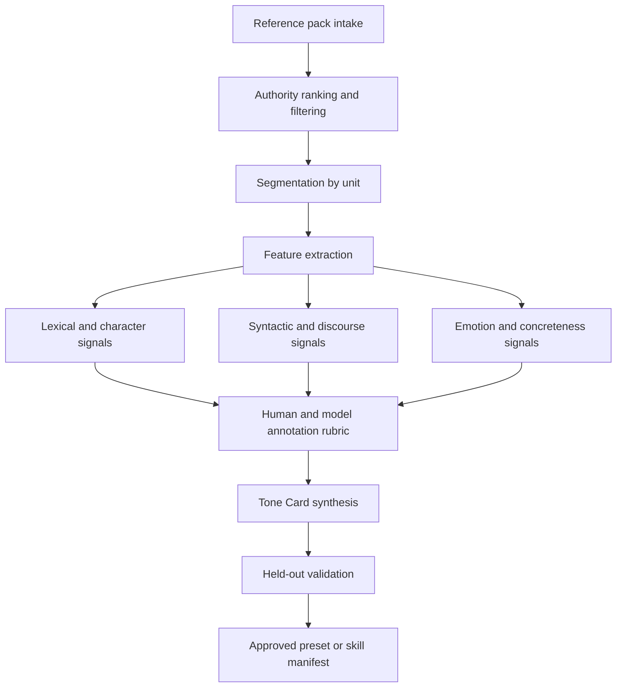
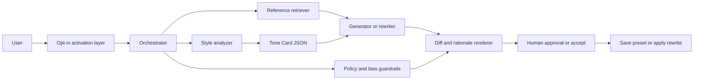
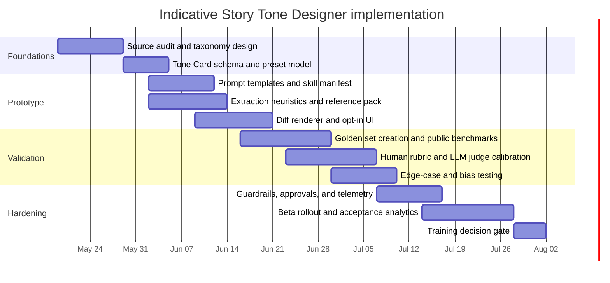

# Story Tone Designer

## Executive summary

A specialized, opt-in **Story/Tone Designer** should be implemented as a **reference-grounded writing specialist** that can do two distinct jobs: first, **extract** a target tone profile from trusted references; second, **apply** that profile to new text while preserving user intent, audience fit, safety constraints, and—unless explicitly authorized—core meaning. The strongest design is not a pure style-transfer model and not a vague “write better” assistant. It is a modular skill or subagent with explicit inputs, structured outputs, guardrails, and a repeatable evaluation loop. That conclusion is well supported by modern style-transfer research, corpus linguistics on register, official style-guide practice, and current agent-framework guidance from OpenAI, Anthropic, and Microsoft. citeturn34view4turn34view3turn36view0turn30view0turn41search0turn24view1turn24view0turn26view1

The report’s central recommendation is a **hybrid architecture**: use a default prompt-engineered skill backed by a **reference pack**, **feature extraction**, **few-shot exemplars**, **structured JSON outputs**, and **eval-driven iteration**; only add fine-tuning after prompt-plus-retrieval behavior has plateaued and only where the style space is stable, high-volume, and internally owned. Current OpenAI guidance explicitly frames optimization as a loop of evals, prompt engineering, and then fine-tuning where justified; its model-optimization page also notes that OpenAI’s fine-tuning platform is currently winding down for new users, which makes prompt/retrieval methods the practical default for that specific stack. citeturn17view1turn17view0turn19view0turn20view4

The most useful tone taxonomy is broader than “formal vs informal.” A production-grade skill needs at least these dimensions: **voice**, **register**, **pacing**, **imagery**, **syntax**, **diction**, **emotional arc**, and **cultural/contextual constraints**. That structure aligns with Mailchimp’s distinction between stable voice and situational tone, Biber and Conrad’s register theory, Le Guin’s emphasis on sound, sentence construction, and point of view, and major UX/documentation guides that prioritize clarity, inclusivity, localization, and active voice. citeturn30view0turn36view0turn15view0turn31view0turn31view1turn31view2turn31view3turn32view1turn32view0turn33view0

For evaluation, the correct baseline is not a single rubric. Text-style research consistently points to a **three-way tradeoff** among **style accuracy**, **content preservation**, and **fluency/quality**; production agent guidance adds **tool/handoff correctness**, **policy compliance**, and **edge-case reliability**. A mature Story/Tone Designer should therefore be validated with a combined stack of human review, LLM-as-judge grading calibrated to humans, regression datasets, and automatic metrics such as BERTScore, style classifiers, readability checks, and distributional metrics like MAUVE where useful. citeturn34view1turn4search2turn5search2turn20view4turn19view0

The implementation path under “no specific constraint” is straightforward: ship a working prompt-based skill in **weeks**, validate it on owned examples and public benchmarks, then decide whether a persistent subagent, retrieval layer, or training path is economically justified. That is the fastest route to a controllable, auditable, opt-in writing specialist rather than an opaque style mimic. citeturn22view0turn23view0turn41search0turn24view1turn24view0

## Purpose and scope

The Story/Tone Designer’s purpose is to let a user **intentionally design or transform delivery**, not to replace authorship, editorial judgment, or factual review. In practical terms, the skill should help users specify *how* a piece should sound and feel—calm, urgent, noir, crisp, warm, spare, lyrical, procedural—while preserving *what* the piece is trying to say. The conceptual split between a persistent **voice** and situational **tone** is explicitly articulated in Mailchimp’s style guide, while Biber and Conrad show that writing varieties also differ by **register**, meaning the situational configuration of participants, relationships, formality, channel, production circumstances, purpose, and topic. That combination is the right foundation for a specialized tone skill. citeturn30view0turn36view0

The skill should be **opt-in by default**. That is not just a UX preference; it is a system-design necessity. Official agent guidance from OpenAI and Anthropic treats skills/subagents as modular specialists with scoped instructions, explicit delegation boundaries, and optional loading rather than invisible, always-on behavior. Microsoft’s agent guidance similarly distinguishes open-ended agent behavior from fixed workflows and recommends using explicit workflow control when the process has well-defined steps. A tone specialist is usually a bounded, intermittent capability, so it should be activated by command, preset, or toggle rather than silently rewriting everything. citeturn41search0turn24view1turn24view0turn26view1

Target users cluster into four high-value groups. **Product and UX writers** need consistent microcopy, error states, helper text, and onboarding language that stays scannable, plain, polite, and task-focused. **Marketing and brand teams** need an enforceable voice system that adapts tone to context without drifting from brand personality. **Fiction and script writers** need help shaping scene energy, narration, dialogue texture, and emotional arc. **Knowledge-work teams** need audience-sensitive rewriting for executive summaries, memos, customer emails, and public documentation. These use cases are directly aligned with official guidance from Microsoft, Google, GOV.UK, Mailchimp, and major story-craft manuals. citeturn32view1turn31view0turn31view2turn33view0turn30view0turn15view0turn15view1turn15view2turn15view3

The scope should be deliberately bounded. The skill should not be treated as an autonomous fact-checker, a legal/medical style adapter for safety-critical advice without domain review, or a “write exactly like a living author” engine. Instead, it should operate on **attribute-based specifications** and **user-provided or public-domain references**. Project Gutenberg is especially useful here because it provides a large body of older literature whose U.S. copyright has expired, making it a strong source of public-domain anchor texts for stylistic analysis and internal benchmarking. citeturn39view2

Your uploaded note points in a compatible direction: it emphasizes small moments, “funny-sad” tonal balance, environmental storytelling, and agent memory as part of a felt narrative experience. Those are strong product aims, but they should be treated as a **design brief overlay**, not as the complete taxonomy or evidence base for the skill. fileciteturn0file0

### Representative user and use-case matrix

| User group | Primary job | High-value outcomes | Failure mode to prevent |
|---|---|---|---|
| UX/content designers | Adjust product copy tone by state and audience | Clearer onboarding, errors, prompts, help text | Cute but unclear copy |
| Brand/marketing teams | Maintain stable voice across channels | Brand consistency with situational tone shifts | Brand drift, generic “AI voice” |
| Fiction/screen writers | Shape narration, dialogue, mood, scene energy | Stronger atmosphere, pacing, emotional contour | Plot distortion, cliché inflation |
| Knowledge workers | Audience-fit rewriting for memos, emails, summaries | Better readability, stakeholder fit, diplomacy | Loss of meaning, hedging or overstatement |
| Editing teams | Normalize multi-author output | House-style consistency, review speed | Flattening distinctive but intended voice |

The matrix above synthesizes the need patterns documented in official UX/content guidance, voice-and-tone style guides, and story-craft references. citeturn32view1turn32view2turn31view0turn30view0turn15view0turn15view1turn15view2turn15view3

## Tone taxonomy and extraction methodology

A usable taxonomy has to connect **human-readable craft concepts** to **measurable textual signals**. The literature supports exactly that bridge. Biber and Conrad show that register can be modeled through situational parameters and empirically observed co-occurring features; Stamatatos’s survey of stylometry organizes style signals into lexical, character, syntactic, semantic, and application-specific features; Le Guin centers sound, sentence construction, and point of view; and Reagan et al. show that stories also exhibit measurable emotional trajectories. Together, these sources justify a layered tone model instead of a single “style” label. citeturn36view0turn35view4turn38view2turn15view0turn35view0

### Operational taxonomy

| Dimension | What it controls | Example signals the skill can measure |
|---|---|---|
| Voice | Stable personality and stance | Brand adjectives, recurring rhetorical posture, allowance for humor, directness |
| Register | Situation-fit language variety | Formality, hedging, pronoun use, contractions, noun density, information density |
| Pacing | Perceived speed and narrative pressure | Sentence-length variance, clause density, paragraph rhythm, dialogue/action ratio |
| Imagery | Sensory vividness and figurativeness | Concreteness, sensory lexicon rates, metaphor density, spatial detail |
| Syntax | Rhythm and structural shape | Parse depth, coordination/subordination, fronting, passive/active balance |
| Diction | Lexical choice and accessibility | Type-token ratio, function-word profile, jargon load, word frequency, register-specific terms |
| Emotional arc | Local and global affect trajectory | Sentence- or paragraph-level affect scores, tension/release curve, polarity shifts |
| Cultural/contextual constraints | Audience safety and portability | Idiom density, culture-bound references, inclusive language, translatability, taboo terms |

This taxonomy is a synthesis of Mailchimp’s voice/tone split, Biber’s situational and feature-based register theory, Google and Microsoft guidance on clarity/globalization/inclusivity, Le Guin’s craft emphasis, and computational work on stylometric features and emotional arcs. citeturn30view0turn36view0turn31view0turn31view1turn31view2turn32view1turn32view0turn15view0turn35view4turn35view0

A detail that matters in production is that some of these dimensions are **stable** and some are **situational**. Voice, baseline diction, and default humor tolerance should drift slowly. Tone, pacing, and emotional temperature may change paragraph by paragraph. Mailchimp says this directly—voice stays, tone changes with context—while Google and Microsoft make similar distinctions when they advise writers to keep a friendly, respectful baseline but adjust for user state, urgency, accessibility, and translation needs. citeturn30view0turn31view0turn31view1turn31view2turn32view1turn32view2

### Concrete extraction methodology

The extraction pipeline should begin with a **reference pack**, not with raw prompting. A reference pack should contain a small, trusted set of exemplar texts or guidelines ranked by authority: user-owned style guides and approved samples first, official/public reference guides second, and public-domain exemplars or benchmark corpora third. OpenAI and Anthropic both now document skill packaging around explicit manifests and instructions, which maps cleanly onto a “reference pack + rules + examples” artifact. citeturn41search0turn24view1turn24view0

The reference pack should then be **segmented** by unit type: sentence, paragraph, scene, dialogue turn, headline, CTA, or error message. That is essential because different tone dimensions operate at different scales. Biber’s work is explicitly about comparing linguistic patterns across registers and textual environments; stylometry research likewise treats texts as sets of measurable features rather than as indivisible wholes. citeturn36view0turn35view4

Next comes **feature extraction**. Stamatatos’s review is particularly useful here because it gives a practical hierarchy of stylometric features: lexical features such as sentence length, word length, vocabulary richness, word frequencies, and n-grams; character-level features, which can be highly discriminative; and syntactic features, which can capture unconscious structural habits but require more capable NLP tooling. The same survey also notes that function words are often highly informative for style discrimination because they are less topic-bound than content words. citeturn35view4turn38view2

For the specific Story/Tone Designer, the feature layer should be expanded beyond classic stylometry. Use **concreteness ratings** to estimate abstract-versus-sensory diction, and use **emotion lexicons** to estimate local affect distribution. Brysbaert et al. provide concreteness ratings for more than 37,000 English words and nearly 3,000 two-word expressions, while the NRC Emotion Lexicon organizes English words by associations with eight emotions and positive/negative sentiment. Those resources are well suited to imagery and emotional-arc estimation. citeturn14search0turn39view3

Then generate a **Tone Card**, a normalized representation of the reference pack. The Tone Card should not simply list adjectives like “warm” or “literary.” It should include parameter ranges, prohibited moves, and exemplars. A minimum schema should include: target audience, use context, voice anchors, register level, sentence profile, diction profile, imagery profile, humor policy, emotional profile, inclusion/localization constraints, and “do not do” rules. OpenAI’s structured outputs guidance is directly relevant here because it allows the model to return a schema-conformant JSON object rather than free-form explanation. citeturn23view0turn18search4

Finally, validate the Tone Card against **held-out passages** from the same references. If the extracted profile cannot reconstruct or reliably recognize the tone of its own references, it is not specific enough to apply elsewhere. This mirrors established style-transfer practice, which depends on explicit control targets, and modern eval guidance, which recommends representative datasets, clear success criteria, and continuous iteration. citeturn34view4turn34view3turn20view4turn19view0

### Reference-to-tone workflow

The following workflow reflects the extraction chain supported by corpus linguistics, stylometry, affect resources, and current agent tooling. citeturn36view0turn35view4turn39view3turn23view0turn41search0



## Reference stack and prioritized sources

A Story/Tone Designer should privilege references in **descending order of authority and specificity**: user-owned references first, official style/UX guides second, editorial standards third, craft manuals fourth, academic papers fifth, and broad corpora last. That ordering reflects a simple principle: the more a source tells the system what *this user or organization* actually wants, the better; the more a source is merely ambient English, the more it should be used for calibration rather than direct imitation. Official guidance from Mailchimp, Google, Microsoft, GOV.UK, APA, AP, Chicago, and major writing-craft authors makes this hierarchy defensible. citeturn30view0turn31view0turn31view1turn31view2turn32view1turn32view0turn33view0turn9search2turn37search0turn37search1turn15view0turn15view1turn15view2turn15view3

### Prioritized source comparison

| Priority | Source class | Why it matters | Best use inside Story/Tone Designer | Main risk |
|---|---|---|---|---|
| Highest | User-owned style guides, approved writing samples, product copy archives | Closest to actual desired output | Primary tone extraction and preset creation | Internal inconsistency |
| High | Official UX/content style guides | Explicit operational rules for clarity, tone, accessibility, localization | Product-writing and documentation modes | Over-optimizes for utilitarian prose |
| High | Editorial standards and usage references | Reliable grammar, house-style, usage resolution | Copyediting and normalization layer | Can flatten voice if over-applied |
| Medium | Craft books and screenwriting manuals | Rich treatment of rhythm, POV, scene energy, structure | Narrative and long-form guidance | Less operational unless converted to rules |
| Medium | Academic controllable-generation and style-transfer papers | Formal methodology for controllable rewriting and evaluation | System design and evaluation framework | Research setups may not map cleanly to production |
| Medium | Public-domain literature corpora | Dense, analyzable exemplars with low rights friction | Style calibration, narrative exemplars | Temporal mismatch with modern prose |
| Lower | Large general corpora | Modern language statistics and register baselines | Sanity checks and language-frequency calibration | Noisy or weakly normative |
| Lowest | Raw web-crawl corpora | Large coverage only | Background language statistics, never first-line style authority | Noise, contamination, topic drift |

The ranking above synthesizes source quality and applicability across official style guides, corpora, and academic literature. Public-domain literature is especially attractive because Project Gutenberg offers a large, proofread collection of older works with expired U.S. copyright, while modern register baselines are better served by COCA and BNC2014. By contrast, broad web-crawl sources like Common Crawl or C4 are valuable for scale but not ideal as normative tone anchors, and documentation on C4 has specifically noted unexpected source composition. citeturn39view2turn7search0turn39view1turn7search3turn7search10turn7search14

### Recommended English-first source list

| Category | Prioritized sources |
|---|---|
| Brand and voice | Mailchimp Content Style Guide; internal brand voice guides |
| Developer/technical writing | Google developer documentation style guide; Microsoft writing guidance |
| Public-sector plain language | GOV.UK content guidance; Digital.gov plain language; ONS plain-language guide |
| Inclusive language | Google inclusive documentation; Microsoft bias-free communication; APA bias-free language |
| Editorial house style | AP Stylebook; Chicago Manual of Style; Merriam-Webster grammar/usage resources |
| Writing craft | Ursula K. Le Guin, *Steering the Craft*; Robert McKee, *Story*; John Truby, *The Anatomy of Story*; John Yorke, *Into the Woods*; Orwell, “Politics and the English Language” |
| Corpora and datasets | COCA; BNC2014; Project Gutenberg; GYAFC; NRC Emotion Lexicon |
| Research on control/evaluation | Hu et al. 2017; Ficler & Goldberg 2017; Mir et al. 2019; BERTScore; MAUVE; Reagan et al. 2016 |

This list privileges official or primary sources wherever possible. AP, Chicago, Mailchimp, Google, Microsoft, GOV.UK, Apple, Adobe, and APA are all official style or writing resources; Le Guin, McKee, Truby, and Yorke are primary craft references from authors or publishers; ACL/PMLR/OpenReview/NeurIPS/ArXiv provide the core academic basis; and COCA, BNC2014, Project Gutenberg, and NRC supply directly usable English-language data resources. citeturn37search0turn37search1turn37search6turn30view0turn31view0turn31view1turn31view2turn32view1turn32view0turn33view0turn33view2turn15view0turn15view1turn15view2turn15view3turn11search0turn39view1turn39view2turn34view2turn39view3turn34view4turn34view3turn34view1turn4search2turn5search2turn35view0

## Architecture and opt-in UX

The recommended implementation is a **modular skill/subagent** that can be invoked one-shot or session-wide, but that always keeps tone control explicit. OpenAI now defines a skill as a versioned bundle with a `SKILL.md` manifest and instructions; Anthropic’s Claude Code docs describe nearly the same pattern for skills and custom subagents, including descriptions, tools, optional preloaded skills, and persistent memory. That means the packaging standard for Story/Tone Designer can be concrete rather than conceptual: it should be a manifest-driven specialist with explicit trigger conditions and structured outputs. citeturn41search0turn24view1turn24view0

### Recommended logical architecture

The architecture below combines current agent-framework patterns with style-extraction components and explicit approvals/guardrails. OpenAI’s Agents SDK emphasizes specialist ownership, handoffs, guardrails, human review, traces, and evals; Microsoft’s agent documentation distinguishes agents from workflows and recommends explicit workflows when control matters; Semantic Kernel’s orchestration docs add sequential, concurrent, handoff, and group-chat patterns. A Story/Tone Designer fits best as a specialist invoked through a deterministic workflow with optional handoff, not as an always-on generalist. citeturn17view6turn21view0turn26view1turn26view2



### Architecture options comparison

| Option | What it is | Strengths | Weaknesses | Best fit |
|---|---|---|---|---|
| Prompt-only transformer | Single prompt with rules and examples | Fastest to ship; low ops overhead | Weak consistency across domains; limited auditability | Prototyping, low volume |
| Skill plus reference retrieval | Prompted skill with exemplar retrieval and structured outputs | Strong control, auditable, cheaper than training, easy update path | Needs clean reference management | Most teams |
| Persistent subagent | Dedicated tone specialist with memory or saved presets | Good multi-turn consistency and reusability | More orchestration complexity | Editorial or writing-heavy workflows |
| Fine-tuned style model | SFT/DPO/RFT or equivalent for stable tone families | High consistency, shorter prompts, lower per-call prompt load | Data burden, evaluation burden, vendor/platform constraints | High-scale, stable internal use |
| Hybrid recommended | Retrieval + prompt skill now; training only after proof | Best balance of control, cost, and maintainability | More components than prompt-only | Default recommendation |

This comparison follows current model-optimization guidance from OpenAI, skill/subagent packaging guidance from OpenAI and Anthropic, and agent-orchestration guidance from Microsoft. OpenAI’s optimization docs are especially clear that prompt engineering and evals usually come first, and that DPO is specifically suited to “chat messages with the right tone and style.” citeturn17view0turn17view1turn41search0turn24view1turn24view0turn26view1turn26view2

### Inputs, outputs, rules, and fallback behavior

The skill should accept a compact but expressive input object:

```json
{
  "task": "rewrite | design | analyze | compare",
  "source_text": "...",
  "audience": "executive | consumer | developer | reader",
  "genre": "ux | memo | email | short_story | screenplay | essay",
  "reference_pack": ["preset_id or attached docs"],
  "preserve_meaning": "strict | moderate | flexible",
  "tone_targets": ["wry", "compressed", "low-ornament", "tender"],
  "constraints": ["plain_english", "inclusive_language", "global_audience"],
  "forbidden_traits": ["snark", "slang", "living-author mimicry"],
  "output_mode": "full_rewrite | side_by_side | tone_card_only"
}
```

The output should be **schema-bound**, not free-form. OpenAI’s structured outputs guidance is directly useful here because it supports JSON-schema-constrained responses and programmatically detectable refusals; its function-calling guidance also recommends strict mode for reliable schema adherence. The output should therefore include a `tone_card`, `rewritten_text`, `applied_changes`, `warnings`, and `confidence` fields. citeturn23view0turn18search4

The rules should be explicit and enforced at the developer/skill level. OpenAI’s prompt-engineering guidance recommends a clear developer message with **Identity**, **Instructions**, **Examples**, and **Context**, and notes that developer messages carry higher authority than user messages. That maps neatly onto Story/Tone Designer rules: preserve semantics by default, prioritize clarity in utilitarian contexts, use positive/active/plain language where appropriate, flag conflicts between references, do not intensify harmful emotion in unsafe contexts, and prefer attribute-based transforms over named living-author imitation. citeturn22view1turn22view3turn31view3turn32view1turn30view0

Fallback behavior should be deterministic. If references are insufficient, the skill should return a **neutral rewrite plus a sparse Tone Card** and a warning that fidelity is low. If references conflict, it should produce either a **split output** with two candidate tones or a merged profile that explicitly lists the conflict. If the requested tone would reduce clarity in a regulated or task-oriented context, the skill should either soften the request or require explicit confirmation, consistent with Microsoft’s task-focused plain-language guidance and OpenAI’s human-review/guardrail model for sensitive decisions. citeturn32view1turn21view0

### Opt-in UX design

The opt-in layer should support four activation modes: **one-shot command**, **draft-level preset**, **session-level default**, and **reference-pack creation**. The commands should be human-readable, but internally they should resolve to structured parameters. Anthropic’s docs support direct skill invocation and subagent selection; OpenAI’s current docs likewise support reusable prompts, skills, tools, and agents with explicit orchestration. citeturn24view1turn24view0turn41search0turn41search5turn41search9

Recommended UX behaviors are listed below.

| UX element | Recommended behavior |
|---|---|
| Default state | Off |
| Activation | `/story-tone`, preset picker, or “Apply tone” button |
| Preview | Side-by-side diff with changed dimensions |
| Controls | Audience, genre, preservation level, tone targets, constraints |
| Provenance | Show which reference pack or preset was used |
| Safety | Warn when humor, sarcasm, or informality conflicts with task-critical copy |
| Memory | Save approved Tone Cards as reusable presets |
| Undo | One-click revert to source text |

These behaviors are consistent with current agent patterns that emphasize explicit delegation, structured state, and human approval for consequential changes. citeturn17view6turn21view0turn24view0turn26view1

## Evaluation and validation

The evaluation framework should treat Story/Tone Designer as both a **text transformation system** and an **agentic workflow**. Style-transfer research makes clear that outputs have to be judged on at least three axes: whether the target style was achieved, whether original content meaning was preserved, and whether the resulting text is fluent or otherwise high quality. OpenAI’s eval guidance then adds engineering requirements: representative datasets, early and continuous evaluation, edge-case coverage, regression testing, and calibrated human feedback. citeturn34view1turn4search2turn5search2turn20view4turn19view0

### Metrics comparison

| Metric family | What it measures | Practical method | Why it matters |
|---|---|---|---|
| Style adherence | Match to requested Tone Card | Trained style classifier + rubric-based LLM judge + human spot checks | Confirms that the requested tone was actually applied |
| Semantic preservation | Meaning retained from source | BERTScore; reference-guided judging; contradiction checks | Prevents “beautiful wrongness” |
| Fluency and coherence | Readability and textual quality | Human ratings; LLM judge; grammar checks; MAUVE when comparing distributions | Catches awkward or over-engineered prose |
| Register fit | Audience/context appropriateness | Rubric on formality, plain language, task focus, localization fit | Distinguishes literary success from contextual success |
| Consistency | Stability across turns or assets | Cross-sample variance against same preset | Prevents drift in multi-turn writing sessions |
| Edit efficiency | Value relative to manual editing | Acceptance rate, number of post-edits, turnaround time | Justifies the product |
| Safety and bias | Harmful or exclusionary phrasing | Inclusive-language checks, taboo/idiom flags, policy graders | Prevents cultural harm and unsafe outputs |
| Workflow correctness | Correct skill routing and approvals | Trace grading, handoff accuracy, schema conformity | Required if implemented as agent/subagent |

This metric set combines the style-transfer literature with current agent-eval practice. BERTScore was proposed because it correlates better with human judgments than older overlap metrics; MAUVE was proposed for comparing generated and human text distributions; Mir et al. argue for evaluating the tradeoff among style, content, and fluency; and OpenAI’s own eval docs emphasize task-specific metrics, human calibration, trace grading, and automated regression testing. citeturn4search2turn5search2turn34view1turn20view4turn19view0

### Validation procedures

A production validation program should use **three datasets**. The first is an **internal golden set** of approved before/after examples collected from real writing tasks. The second is a **public benchmark set** for specific dimensions like formality; GYAFC remains the standard English formality-transfer corpus and was explicitly created to address the lack of datasets, benchmarks, and metrics in this area. The third is a **reference reconstruction set**: held-out passages from the very sources used to build presets, used to test whether the extracted Tone Card can recover the intended tone family. citeturn34view2turn20view4

Human review should be **blinded and pairwise** whenever possible. OpenAI’s eval guidance recommends multiple rounds of detailed human review, examples at multiple score levels, pass/fail thresholds, and consensus aggregation. It also notes that LLM judges can scale once they consistently align with human annotations, but warns about position bias and verbosity bias. For Story/Tone Designer, that means using human review to calibrate a judge model before automating most of the regression loop. citeturn20view4

Edge-case coverage should be broad. OpenAI’s best-practices guide explicitly calls out non-English or multilingual inputs, alternate formats, multiple intents, typos, minimal context, long conversations, circular handoffs, conflicting prompts, and jailbreak attempts. For this skill, add story-specific and prose-specific edge cases: satire vs sincerity, culturally loaded humor, emotionally intense requests, mixed-reference packs, ultra-short text where style signal is weak, and utilitarian copy where ornamental tone is likely to harm clarity. citeturn20view4

Bias and safety checks are not optional because tone is one of the easiest places to smuggle exclusion. Google’s inclusive-documentation guide warns that friendly or informal tone can accidentally introduce ableist, gendered, violent, or culturally specific language. Microsoft’s bias-free guidance requires gender-neutral alternatives and avoidance of biased generic references. APA’s bias-free guidance sets the same expectation in academic/professional contexts. These should be turned into preflight and postflight checks, not merely editorial advice. citeturn31view1turn32view0turn9search2

## Implementation plan, artifacts, and user guidance

Assuming **no specific platform or budget constraint**, the most rational plan is a staged build: start with a skill or subagent backed by a rule-based Tone Card extractor and prompt templates, integrate retrieval and structured outputs, stand up evals, then decide whether model training is needed. Current OpenAI documentation explicitly recommends starting from evals and prompt engineering, using examples and context, and only then considering fine-tuning; it also notes that fine-tuning can help enforce consistent formatting or tone but requires datasets and iteration. Anthropic and Microsoft documentation support the same general direction through skills/subagents and explicit workflow orchestration. citeturn17view1turn17view0turn22view0turn24view1turn24view0turn26view1

### Suggested stack choices

| Layer | Low-complexity choice | Higher-control choice |
|---|---|---|
| Orchestration | Single API wrapper + prompt templates | Agent SDK / skill runtime + trace logging |
| Style analysis | Heuristic features + LLM extraction | Heuristics + parser + embeddings + judge models |
| Storage | Flat preset files | Versioned reference packs + vector store + audit logs |
| Output control | Prompted JSON | Structured outputs / strict function calling |
| Evaluation | Manual review spreadsheet | Automated eval runs + judge models + CI regression |
| Safety | Prompt rules | Guardrails + human approval for sensitive rewrites |

If the implementation is OpenAI-based, structured outputs and strict function-calling materially reduce output-format fragility, while the Agents SDK adds guardrails, handoffs, traces, and approvals. If the implementation is Anthropic-based, the skills/subagents model already matches the packaging pattern closely. Microsoft’s current Agent Framework is a reasonable choice where explicit multi-step workflow control and enterprise telemetry matter more than minimalism. citeturn23view0turn18search4turn41search9turn21view0turn24view1turn24view0turn26view1

### Training versus prompt engineering

The correct default is **prompt engineering plus retrieval**, not training. OpenAI’s current optimization guidance says the prompt-engineering process may be all that is needed and recommends clear instructions, relevant context, and few-shot examples. Fine-tuning becomes attractive when you need more examples than fit in context, shorter prompts, or highly consistent formatting and behavior; within OpenAI’s documented methods, DPO is explicitly listed as suitable for generating chat messages with the right tone and style. citeturn17view1turn22view0turn17view0

For Story/Tone Designer specifically, training is justified only when all of the following are true: the organization has a large owned corpus of approved transforms; the tone family is stable enough to label; acceptance-rate data shows prompt/retrieval has plateaued; and the business case benefits from shorter prompts or lower latency at scale. Otherwise, training buys cost and consistency at the price of slower iteration and larger evaluation burden. citeturn17view0turn20view4

### Indicative implementation timeline

The following plan assumes a small cross-functional team and aims for a production-quality first release in roughly three months.



### Example skill manifest

The manifest below is illustrative, but it tracks the current skill packaging direction documented by OpenAI and Anthropic.

```yaml
---
name: story-tone-designer
description: Extracts and applies a reference-grounded story/tone profile to prose, scripts, UX copy, and business text. Use only when the user explicitly requests tonal design, rewriting, or analysis.
tools:
  - reference_retrieval
  - tone_feature_extractor
  - rewrite_text
  - compare_diff
constraints:
  default_mode: opt_in
  preserve_meaning: strict
  forbid:
    - living-author mimicry
    - unsafe persuasion
    - exclusionary language
outputs:
  schema: ToneDesignerOutput
---
```

### Core developer prompt template

This template follows the modern prompt-structuring pattern documented in OpenAI’s prompt guide: identity, instructions, examples, and context. citeturn22view3turn22view1

```text
# Identity
You are Story/Tone Designer, a specialized writing skill.
Your job is to extract, compare, and apply tone profiles from trusted references.

# Instructions
- Preserve source meaning unless the user explicitly allows content changes.
- Treat voice as relatively stable and tone as situation-dependent.
- Prefer clarity over ornament in UX, public-service, and task-driven writing.
- Apply inclusive, globally legible language when requested or when the context is public/product-facing.
- Never emulate a living author by name; convert such requests into attribute-based descriptions.
- When references conflict, surface the conflict explicitly.
- Return all outputs in the required schema.

# Output fields
tone_card
rewritten_text
changed_dimensions
warnings
confidence

# Examples
[insert few-shot examples for narrative, UX, and memo contexts]

# Context
Reference pack:
{{reference_pack}}
User request:
{{user_request}}
Source text:
{{source_text}}
```

### Rule set for production use

| Rule | Default |
|---|---|
| Meaning preservation | Strict |
| Plot/content invention | Off unless requested |
| Named living-author mimicry | Refuse and convert to attributes |
| Public/product copy mode | Plain language preferred |
| Humor | Allowed only when context-safe |
| Cultural specificity | Flag if audience is broad or global |
| Jargon | Minimize unless domain-specific and audience-matched |
| Emotional intensity | Cap in safety-sensitive contexts |
| Reference conflict | Explain, do not silently merge |
| Missing reference data | Fall back to neutral controlled rewrite |

### Before-and-after examples

These examples are illustrative artifacts, not quoted transformations from external sources.

**Business memo**

**Before**

> We are reaching out to inform stakeholders that several deliverables may experience a delay due to cross-functional dependencies that have not yet been resolved.

**After**

> Several deliverables may slip because a few cross-team dependencies are still unresolved.

**Applied dimensions**

- Register shifted from bureaucratic to executive-plain
- Diction simplified
- Syntax shortened
- Accountability preserved without inflation

**UX error message**

**Before**

> Authentication was not successfully completed. Please re-enter your credentials and attempt the process again.

**After**

> We couldn’t sign you in. Check your email and password, then try again.

**Applied dimensions**

- Active voice
- Friendlier tone
- Shorter sentence length
- Better task focus

**Literary narration**

**Before**

> The hallway was dark and he felt uneasy as he moved toward the door.

**After**

> The hallway held its breath. He moved toward the door with the bad feeling already in him.

**Applied dimensions**

- Higher imagery and tension
- Slightly more figurative diction
- Stronger cadence
- Emotional arc sharpened without changing event content

**Screenplay beat note**

**Before**

> Sarah enters the kitchen and realizes something is wrong.

**After**

> Sarah enters. The kitchen is too still. She knows something is wrong before she can name it.

**Applied dimensions**

- Pacing tightened
- Subtext increased
- Sensory cue added
- Scene energy raised

### User-facing activation and customization guidance

The user guidance should be short and explicit.

**Quick activation**

- `Apply Story/Tone Designer to this draft`
- `/story-tone analyze`
- `/story-tone rewrite preset=warm-plain`
- `/story-tone create-preset from references`

**Customization controls**

| Control | Meaning |
|---|---|
| Audience | Who the text is for |
| Genre | Memo, UX, fiction, screenplay, email, article |
| Preservation | How strictly to preserve source meaning |
| Tone targets | Desired tonal traits |
| Constraints | Plain language, inclusive language, global audience, brand mode |
| References | Attached examples, preset, or style guide |
| Output mode | Full rewrite, side-by-side, Tone Card only |

**Recommended help text**

> Story/Tone Designer is off unless you turn it on. It changes delivery, not facts, unless you explicitly allow content changes. For the best results, attach a reference pack or choose a saved preset.

### Open questions and limitations

The highest-confidence version of this report is strong on **English-first style frameworks, controllable-generation research, agent packaging, and evaluation design**, but weaker on two areas. First, some classic craft books and editorial manuals are only partially accessible online without purchase or JavaScript, so the report relies on official descriptions and widely documented emphases rather than full-text review for those sources. Second, specific model-vendor training options are volatile; OpenAI’s public docs currently note that fine-tuning access is winding down for new users, so any training recommendation should be rechecked against the target platform before implementation. citeturn15view0turn15view1turn15view2turn15view3turn17view0turn41search4