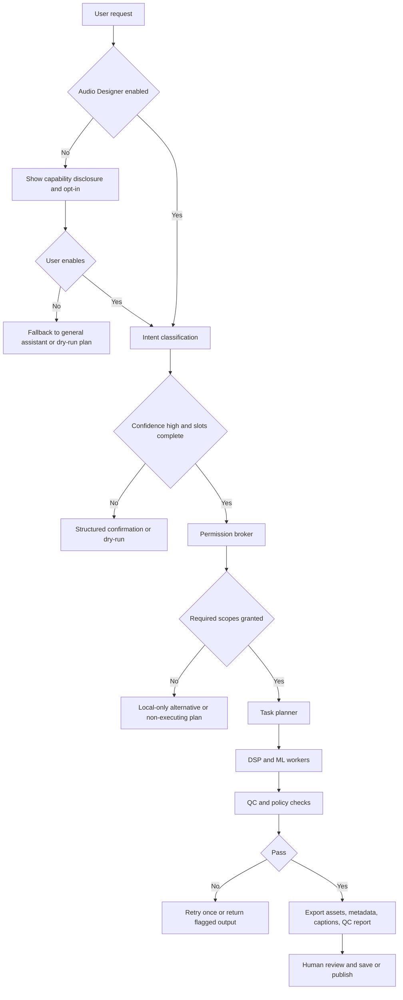
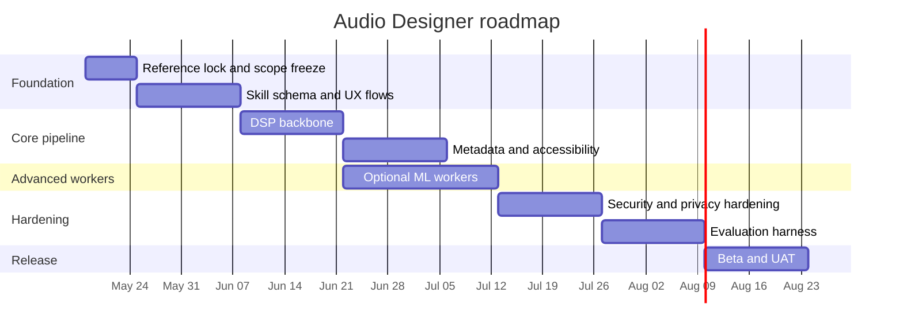

# Audio Designer opt-in subagent design report

> Status: historical/background only. The active Sketchbook Ridge audio spec is
> `docs/game-design/sketchbook-ridge-m3-audio-pack.md`; runtime hard rules live
> in `.agents/rules/40-audio-runtime.md`. Use this report as provenance, not as
> current implementation direction.

## Executive summary

Audio Designer should be implemented as an **optional, explicitly enabled, permission-scoped skill**, not as a default-on autonomous agent. That recommendation follows directly from the sensitivity of audio inputs, which may contain personal data and, in some circumstances, biometric voice data; from GDPR principles of purpose limitation and data minimization; and from NIST guidance that AI systems should be risk-managed and privacy-engineered rather than given broad implicit authority. citeturn24search2turn24search1turn5search2turn5search1turn5search0

The skill should be **modular and standards-backed**. Real-time and browser-side preview should align to the Web Audio API and AudioWorklet. Loudness and mastering QC should align to ITU-R BS.1770 and EBU R 128. Metadata and immersive interchange should align to BWF/RF64/BW64 and ADM. Accessibility outputs should align to WebVTT, TTML2, and WCAG transcript/caption requirements. citeturn0search0turn13search0turn1search0turn1search5turn1search2turn30search17turn1search7turn16search0turn16search2turn3search4turn3search16

The practical architecture should be **hybrid**: a deterministic DSP/media layer for ingest, editing, transcoding, mixing, loudness analysis, and packaging, plus optional ML workers for diarization, source separation, denoising, and transcription. FFmpeg is the strongest general-purpose media backbone; Web Audio/AudioWorklet is the right browser preview layer; JUCE is the most credible desktop/plugin-host route; and libraries such as librosa, SoundFile, Pedalboard, pyannote.audio, and pyloudnorm cover the main offline DSP/ML gaps. citeturn19view0turn19view2turn13search0turn37search1turn37search8turn0search2turn11search0turn10search1turn10search2turn9search3

Recommended defaults are conservative. Use **non-destructive processing**, **local-first preview**, and **ephemeral retention**. For internal processing, use 32-bit float buffers; for interchange, prefer WAV/BWF or FLAC; for previews, prefer Opus; for captions, emit WebVTT plus SRT. For generalized online delivery, a default QC preset around **-16 LUFS integrated** with **-1 dBTP ceiling** is the best neutral default, while preserving dedicated presets for broadcast at **-23 LUFS** and Spotify-style advisory monitoring at **-14 LUFS**. citeturn31search17turn30search0turn30search1turn16search0turn16search1turn25view2turn1search5turn15search2

The most important design constraint is **permission granularity**. File read, cloud upload, microphone capture, speaker analysis, internet retrieval, plugin execution, persistent storage, and external publishing should all be separate scopes. The highest-risk operations should always require explicit confirmation, even if intent classification confidence is high. OAuth-scoped access, short-lived tokens, and zero-trust segmentation should be baseline controls. citeturn6search0turn6search1turn6search11turn5search3turn5search0turn5search9

## Assumptions and reference base

### Assumptions

| Area | Assumption | Resulting design default |
|---|---|---|
| Target platform | No specific constraint | Reference architecture supports browser, desktop, and backend service modes |
| Programming language | No specific constraint | TypeScript control plane plus Python DSP/ML reference stack; C++/JUCE only if desktop/plugin hosting is a first-class goal |
| User language | en-US | UI copy, captions, and prompt templates default to en-US |
| Deployment model | Local and cloud both possible | Local-first preview; cloud only when a job benefits materially from remote processing |
| Audio domain | General creator/post-production workflows | Excludes medical, forensic, evidentiary, and identity-verification use cases by default |
| Privacy baseline | GDPR-oriented | Purpose limitation, minimization, revocable consent, short retention, no training reuse by default |
| Rights model | User attests rights before processing sensitive or copyrighted content | Rights confirmation becomes a required slot for stem extraction, voice-likeness operations, or public distribution |
| Persistence | Session-scoped unless explicitly saved | Ephemeral workspace by default |

The weighting of evidence for this report is deliberate: **industry standards and official specifications** should control formats, loudness, accessibility, and security choices; **official tool documentation** should control implementation choices; **seminal academic work** should inform advanced synthesis and transformation features; **public datasets** should drive evaluation; and any user-provided brief should be treated as supplementary context, not normative specification. citeturn1search0turn1search5turn1search2turn1search7turn16search0turn3search4turn5search0turn5search1turn6search0turn6search11

The uploaded brief should therefore be treated as a contextual artifact rather than a governing source. It is useful for scenario-shaping, especially if the implementation ultimately targets mobile-web, interaction-heavy use cases, but it should not override standards or official documentation. fileciteturn0file0

### Candidate reference comparison

| Reference class | Representative sources | Weight in design | Best use |
|---|---|---:|---|
| Official standards and recommendations | ITU-R BS.1770, EBU R 128, BWF, ADM, WebVTT, WCAG | Highest | Normative behavior, QC thresholds, file formats, accessibility |
| Official tool documentation | Web Audio, FFmpeg, JUCE, GStreamer, librosa, Pedalboard | High | Technical capability selection, implementation feasibility, dependency choice |
| Governance and security frameworks | NIST AI RMF, NIST Privacy Framework, GDPR, OAuth, Zero Trust | High | Consent, permissions, privacy, authn/authz, deployment controls |
| Seminal academic papers | Chowning FM, phase vocoder tutorial, STOI | Medium | Advanced capability design and algorithm tradeoffs |
| Public datasets/benchmarks | AudioSet, FSD50K, MUSDB18, LibriSpeech, Common Voice | High | Evaluation coverage and regression testing |
| User-provided contextual material | Uploaded brief | Low | Use-case framing only |

The table above is grounded in the cited standards, security frameworks, and official docs, which are materially more reliable than tutorials, blog posts, or vendor marketing when the goal is a durable skill design. citeturn5search0turn5search1turn5search2turn6search0turn6search11turn1search0turn1search5turn1search2turn1search7turn0search0turn16search0turn3search4

### Curated reference list

#### Standards, formats, accessibility, and governance

- **W3C Web Audio API 1.1** — Normative base for browser-side audio graphs, scheduling, sources, processing nodes, and spatialization. Essential if the skill offers web preview, interactive synthesis, or browser editing. `https://www.w3.org/TR/webaudio-1.1/` citeturn0search0turn17search4
- **ITU-R BS.1770-5** — Authoritative loudness and true-peak measurement algorithm. This is the core reference for objective loudness QC. `https://www.itu.int/rec/R-REC-BS.1770-5-202311-I/en` citeturn1search0turn1search8
- **EBU R 128** — Operational loudness normalization recommendation built on BS.1770, including program loudness, true peak, and loudness range. `https://tech.ebu.ch/publications/r128` citeturn1search5turn1search13
- **EBU R 128 S2** — Streaming-specific loudness guidance, including the cases where online distribution may use a higher interim loudness before playback normalization. `https://tech.ebu.ch/publications/r128s2` citeturn21search0turn25view2
- **EBU Tech 3285 BWF** — Primary reference for Broadcast Wave Format metadata and interchange. Use this for archival/export-grade masters and production metadata. `https://tech.ebu.ch/publications/tech3285` citeturn1search2turn33search10
- **ITU-R BS.2076-3 Audio Definition Model** — Authoritative structure for object-, scene-, and channel-based audio metadata in immersive workflows. `https://www.itu.int/rec/R-REC-BS.2076` citeturn1search7turn1search3
- **EBU ADM Guidelines** — Practical guidance and examples for understanding and applying ADM in production workflows. `https://adm.ebu.io/` citeturn2search5turn2search9
- **W3C WebVTT** — Primary timed-text format for captions, subtitles, descriptions, chapters, and metadata aligned to audio/video. `https://www.w3.org/TR/webvtt1/` citeturn16search0
- **W3C TTML2** — More expressive timed-text interchange standard than WebVTT, useful when interoperating with broadcast/media accessibility systems. `https://www.w3.org/TR/2018/REC-ttml2-20181108/` citeturn16search2
- **WCAG 2.2 and WAI transcript guidance** — Accessibility baseline: captions for prerecorded synchronized media and transcripts for prerecorded audio-only content. `https://www.w3.org/TR/WCAG22/` and `https://www.w3.org/WAI/media/av/transcripts/` citeturn3search4turn3search16
- **NIST AI RMF 1.0** — High-quality governance frame for trustworthy AI deployment, including risk identification and controls. `https://www.nist.gov/publications/artificial-intelligence-risk-management-framework-ai-rmf-10` citeturn5search0turn5search4
- **NIST Privacy Framework 1.0** — Practical privacy-engineering and privacy-risk-management framework. `https://www.nist.gov/privacy-framework` citeturn5search1turn5search9
- **European Commission GDPR principles and EDPB Voice Assistant Guidelines** — Best primary references for purpose limitation, data minimization, and voice-data sensitivity. `https://commission.europa.eu/law/law-topic/data-protection/rules-business-and-organisations/principles-gdpr_en` and `https://www.edpb.europa.eu/system/files/2021-07/edpb_guidelines_202102_on_vva_v2.0_adopted_en.pdf` citeturn5search2turn24search2
- **OAuth 2.0, OAuth 2.1 draft, and NIST Zero Trust** — Strong base for scoped authorization, short-lived tokens, and least-privilege service access. `https://datatracker.ietf.org/doc/html/rfc6749`, `https://datatracker.ietf.org/doc/draft-ietf-oauth-v2-1/`, and `https://csrc.nist.gov/pubs/sp/800/207/final` citeturn6search0turn6search1turn6search11
- **OpenAPI 3.2, JSON Schema 2020-12, and MCP** — Best references for a structured skill contract and optional agent-tool transport. `https://spec.openapis.org/oas/v3.2.0.html`, `https://json-schema.org/draft/2020-12`, and `https://modelcontextprotocol.io/specification/2025-03-26` citeturn23search8turn23search1turn23search0

#### Tooling and seminal papers

- **FFmpeg documentation** — The strongest general-purpose media I/O, filtering, analysis, and transcoding backbone; especially useful for `loudnorm` and `ebur128`. `https://ffmpeg.org/documentation.html` citeturn31search16turn19view0turn19view1turn19view2
- **JUCE** — The clearest path for cross-platform desktop audio applications and plug-ins, including VST3, AU, AUv3, LV2, and AAX. `https://juce.com/` and `https://docs.juce.com/` citeturn37search1turn37search8
- **librosa** — Excellent high-level library for analysis features, pitch/time transforms, and research-grade prototyping. `https://librosa.org/doc/main/` citeturn0search2turn18search1turn18search5
- **Spotify Pedalboard** — Useful for studio-quality effects chains from Python, including third-party VST3 and Audio Unit support. `https://spotify.github.io/pedalboard/` citeturn10search1turn10search5turn10search9
- **pyannote.audio** — Strong official reference for speaker diarization. `https://pyannote.github.io/pyannote-audio/` citeturn10search2turn10search6
- **John Chowning, FM synthesis** — Seminal synthesis paper; strong conceptual basis for procedural sound-design features. `https://web.eecs.umich.edu/~fessler/course/100/misc/chowning-73-tso.pdf` citeturn20search0
- **Mark Dolson, phase vocoder tutorial** — Classic reference for time-stretching and spectral editing concepts. `https://www.eumus.edu.uy/eme/ensenanza/electivas/dsp/presentaciones/PhaseVocoderTutorial.pdf` citeturn20search10

## Workflow and user analysis

Audio design work is broad, but the skill boundary should remain crisp: **ingest, analyze, create, edit, mix, master, package, and make accessible**. Real-time preview and simple procedural creation belong in a signal graph environment such as Web Audio or JUCE; heavy editing, transcoding, and QC belong on deterministic media tooling such as FFmpeg; and optional ML capabilities should remain modular adjuncts rather than hidden default behaviors. citeturn0search0turn13search0turn37search1turn19view0turn18search14turn10search2turn27view1

Sound synthesis is a legitimate capability, but it should be bounded. The skill can responsibly support oscillator/sample-based synthesis, procedural UI sounds, texture generation, simple layering, pitch/time manipulation, and effect-chain construction. That scope is well supported by Web Audio, JUCE, librosa, and Pedalboard, and the conceptual basis for FM-style procedural synthesis is well established in the Chowning literature. Full open-ended “make an entire finished track” behavior is a separate product decision and should not be the default assumption for this skill. citeturn0search0turn37search1turn0search2turn10search1turn20search0

Editing and restoration should cover trim/split/fade, silence removal, re-timing, loudness scan, codec conversion, denoise/declick where tooling exists, channel operations, simple stem extraction, and transcript/caption preparation. FFmpeg’s filtering stack, `loudnorm`, `ebur128`, and JSON-exportable stats make it especially suitable for this layer. librosa and SoundFile complement it for waveform-domain analysis, while pyannote.audio adds speaker diarization and Pedalboard adds high-level effects and plug-in bridges. citeturn19view0turn19view1turn19view2turn0search2turn11search0turn10search2turn10search1

Mixing and mastering should be framed as **assistive** rather than fully autonomous. The skill can recommend gain staging, bus routing, EQ/compression chains, reference matching, and deliverable-specific QC, but final approval should remain human-in-the-loop. Loudness compliance should be defined by BS.1770 and EBU R 128, not by ad hoc RMS or peak-only targeting, because the standards explicitly define integrated loudness, loudness range, and true peak as the relevant operational quantities. citeturn1search0turn1search5turn18search3turn5search0

Spatial audio belongs in scope, but in two tiers. **Tier one** is practical preview: stereo panning, room simulation, and binaural/HRTF preview. **Tier two** is interchange/export: ADM/BW64 and, when HRTF assets are involved, SOFA/AES69 references. The browser stack already exposes HRTF-capable panning models, while ADM and SOFA cover richer interchange and rendering metadata. citeturn17search0turn17search3turn17search2turn17search16turn1search7turn2search9

Metadata and accessibility are a first-class workflow layer, not post-processing afterthoughts. BWF and ADM cover professional audio interchange; WebVTT, TTML2, and SRT cover caption and timed-text outputs; and WCAG/WAI guidance requires transcripts for prerecorded audio-only content and captions for prerecorded synchronized media. An Audio Designer skill that cannot emit metadata and accessibility artifacts is incomplete. citeturn1search2turn30search17turn1search7turn16search0turn16search2turn16search1turn3search4turn3search16

### Workflow decomposition

| Workflow layer | Representative intents | Typical inputs | Typical outputs | Human approval |
|---|---|---|---|---|
| Brief and analysis | analyze, classify, reference-match | text brief, reference audio, uploaded assets | analysis report, style tags, QC baseline | Optional |
| Creation and synthesis | create_sound, layer_sound, render_variants | text brief, presets, reference descriptors | WAV/FLAC assets, preview renders | Recommended |
| Editing and restoration | trim, denoise, align, split, diarize | uploaded audio/video | cleaned assets, stems, transcripts, edit decision list | Recommended |
| Mixing and spatialization | mix, pan, binauralize, scene_render | stems, session manifest, room/layout data | stereo mix, binaural preview, ADM package | Required before final |
| Mastering and compliance | loudness_qc, master_export | final mix, delivery profile | mastered deliverables, QC JSON/CSV | Required before publish |
| Metadata and accessibility | tag, package, caption, transcript | audio/video, speaker map, project data | BWF/ADM/ID3 metadata, WebVTT/SRT/TTML2, manifest | Required before publish |

The workflow above is synthesized from the standards and toolchains already cited, and it maps cleanly to a skill that is broad enough to be useful but narrow enough to be governable. citeturn19view0turn1search0turn1search5turn1search2turn1search7turn16search0turn3search4

### Core capabilities, permissions, and user journeys

Because voice and speech are sensitive inputs, permissions should be split by **data movement** and **operation type**, not by a vague “audio access” umbrella. File read is not equivalent to cloud upload; diarization is not equivalent to speaker identification; plugin execution is not equivalent to an effect preset; and publishing is not equivalent to local export. GDPR, the EDPB voice assistant guidance, and NIST privacy guidance all favor this narrower consent and retention model. citeturn5search2turn24search2turn5search1turn5search9

| Permission scope | Default | Needed for | Risk profile | Safeguard |
|---|---|---|---|---|
| Read uploaded files | Off until granted | Any edit/analyze task | Moderate | Per-file, session-scoped grant |
| Cloud upload for processing | Off | Remote ASR, heavy ML, shared review | High | Separate consent, retention disclosure |
| Microphone capture/live monitor | Off | Recording, live tuning, monitoring | High | Session-only, visible recording indicator |
| Speaker analysis/diarization | Off | Speaker turns, chaptering, meeting cleanup | High | No identity labels by default |
| Internet asset retrieval | Off | Reference search, stock ambience, docs fetch | Moderate | Domain allowlist and audit log |
| Third-party plugin execution | Off | VST3/AU/LV2 rendering | High | Isolated sandbox, no network by default |
| Persistent project storage | Off | Save/reopen workflows | Moderate | Project-scoped save only |
| External publish/share | Off | Push to CMS, cloud drive, DAW integration | High | Explicit approval each destination |
| Training or product improvement reuse | Off | Any telemetry/training use | Highest | Separate opt-in only |

Representative user journeys should remain narrow and legible:

| Journey | Trigger | Minimal permissions | Expected outputs | Latency class |
|---|---|---|---|---|
| UI sound pack from brief | “Create 12 tactile UI clicks and soft confirmation tones” | File read only if references are uploaded | short WAV assets, Opus previews, manifest | Interactive to short-job |
| Podcast cleanup and captioning | “Clean this interview, remove hum, add chapters and captions” | File read, optional cloud ASR | cleaned master, WebVTT/SRT, chapter JSON | Short-job to queued |
| Stem prep for remix | “Split this song into vocals/drums/bass/other” | File read, rights confirmation | stems, QC notes, package ZIP | Queued |
| Spatial ambience package | “Place these ambiences in a 3D scene and export a binaural preview” | File read | binaural WAV preview + ADM package | Short-job to queued |

## Skill specification

The best specification is not a single free-form “audio agent,” but a **small, explicit bundle of sub-intents** hidden behind one opt-in skill surface. That gives the user one mental model while keeping execution safer, more testable, and easier to permission. NIST AI RMF and privacy-by-design guidance both support bounded, reviewable automation over opaque delegated autonomy. citeturn5search0turn5search1turn5search9

### Intent matrix

| Intent | Example prompt | Required slots | Primary outputs |
|---|---|---|---|
| `analyze_audio` | “Analyze this clip for LUFS, tempo, key, and noise issues.” | `source_audio`, `analysis_profile` | QC report, tags, recommendations |
| `create_sound` | “Create a soft ceramic button click with three variants.” | `creative_brief`, `deliverable_profile` | rendered assets, preset/recipe |
| `edit_audio` | “Trim silence, normalize dialog, and export chapter markers.” | `source_audio`, `edit_ops`, `deliverable_profile` | edited audio, markers |
| `restore_audio` | “Reduce hum and de-click this archival transfer.” | `source_audio`, `restoration_profile` | restored audio, before/after comparison |
| `separate_stems` | “Split this mix into vocals, drums, bass, and other.” | `source_audio`, `rights_confirmation` | stems, artifact warning notes |
| `mix_session` | “Balance these stems into a calm, intimate stereo mix.” | `source_assets`, `mix_goals`, `deliverable_profile` | mix render, session manifest |
| `master_export` | “Master for web video and show LUFS/true peak compliance.” | `source_mix`, `delivery_target` | mastered export, QC JSON/CSV |
| `spatialize_scene` | “Pan these effects around the listener and export binaural preview.” | `source_assets`, `scene_layout`, `spatial_profile` | binaural preview, optional ADM |
| `caption_and_transcribe` | “Generate captions, transcript, and speaker turns.” | `source_audio_or_video`, `language`, `caption_profile` | WebVTT, SRT, transcript, speaker map |
| `tag_and_package` | “Embed BWF metadata and package all deliverables.” | `source_assets`, `metadata_profile`, `package_profile` | tagged files, package ZIP, manifest |

### Slot definitions

| Slot | Type | Required | Example | Notes |
|---|---|---:|---|---|
| `source_audio` | file/URI | Conditional | uploaded WAV, FLAC, MP3, video audio track | Per-file permission required |
| `source_assets` | array[file/URI] | Conditional | stems, one-shots, ambience layers | For mix/spatial/package flows |
| `creative_brief` | text | Conditional | “warm, tactile, ceramic, quiet luxury” | For synthesis/design tasks |
| `analysis_profile` | enum | No | `music`, `dialog`, `sfx`, `archive` | Defaults to auto-detect |
| `deliverable_profile` | enum | Yes | `web_general`, `broadcast`, `streaming_music`, `podcast`, `game_ui` | Drives defaults |
| `delivery_target` | enum | Conditional | `web_video`, `spotify_advisory`, `ebu_broadcast` | QC preset |
| `scene_layout` | JSON | Conditional | object positions, trajectories, room size | Used for spatial tasks |
| `metadata_profile` | JSON | No | title, creator, project, scene, take | Supports BWF/ID3/manifest |
| `package_profile` | enum/JSON | No | `archive_zip`, `delivery_bundle`, `DAW_import` | Packaging behavior |
| `language` | BCP-47 | No | `en-US` | Default inherited from user locale |
| `rights_confirmation` | boolean/object | Conditional | “I own or have rights to process this content” | Required for stemming, likeness-sensitive tasks |
| `retention_scope` | enum | No | `session`, `24h`, `project` | Default `session` |
| `execution_mode` | enum | No | `local_only`, `hybrid`, `cloud_render` | Default `local_only` if feasible |
| `approval_mode` | enum | No | `manual_final`, `manual_each_step` | Default `manual_final` |

### Confidence thresholds, fallback behavior, and opt-in rules

| Condition | Threshold or trigger | Behavior |
|---|---|---|
| High-confidence safe intent | `>= 0.80` and all required slots present | Execute after checking permission scope |
| Mid-confidence intent | `0.60–0.79` | Present structured confirmation/dry-run plan before execution |
| Low-confidence intent | `< 0.60` | Do not execute; route to supported-intent chooser or analysis-only mode |
| Missing required slots | Any | Attempt safe inference from metadata; otherwise pause in dry-run mode |
| Rights-sensitive task | Any stem extraction, voice likeness, or publish step | Always require explicit rights or approval regardless of classifier confidence |
| Permission denied | Any required scope absent | Return non-executing plan, local-only alternative, or redacted output |
| QC failure | Loudness, caption timing, metadata validity, or render errors fail | Retry once with adjusted pipeline; otherwise return flagged artifact |
| Plugin sandbox failure | Crash, timeout, invalid preset, unsupported format | Return deterministic fallback chain and incident log |

This thresholding model is not only a UX choice; it is a control model. High-risk audio operations should require more than semantic intent confidence because the risk is not only “wrong task,” but also unauthorized data movement, privacy harm, or irreversible publishing. citeturn5search0turn5search1turn24search2turn6search0turn6search11

### Recommended default settings

| Setting | Recommended default |
|---|---|
| Skill state | Disabled by default; explicit enable per session, project, or account |
| Execution model | Non-destructive |
| Retention | Session-scoped ephemeral workspace |
| Training reuse | Off |
| Internal sample representation | 32-bit float buffers |
| Browser preview | Single reusable AudioContext with AudioWorklet where custom DSP is needed |
| Master/archive export | WAV/BWF or FLAC |
| Preview export | Opus |
| Caption export | WebVTT plus SRT |
| Spatial preview | Binaural HRTF preview only |
| Default QC preset | `web_general` at about -16 LUFS integrated, -1 dBTP ceiling |
| Alternate QC presets | `ebu_broadcast` at -23 LUFS; `spotify_advisory` at -14 LUFS monitor target |
| Plugin execution | Off unless explicitly enabled |
| External publish | Off unless explicitly enabled |
| Identity-like voice operations | Off by default; explicit rights and approval required |

These defaults align with Web Audio’s sample model, FFmpeg/EBU loudness workflows, FLAC/Opus delivery tradeoffs, Spotify’s public delivery advice, and W3C timed-text standards. They also minimize silent data movement. citeturn31search17turn13search8turn13search0turn30search0turn30search1turn1search5turn25view2turn15search2turn16search0turn16search1turn5search2

### Opt-in UX and permission prompts

First-run enablement should disclose **capabilities**, **data paths**, **retention**, **sensitive scopes**, **revocation**, and **whether processing is local or remote**. It should not be hidden in a generic privacy policy or settings page. GDPR transparency principles support just-in-time disclosure here. citeturn5search2turn24search2

Representative prompt templates:

- **Enable skill**
  - “Enable Audio Designer for this session. It can analyze, edit, mix, master, caption, and package audio. Default mode is non-destructive and session-scoped. Cloud processing stays off unless you enable it.”

- **Allow cloud render**
  - “Allow Audio Designer to upload selected files for remote transcription or heavy ML processing. Scope: this job only. Retention: 24 hours. Training reuse: off.”

- **Allow microphone**
  - “Allow live microphone input for monitoring or recording. Scope: this session only. Recording indicator stays visible while active.”

- **Allow plugin sandbox**
  - “Allow third-party audio plugin execution in an isolated worker. Network access remains blocked. Unsupported plugins may fail or produce non-deterministic output.”

- **Allow publishing**
  - “Allow export to external destination. Destination: selected workspace only. Final approval required before upload.”

## Integration architecture

A durable integration should separate **control plane** from **media plane**. The control plane handles intent routing, consent, policy checks, orchestration, and audit logging. The media plane handles DSP, ML inference, metadata, and file I/O. That separation makes it possible to run low-risk operations locally and high-cost operations remotely without changing the skill contract. It also matches zero-trust and least-privilege architecture patterns. citeturn6search11turn5search0turn5search1

### Recommended architecture

| Layer | Responsibility | Recommended approach |
|---|---|---|
| Skill gateway | Intent intake, schema validation, routing | OpenAPI 3.2 + JSON Schema 2020-12 |
| Consent and policy | Scope checks, rights checks, retention, audit | Central policy broker |
| Task planner | Break intent into deterministic steps | DAG/job spec with dry-run support |
| Browser preview | Real-time audition and simple DSP | Web Audio + AudioWorklet |
| DSP/media backbone | Ingest, trim, filters, transcode, loudness, probes | FFmpeg + SoundFile |
| ML workers | Diarization, ASR, separation, denoise | Optional queued workers |
| Packaging and metadata | BWF/ADM/ID3/manifests/captions | Dedicated export layer |
| Storage | Ephemeral workspace, project store, audit log | Session-first object storage |
| External tool transport | Optional agent-native integration | MCP wrapper if needed |

The contract layer should be declarative: OpenAPI describes endpoints, JSON Schema validates payloads, and MCP remains optional transport rather than the sole interface assumption. citeturn23search8turn23search1turn23search0

### API surface and data formats

| Endpoint | Method | Purpose | Input | Output |
|---|---|---|---|---|
| `/audio/analyze` | POST | QC, feature extraction, tagging | audio/video + profile | JSON report |
| `/audio/edit` | POST | deterministic edit pipeline | audio + edit ops | audio + edit manifest |
| `/audio/create` | POST | procedural/templated sound design | brief + profile | audio assets + recipe |
| `/audio/mix` | POST | multi-asset mixing | stems/assets + mix goals | mix render + session manifest |
| `/audio/master` | POST | loudness/true-peak/QC export | mix + delivery target | mastered audio + QC report |
| `/audio/captions` | POST | transcription, diarization, captions | audio/video + language | WebVTT/SRT/transcript |
| `/audio/package` | POST | metadata and bundle assembly | assets + metadata profile | ZIP/package + manifest |
| `/audio/jobs/{id}` | GET | async status for heavy tasks | job id | status + artifact references |

| Format role | Preferred format | Alternate | Why |
|---|---|---|---|
| Lossless archive/master | WAV/BWF, RF64/BW64, FLAC | AIFF | strong interchange and metadata support |
| Browser/remote preview | Opus | AAC | standardized for interactive audio and efficient preview |
| Immersive interchange | BW64 + ADM | channel-based WAV | object/scene metadata |
| HRTF data | SOFA | vendor-specific HRTF packs | standard HRTF/impulse-response container |
| Timed text | WebVTT | TTML2, SRT | web compatibility plus broader interchange |
| Embedded metadata | BWF chunks, ADM aXML, ID3 | sidecar JSON | production-grade plus user-visible metadata |
| Machine-readable manifest | JSON | YAML | schema-validated orchestration and audit |

The format profile above follows BWF/RF64/ADM guidance from EBU and ITU, timed-text standards from W3C, and codec guidance from Xiph/IETF. citeturn1search2turn30search17turn1search7turn17search16turn16search0turn16search2turn16search1turn30search0turn30search1

### Candidate tools comparison

| Tool or platform | Best fit | Strengths | Main constraints | Recommendation |
|---|---|---|---|---|
| Web Audio API + AudioWorklet | Browser preview, lightweight synthesis, interactive controls | Native graph model, low-latency custom DSP, broad browser support | Secure-context and browser variability; not ideal for long offline batch jobs | Use for preview and light interactive DSP |
| FFmpeg | Ingest, transcode, filters, loudness, QC, export | Extremely broad format/filter support, `loudnorm`, `ebur128`, JSON stats | CLI-centric, complex pipelines, plugin hosting not native | Make this the media backbone |
| GStreamer | Live streams, long-running media graphs, ingest/distribution | Streaming graph architecture, strong live pipeline model | More operational complexity than FFmpeg for simple batch edits | Use when live media pipelines matter |
| JUCE | Desktop editor, plugin host, cross-platform audio app | Mature C++ framework for apps and plugins | Heavier engineering cost than browser/backend options | Best desktop/plugin path |
| VST3 / AU / LV2 | Optional advanced processing integrations | Rich plugin ecosystems and host extensibility | Sandboxing, crash isolation, platform differences | Keep optional, not baseline |

This comparison is derived from official documentation for Web Audio, FFmpeg, GStreamer, JUCE, VST3, Audio Units, and LV2. VST3’s recent MIT licensing change reduces integration friction, but sandboxing and determinism still remain operational concerns. citeturn13search0turn13search2turn13search21turn19view0turn19view1turn11search6turn37search1turn37search8turn36view0turn12search12turn12search1turn35view2

### Candidate libraries and models comparison

| Library or model | Best fit | Strengths | Main constraints | Recommendation |
|---|---|---|---|---|
| librosa | Analysis and prototyping | Feature extraction, pitch/time transforms, mature examples | Offline/research bias, not a full production media stack | Use for analysis helpers |
| SoundFile | Lossless audio I/O | Clean NumPy-centered read/write via libsndfile | Not a full effects or streaming stack | Use for reliable file I/O |
| Pedalboard | Effects and plugin-capable chains | Studio-quality effects; VST3/AU bridge | Plugin determinism and sandboxing still required | Strong optional effects layer |
| pyannote.audio | Diarization | Strong speaker-turn tooling | PyTorch/ML dependency, privacy-sensitive outputs | Use as optional speech-analysis worker |
| pyloudnorm | BS.1770 loudness in Python | Direct loudness measurement and normalization helpers | More limited than FFmpeg for full media pipelines | Use for Python-native QC helpers |
| pyroomacoustics | Spatial prototyping | Room simulation and array processing | Prototype/research orientation | Use only for advanced spatial features |
| torchaudio | ML audio utilities | Good with PyTorch ecosystems | Official docs indicate maintenance phase | Avoid as the strategic core |
| Demucs | Music stem separation | Strong quality | Not actively maintained | Optional heavy-worker only |
| Open-Unmix | Music stem separation | Simpler, actively updated, MUSDB-based | Lower ceiling than top Demucs variants | Better default open baseline |
| Spleeter | Fast stem separation | Fast, easy, production-proven in some apps | TensorFlow-based and older assumptions | Good speed-first fallback |

The library and model choices above come directly from official documentation and repos. The most important current caution is maintenance: torchaudio is in maintenance phase, Demucs is no longer actively maintained, Open-Unmix has recent Torch 2.0 updates, and Spleeter remains operationally attractive when speed matters more than long-term architectural purity. citeturn0search2turn11search0turn10search1turn10search5turn10search2turn9search3turn18search4turn10search0turn27view0turn27view1turn27view2

### Latency, resources, and security

Latency classes should drive routing:

| Task type | Examples | Recommended execution | Notes |
|---|---|---|---|
| Interactive | parameter tweak, audition, transport controls | local/browser or local desktop | keep below perceptible control lag; monitor `baseLatency` where available |
| Short job | trim, convert, loudness scan, captions on short clips | local CPU or small worker | deterministic DSP first |
| Queued heavy job | stem separation, long diarization, immersive render | async worker queue, GPU optional | user should expect progress UI |
| Batch/archive | full-library QC, metadata repackaging | offline worker | optimized for volume, not interactivity |

Browser-side preview should assume **reuse of a single AudioContext**, **AudioWorklet for custom low-latency DSP**, and **HTTPS/secure context**. Preview streams should use Opus for remote transport where low-latency review matters. FFmpeg’s loudness filters are especially useful in the QC stage because they support true-peak targeting and JSON/stat export. citeturn13search8turn13search0turn13search2turn13search21turn30search1turn19view2

Security should follow four principles: scoped authorization, isolation, explicit data paths, and revocation. Concretely: OAuth-scoped short-lived tokens; zero-trust segmentation between gateway, storage, and workers; per-job sandboxing for plugins and model workers; and audit logs for every externalized file movement. OWASP’s GenAI security work is a useful secondary control reference here. citeturn6search0turn6search1turn6search11turn5search3

## Evaluation plan

The evaluation program should test **capability**, **quality**, **compliance**, **safety**, and **user trust** separately. Audio tools frequently score well on signal metrics while failing on packaging, rights handling, or permission correctness. That is the wrong tradeoff for an opt-in skill. citeturn5search0turn5search1turn1search0turn3search4

### Metrics and acceptance thresholds

| Evaluation layer | Metric | Suggested acceptance target | Method |
|---|---|---|---|
| Intent routing | top-1 intent accuracy | ≥ 95% on in-scope intent set | labeled prompt suite |
| Slot filling | required-slot completeness | ≥ 98% on structured tasks | schema validation |
| Permission safety | unauthorized execution rate | 0 | adversarial permission tests |
| Loudness QC | integrated loudness error | within preset tolerance | BS.1770 measurement |
| True peak | overs above target | 0 overs | BS.1770 / FFmpeg QC |
| Metadata validity | schema/format pass rate | 100% for exported packages | JSON Schema + format validators |
| Captions/transcripts | transcript completeness, timing validity | no missing segments; valid WebVTT/SRT syntax | parser + human audit |
| Source separation | SDR or equivalent separation score | benchmark-specific | MUSDB18 + museval |
| Speech intelligibility/restoration | STOI/P.808/MOS trends | non-regression or improvement | objective + subjective |
| Perceptual audio quality | MUSHRA / BS.1116 / PEAQ | task-specific target | listening tests + objective model |
| UX trust | unexpected upload incidents | 0 | instrumentation + UAT |
| Task success | completion without manual external tool intervention | ≥ 85% on v1 journeys | moderated UAT |

This metric stack is anchored to BS.1770/EBU R 128 for compliance, MUSHRA and BS.1116 for subjective audio quality, P.808 for crowdsourced speech listening tests, BS.1387/PEAQ for objective perceptual audio quality, STOI for intelligibility, and museval/BSSEval for source separation. citeturn1search0turn1search5turn28search0turn28search2turn28search1turn29search0turn9search13turn9search2turn9search6

### Datasets and test coverage

| Capability | Dataset | Why it matters |
|---|---|---|
| Audio tagging/classification | AudioSet | broad ontology and scale |
| Sound-event tagging | FSD50K | manageable open benchmark with hierarchical labels |
| Stem separation | MUSDB18 | standard open evaluation corpus for music source separation |
| English ASR/transcripts | LibriSpeech | large clean English speech corpus |
| Diverse multilingual speech | Common Voice | broader voice and language variation |
| Diarization | project-internal labeled meetings/interviews | public coverage is weaker than task-specific enterprise audio |
| Accessibility packaging | synthetic and real caption fixtures | validates WebVTT/SRT/TTML2 edge cases |
| Long-form export | large RF64/BW64 fixture set | validates file-size and metadata edge cases |

Use both public benchmarks and internal fixtures. Public datasets are necessary for comparability; internal fixtures are necessary because actual product failures usually cluster around edge conditions such as long-form files, mixed speech/music, unusual metadata, denied permissions, or plugin crashes. citeturn7search0turn7search1turn7search2turn8search0turn8search4turn30search17

Representative test cases should include:

- mono, stereo, and multichannel ingest
- WAV/BWF, RF64/BW64, FLAC, Opus, compressed consumer formats
- short UI SFX, long interviews, music mixes, noisy field recordings
- caption generation for audio-only and synchronized media
- denied cloud-upload permission on a task that would benefit from ASR
- rights-sensitive stem extraction without rights confirmation
- plugin crash, timeout, or unsupported preset
- low-confidence intent that resembles an in-scope task
- export to broadcast, streaming, and accessibility bundles

### User acceptance criteria

A release should not pass UAT unless users can complete the four representative journeys with no unexpected uploads, no silent permission escalation, correct QC reporting, and artifacts that are reusable in ordinary production workflows. Every output bundle should include **audio artifact(s)**, **machine-readable manifest**, **QC summary**, and, when applicable, **accessibility sidecars**. Final publish or save-out to external systems should always remain visible and reversible until the last step. citeturn5search2turn6search0turn6search11turn16search0turn3search4

## Roadmap and risks

A phased build is preferable to a “full creative suite” launch. The correct v1 is a standards-compliant, permission-safe assistant for **analysis, editing, mastering QC, metadata, and accessibility**. Heavy ML, plugin hosting, and advanced spatial packaging can follow once the core control model is stable. That sequencing reduces technical risk and sharply improves testability. citeturn5search0turn5search1turn19view0turn10search0turn27view0

### Milestones, effort, and exit criteria

| Milestone | Scope | Effort | Duration | Exit criteria |
|---|---|---|---|---|
| Reference lock and scope freeze | finalize normative standards, v1 boundaries, presets | Low | 1 week | signed-off v1 scope |
| Skill schema and UX flows | intents, slots, error model, consent UI | Medium | 2 weeks | validated schemas and prompt copy |
| DSP backbone | ingest, trim, export, loudness scan, QC JSON | Medium | 2 weeks | deterministic edit/master path passes integration tests |
| Metadata and accessibility | BWF/manifest/WebVTT/SRT packaging | Medium | 2 weeks | packaged exports validate |
| Optional ML workers | diarization, transcription, separation | High | 3 weeks | async queue and model contracts stable |
| Security and privacy hardening | scoped auth, audit, retention, sandboxing | Medium | 2 weeks | threat-model review passes |
| Evaluation harness | benchmark fixtures, listening-test harness, UAT scripts | Medium | 2 weeks | automated regression dashboard live |
| Beta and UAT | narrow pilot with real users | Medium | 2 weeks | acceptance metrics met |

### Primary risks and mitigations

| Risk | Why it matters | Mitigation |
|---|---|---|
| Permission creep | Audio tools often expand from “read file” to “upload and publish” without enough user visibility | Separate scopes; just-in-time prompts; deny by default |
| Voice/privacy sensitivity | Voice data may be personal or biometric | No identity labeling by default; explicit consent for speaker-sensitive tasks; short retention |
| Rights ambiguity | Stem extraction or likeness-sensitive processing can implicate rights beyond mere file access | Require rights attestation slot and policy gate |
| Plugin nondeterminism and crashes | Third-party plugins can fail, drift, or escape assumptions | Sandbox, block network, keep optional, log exact versions |
| Dependency staleness | Some attractive audio ML tools are not strongly maintained | Prefer maintained baselines; isolate swappable model workers |
| Quality overconfidence | Objective metrics can hide audible artifacts | Combine metrics with listening tests and human review |
| Latency/cost blowouts | Heavy ML tasks can turn a “quick edit” into a queued batch system | Route by latency class; show job cost/latency before execution |
| Standards mismatch | One export preset rarely fits broadcast, web, podcasts, and streaming music | Preset-based delivery profiles, not one global target |

The risk register aligns most directly to NIST AI RMF, the NIST Privacy Framework, GDPR/EDPB voice guidance, OAuth, and zero-trust architecture. Maintenance-related risk is also concrete in current tool documentation, especially for torchaudio and Demucs. citeturn5search0turn5search1turn5search2turn24search2turn6search0turn6search11turn10search0turn27view0

The implementation recommendation is therefore straightforward: build Audio Designer as a **bounded, opt-in, standards-led skill** with deterministic DSP at the center, heavy ML as modular workers, accessibility and metadata as first-class outputs, and consent/security controls enforced before execution rather than after it. That design is the strongest fit to the reference base and the lowest-risk path to a credible first release. citeturn1search0turn1search5turn1search2turn1search7turn16search0turn3search4turn5search0turn6search11
