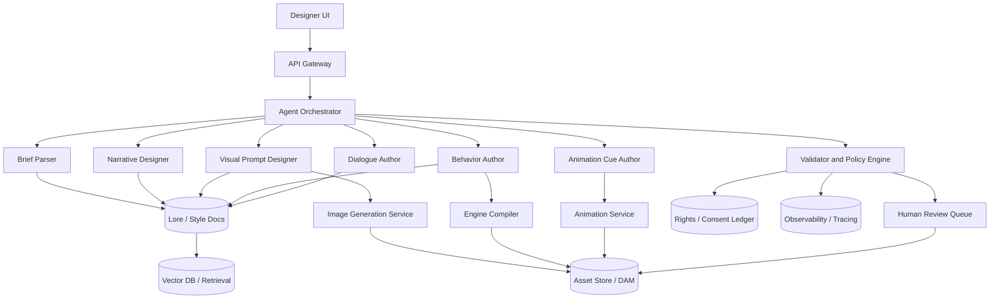
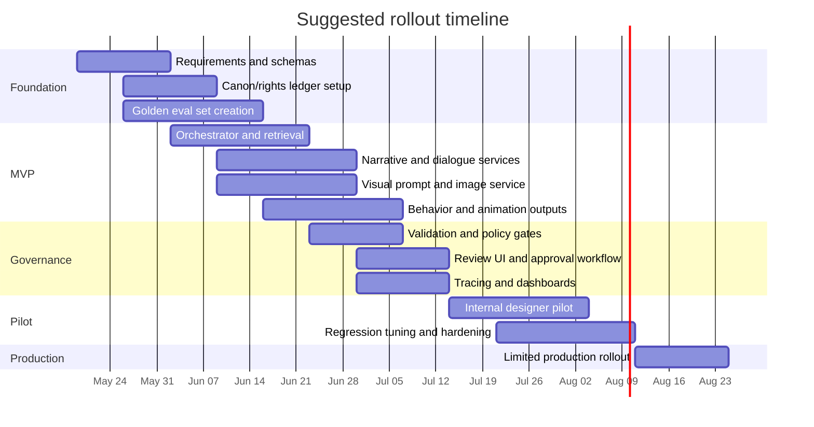

# Character Designer AI Agent Research

## Executive summary

A production-grade **Character Designer** AI should be built as a **design-time specialist agent**, not as a single long prompt and not as the final runtime “brain” for NPCs. The strongest architecture is an **orchestrated workflow** with specialist components for brief parsing, lore/style retrieval, persona and backstory generation, visual prompt generation, behavior authoring, dialogue generation, validation, and human approval. That recommendation aligns with current agent platforms that explicitly support state, tools, handoffs, tracing, and human-in-the-loop control, including the OpenAI Agents SDK, LangGraph, AutoGen, Semantic Kernel, and CrewAI. citeturn1search0turn1search4turn17search2turn0search9turn0search11turn0search10

The agent should emit **auditable artifacts**, not only prose. Minimum useful outputs are: persona sheet, motivations and relationship map, backstory timeline, visual prompt pack, dialogue samples and bark sets, engine-neutral behavior trees/state logic, animation/event cues, and a metadata envelope that records canon references, asset pointers, review state, and rights/provenance metadata. JSON Schema Draft 2020-12 is the right baseline for machine-validated contracts; SVG is appropriate for scalable 2D vector deliverables; glTF is appropriate for runtime-friendly 3D interchange; and OpenUSD is a strong master/interchange format where richer scene/asset composition matters. citeturn4search4turn4search3turn4search1turn4search6

For integrations, the right split is usually: **streaming request/response** for interactive designer sessions, **batch** for roster generation/evals/regression sweeps, and **realtime** only when the product also includes live voice or embodied preview. Official API guidance now clearly distinguishes those modes, and domain NPC platforms such as Inworld, Convai, and NVIDIA ACE increasingly support low-latency conversational or animation-oriented workflows. citeturn1search8turn20search6turn1search11turn2search8turn2search21turn2search6

Legal and governance constraints are now first-order design requirements. The U.S. Copyright Office has published formal reports on both **AI output copyrightability** and **AI training**, the EU AI Act and its GPAI Code of Practice impose transparency/copyright-oriented obligations on general-purpose AI providers, Creative Commons stresses that copyright licenses do not resolve privacy issues, and voice/likeness use is increasingly contract- and consent-sensitive, including under California’s digital-replica protections and SAG-AFTRA agreements. A serious Character Designer therefore needs a **rights ledger**, consent records, human editorial checkpoints, provenance metadata, and policy filters for bias and impersonation risk. citeturn30search4turn30search0turn5search0turn5search16turn6search6turn6search8turn5search2turn5search9turn8search1turn8search6

The practical recommendation is to build the system in three layers: **orchestration**, **generation services**, and **validation/publishing**. Start with managed APIs and strict schemas, then add custom adapters or fine-tuning only where repeated human feedback shows persistent failure modes. This minimizes integration risk, accelerates time to pilot, and preserves optionality across engines and model vendors. citeturn1search20turn15search1turn15search17turn13search4

## Assumptions, goals, and scope

The prompt leaves several important variables unspecified. Those unknowns should be treated as explicit assumptions rather than silently filled in.

| Dimension | Assumption |
|---|---|
| Character types | **No specific constraint** |
| Genres | **No specific constraint** |
| Art styles | **No specific constraint** |
| Target engine | Unspecified |
| Target runtime platforms | Unspecified |
| Latency targets | Unspecified |
| Budget | Unspecified |
| Voice/cloned likeness use | Unspecified |
| Publishing autonomy | Assumed **human approval required** before downstream asset publication |

An uploaded project blueprint appears to describe one possible stylistic and systemic direction—stylized NPC work with emphasis on silhouette readability, bark taxonomies, finite-state/reactive behaviors, and animation/event expression—but the current request does not make those constraints binding. In this report, that uploaded material is treated as **contextual inspiration**, not as a hard requirement. fileciteturn0file0

Given those assumptions, the recommended goal is to make the Character Designer a **high-leverage AI team member for pre-production and production support**, able to handle at least these classes of work:

| Supported scope in recommended v1 | Why it belongs in v1 |
|---|---|
| Named story NPCs | Highest narrative/design leverage |
| Systemic NPC archetypes | Useful for merchants, guards, villagers, vendors, ambient roles |
| Enemy/supporting-character variants | Important for roster scale and faction coherence |
| Persona and backstory packages | Core design output |
| Visual concept prompts and turnarounds | Necessary for art pipeline handoff |
| Dialogue samples and bark sets | Necessary for narrative and encounter design |
| Behavior-tree/state-machine stubs | Necessary for gameplay implementation handoff |
| Animation/event cue metadata | Necessary for cinematic and runtime integration |

The most important scoping discipline is this: the Character Designer should produce **design packages that downstream humans and tools can approve, edit, compile, and trace**. It should not be the only source of truth for final lore, and it should not publish directly into game content pipelines without validation. That design follows both modern agent practice and the broader lesson from generative-agent research: believable behavior improves when memory, planning, and constraints are structured, but unconstrained generation is not an acceptable substitute for production control. citeturn14search0turn14search1turn17search2turn32search10

## Capability model and data contracts

A serious Character Designer agent needs more than “creative writing.” It needs a capability set that maps to actual production artifacts.

| Capability | Minimum deliverable | Preferred machine-readable form |
|---|---|---|
| Persona generation | Role, archetype, traits, motivations, fears, relationships, hooks | JSON object with controlled vocabularies |
| Backstory generation | Timeline, formative events, factions, secrets, goals | JSON + prose summary |
| Visual concept generation | Hero prompt, negative prompt, ref-sheet prompt, pose/expression variants | JSON prompt bundle + image refs |
| Behavior authoring | Goals, utility/priority notes, triggers, actions, fallback states | Engine-neutral behavior-tree JSON |
| Dialogue generation | Barks, greetings, quest lines, emotional variants, taboo lists | JSON dialogue pack |
| Animation cue generation | Idle loops, gesture cues, viseme/emotion tags, timeline events | JSON events/cues |
| Metadata/schema management | IDs, versioning, canon refs, licensing, approvals, asset links | JSON Schema-validated envelope |

That output structure is consistent with how modern engines and avatar systems work. Unreal exposes built-in Behavior Trees for NPC AI; Unity now has a graph-based Behavior package for authoring NPC behaviors and still relies heavily on state machines and animation events for execution; Epic’s MetaHuman Animator and NVIDIA Audio2Face convert captured audio/video into performance or blendshape-oriented animation data. A Character Designer that cannot emit those downstream-friendly structures is not yet a real production teammate. citeturn3search0turn3search1turn3search2turn19search1turn19search3turn19search6

### Recommended data formats

| Artifact class | Recommended master format | Delivery formats | Notes |
|---|---|---|---|
| Design brief / persona / lore bindings | JSON validated by JSON Schema 2020-12 | JSON, Markdown, YAML | Use JSON as source of truth; prose is a view layer. citeturn4search4turn4search20 |
| 2D vector concepts / icons / callouts | SVG | SVG, PNG, WebP | SVG is open, scalable, stylable, and interoperable for vector assets. citeturn4search3 |
| 2D concept images / ref sheets | PNG or WebP masters in object store | PNG, WebP, JPEG | Keep prompt/provenance metadata alongside image assets. citeturn11search6turn12search2 |
| Runtime-friendly 3D packages | glTF 2.0 | glTF/GLB | Good for delivery and app/runtime loading. citeturn4search1 |
| DCC/master 3D composition | OpenUSD | USDA, USDC, USDZ | Better for richer composition and pipeline interoperability. citeturn4search6turn4search10 |
| Behavior logic | Engine-neutral JSON tree/state graph | Engine-specific import JSON/assets | Compile to Unity/Unreal assets downstream. citeturn3search0turn3search1 |
| Dialogue pack | JSON + text renderings | JSON, CSV, localization sheets | Include emotional tags and safety/policy annotations |
| Animation cue pack | JSON cue/event timeline | JSON, CSV, engine timeline data | Map to Timeline/Event systems or blendshape pipelines. citeturn19search2turn19search6turn19search3 |

### Sample input schema

The following is a practical, engine-neutral input contract. It uses JSON Schema 2020-12 because that draft is current and standard for validation/interoperability. citeturn4search0turn4search4

```json
{
  "$schema": "https://json-schema.org/draft/2020-12/schema",
  "$id": "https://studio.example/schemas/character-design-request.json",
  "title": "CharacterDesignRequest",
  "type": "object",
  "required": ["project", "brief", "deliverables"],
  "properties": {
    "project": {
      "type": "object",
      "required": ["project_id", "world_id", "language"],
      "properties": {
        "project_id": { "type": "string" },
        "world_id": { "type": "string" },
        "language": { "type": "string", "enum": ["en-US"] },
        "engine_target": {
          "type": "string",
          "enum": ["unity", "unreal", "godot", "custom", "unspecified"],
          "default": "unspecified"
        }
      }
    },
    "brief": {
      "type": "object",
      "required": ["character_role"],
      "properties": {
        "character_role": { "type": "string" },
        "character_class": {
          "type": "string",
          "enum": [
            "hero", "companion", "merchant", "quest_giver", "enemy",
            "boss", "ambient_npc", "faction_leader", "tutorial_npc", "other"
          ]
        },
        "genre": { "type": "string", "default": "no specific constraint" },
        "art_style": { "type": "string", "default": "no specific constraint" },
        "tone": { "type": "string" },
        "faction": { "type": "string" },
        "lore_constraints": {
          "type": "array",
          "items": { "type": "string" }
        },
        "visual_constraints": {
          "type": "array",
          "items": { "type": "string" }
        },
        "safety_constraints": {
          "type": "array",
          "items": { "type": "string" }
        },
        "reference_asset_ids": {
          "type": "array",
          "items": { "type": "string" }
        }
      }
    },
    "deliverables": {
      "type": "object",
      "properties": {
        "persona": { "type": "boolean", "default": true },
        "backstory": { "type": "boolean", "default": true },
        "visual_prompts": { "type": "boolean", "default": true },
        "dialogue_samples": { "type": "boolean", "default": true },
        "behavior_tree": { "type": "boolean", "default": true },
        "animation_cues": { "type": "boolean", "default": true }
      }
    },
    "approval_mode": {
      "type": "string",
      "enum": ["draft_only", "human_review_required"],
      "default": "human_review_required"
    }
  }
}
```

### Sample output schema

```json
{
  "$schema": "https://json-schema.org/draft/2020-12/schema",
  "$id": "https://studio.example/schemas/character-design-package.json",
  "title": "CharacterDesignPackage",
  "type": "object",
  "required": ["character_id", "version", "summary", "metadata"],
  "properties": {
    "character_id": { "type": "string" },
    "version": { "type": "string" },
    "summary": {
      "type": "object",
      "required": ["name", "role", "elevator_pitch"],
      "properties": {
        "name": { "type": "string" },
        "role": { "type": "string" },
        "elevator_pitch": { "type": "string" }
      }
    },
    "persona": {
      "type": "object",
      "properties": {
        "traits": { "type": "array", "items": { "type": "string" } },
        "motivations": { "type": "array", "items": { "type": "string" } },
        "fears": { "type": "array", "items": { "type": "string" } },
        "relationships": {
          "type": "array",
          "items": {
            "type": "object",
            "properties": {
              "target_id": { "type": "string" },
              "relationship_type": { "type": "string" },
              "strength": { "type": "number", "minimum": 0, "maximum": 1 }
            }
          }
        }
      }
    },
    "backstory": {
      "type": "object",
      "properties": {
        "timeline": {
          "type": "array",
          "items": {
            "type": "object",
            "properties": {
              "age_or_period": { "type": "string" },
              "event": { "type": "string" },
              "canon_refs": { "type": "array", "items": { "type": "string" } }
            }
          }
        },
        "secrets": { "type": "array", "items": { "type": "string" } }
      }
    },
    "visual_prompt_pack": {
      "type": "object",
      "properties": {
        "hero_prompt": { "type": "string" },
        "negative_prompt": { "type": "string" },
        "turnaround_prompt": { "type": "string" },
        "expression_sheet_prompt": { "type": "string" },
        "style_anchors": { "type": "array", "items": { "type": "string" } }
      }
    },
    "behavior_tree": {
      "type": "object",
      "properties": {
        "engine_neutral_nodes": {
          "type": "array",
          "items": {
            "type": "object",
            "required": ["id", "type", "label"],
            "properties": {
              "id": { "type": "string" },
              "type": { "type": "string" },
              "label": { "type": "string" },
              "children": { "type": "array", "items": { "type": "string" } },
              "conditions": { "type": "array", "items": { "type": "string" } },
              "actions": { "type": "array", "items": { "type": "string" } }
            }
          }
        }
      }
    },
    "dialogue_pack": {
      "type": "object",
      "properties": {
        "greetings": { "type": "array", "items": { "type": "string" } },
        "barks": { "type": "array", "items": { "type": "string" } },
        "quest_lines": { "type": "array", "items": { "type": "string" } },
        "taboo_topics": { "type": "array", "items": { "type": "string" } }
      }
    },
    "animation_cues": {
      "type": "object",
      "properties": {
        "idle_set": { "type": "array", "items": { "type": "string" } },
        "gesture_cues": { "type": "array", "items": { "type": "string" } },
        "emotions": { "type": "array", "items": { "type": "string" } },
        "timeline_events": {
          "type": "array",
          "items": {
            "type": "object",
            "properties": {
              "timecode": { "type": "string" },
              "event_name": { "type": "string" },
              "payload": { "type": "object" }
            }
          }
        }
      }
    },
    "metadata": {
      "type": "object",
      "required": ["status", "rights", "provenance"],
      "properties": {
        "status": { "type": "string", "enum": ["draft", "reviewed", "approved"] },
        "rights": {
          "type": "object",
          "properties": {
            "training_sources": { "type": "array", "items": { "type": "string" } },
            "consent_ids": { "type": "array", "items": { "type": "string" } },
            "license_tags": { "type": "array", "items": { "type": "string" } }
          }
        },
        "provenance": {
          "type": "object",
          "properties": {
            "model_version": { "type": "string" },
            "prompt_hash": { "type": "string" },
            "reviewer_id": { "type": "string" }
          }
        }
      }
    }
  }
}
```

### Example prompt templates

OpenAI’s current image-generation guidance emphasizes highly controllable creative workflows and structured prompting for production use. That strongly suggests prompt templates that explicitly separate role, constraints, style anchors, negative constraints, output schema, and revision instructions. citeturn11search0turn11search7

**Narrative generation template**

```text
System:
You are the Character Designer agent for a game studio.
Generate a production-ready character package, not free-form prose.
Treat lore constraints as hard requirements.
If something is missing, mark it as assumption.

User:
Project context:
- World: {{world_summary}}
- Genre: {{genre_or_no_specific_constraint}}
- Tone: {{tone}}
- Existing factions: {{factions}}
- Canon constraints: {{canon_constraints}}
- Prohibited themes: {{safety_constraints}}

Design brief:
- Role: {{character_role}}
- Gameplay function: {{gameplay_function}}
- Relationship targets: {{relationship_targets}}
- Narrative need: {{narrative_need}}

Return:
1. 1-sentence pitch
2. Persona table
3. Backstory timeline with 5–8 events
4. Contradiction check against canon
5. Open risks/assumptions
6. Strict JSON matching schema {{schema_name}}
```

**Visual concept template**

```text
Create a character concept prompt pack.

Character:
- Name: {{name}}
- Role: {{role}}
- Core traits: {{traits}}
- Faction/style anchors: {{style_anchors}}
- Must-read silhouette notes: {{silhouette_notes}}
- Materials/colors: {{materials_colors}}
- Required props: {{props}}
- Forbidden features: {{forbidden_features}}

Outputs:
- Hero prompt
- Full-body turnaround prompt
- Expression-sheet prompt
- 3 variant prompts
- Negative prompt
- 10 short tagging keywords

Constraints:
- Keep visual identity consistent across all prompts
- Avoid copyrighted franchise references
- Use concise, image-model-friendly wording
- Mention camera/framing, lighting, pose, material finish, costume layers
```

**Behavior-authoring template**

```text
Convert the approved character package into an engine-neutral behavior tree.

Inputs:
- Persona: {{persona_json}}
- Dialogue affordances: {{dialogue_json}}
- Gameplay role: {{gameplay_role}}
- Trigger list: {{world_triggers}}
- Engine target: {{engine_target}}

Return:
- Root goal
- 3–7 main behavior branches
- Conditions, actions, fallback nodes
- Interrupt rules
- Forbidden actions
- Import-ready JSON
- Explanation for designers in plain English
```

## Reference architecture and integration patterns

The Character Designer is best implemented as a **multi-stage service graph**. OpenAI’s Responses/Agents stack explicitly supports tools and stateful multi-step applications; LangGraph focuses on durable execution, streaming, and human-in-the-loop orchestration; MCP standardizes connectivity to external tools and data. That combination is a strong fit for a studio workflow where the agent must consult canon, style guides, asset stores, and approval systems rather than hallucinating in isolation. citeturn1search0turn1search4turn1search1turn17search2turn18search0turn18search2turn18search5



### Suggested service boundaries

| Service | Responsibility | Notes |
|---|---|---|
| Orchestrator | State machine for the whole job | Good fit for Agents SDK, LangGraph, SK, or AutoGen |
| Retrieval layer | Lore/style retrieval with permissions | Use metadata filters, namespace isolation, and canonical docs |
| Narrative service | Persona, backstory, hooks, conflict checks | Usually LLM-first |
| Visual service | Prompt packs and image iteration requests | LLM + image model |
| Behavior compiler | Author engine-neutral behavior, compile to engine target | Keep engine-specific logic downstream |
| Dialogue service | Barks, branches, emotional variants | Validate taboo/safety constraints |
| Animation cue service | Event tags, visemes, gestures, timelines | Optional but valuable |
| Validator | Schema, canon, rights, safety, duplication, review status | Must gate publishing |
| Review/publishing | Human approval and asset release | Studio-owned source of truth |

For retrieval, the simplest option is often **PostgreSQL + pgvector** if canonical metadata already lives in a relational system. If semantic search is central and scale/filtering complexity grows, Qdrant and Weaviate are strong vector-native choices; Milvus is specifically positioned for large-scale GenAI retrieval. citeturn9search6turn9search4turn9search9turn9search15

### Interaction modes

| Mode | Best use | API pattern | Recommended default |
|---|---|---|---|
| Streaming synchronous | Designer chats, iterative revisions, brief clarification, narrative generation | REST + SSE/streaming | Default for interactive authoring citeturn1search8turn1search2 |
| Batch asynchronous | Bulk NPC roster generation, nightly consistency checks, offline evals, embedding refresh | Batch jobs / queue workers | Default for non-urgent jobs; OpenAI notes Batch pricing at 50% of standard rates for applicable models. citeturn22search0turn22search6 |
| Realtime | Live voice preview, embodied rehearsal, immediate player-style NPC simulations | WebSocket/WebRTC session | Only if the product extends into runtime preview or voice interaction. citeturn20search6turn1search11turn2search8turn2search21 |

### Recommended latency envelopes

Because the prompt states **latency targets unspecified**, the following are **engineering assumptions**, not formal requirements:

| Workflow | Recommended envelope |
|---|---|
| Text-first design iteration | Stream first tokens immediately; P95 complete response under 5 s |
| Retrieval + validation pass | P95 under 2 s when cached/indexed |
| Thumbnail image concept | Preview under 15–20 s |
| Full ref-sheet / final comp | 20–60 s depending on model and queue |
| Bulk roster generation | Overnight or explicit batch window |
| Live voice preview | End-of-turn response perceived as low-latency; use realtime path only when necessary |

### Packaging the agent as a reusable skill

If the studio wants this capability reusable across projects, package it as a **skill bundle**: versioned instructions, schemas, example briefs, validator scripts, style guides, safety rules, and import/export helpers. That matches current “agent skills” patterns in which a skill packages instructions, resources, and optional scripts so the agent can follow a workflow reliably. citeturn1search17

## Comparative landscape

### Agent and orchestration frameworks

| Framework | Best fit for Character Designer | Strengths | Main trade-offs | License / source |
|---|---|---|---|---|
| **OpenAI Agents SDK** | Teams that want strong tool use, tracing, MCP integration, and fast path to production | Multi-agent workflows, built-in tracing, tool and handoff support, provider-agnostic SDK framing | Many convenience features are strongest inside the OpenAI ecosystem; API dependency for managed capabilities | MIT SDK; official docs and repos. citeturn16search0turn16search1turn32search0turn16search12 |
| **LangGraph** | Teams that want explicit state graphs, durable execution, and human approval checkpoints | Durable execution, streaming, persistence, human-in-the-loop | Lower-level than “agent-in-one-call” abstractions; requires more engineering discipline | MIT. citeturn17search2turn17search13turn17search1 |
| **AutoGen** | Multi-agent research/prototyping and distributed specialist agents | Deterministic/dynamic workflows, distributed agents, strong research heritage | More conversation-centric than pipeline-centric unless carefully constrained | MIT for code; docs/content mixed with CC BY for repository docs. citeturn0search9turn0search17turn0search5turn0search13 |
| **Semantic Kernel** | Enterprises that need model-agnostic orchestration across Python/.NET/Java | Model-agnostic SDK, enterprise positioning, multi-agent support | Less “opinionated creative stack” out of the box; more assembly required | MIT. citeturn0search11turn0search7 |
| **CrewAI** | Teams that want role-based crews and simpler workflow layer | Clear “Crews + Flows” mental model, open-source base plus commercial platform | Can become opaque at larger scale unless backed by strong tests/observability | MIT OSS; commercial AMP available. citeturn0search10turn0search6turn0search14 |

### Domain platforms and pipeline components

| Tool / platform | Best role in stack | Strengths | Main trade-offs | License / commercial note |
|---|---|---|---|---|
| **Inworld** | Runtime or preview layer for interactive AI characters | Full-duplex low-latency speech, tool calling, realtime orientation | Proprietary platform and usage-led pricing | Proprietary; public pricing available, including Developer tier. citeturn2search8turn2search0turn2search12 |
| **Convai** | Runtime/preview conversational NPC layer with engine plugins | Official docs, Unity/Unreal/web integrations, actions/environment interaction | Proprietary service; governance review needed on service terms | Service proprietary; Unreal plugin Apache-2.0. citeturn2search5turn2search13turn2search21turn2search9turn2search1 |
| **NVIDIA ACE** | High-end avatar/NPC stack for speech, intelligence, and animation microservices | Suite spans speech, intelligence, and animation; cloud and on-device positioning | Platform complexity and commercial/vendor footprint | Commercial/proprietary suite, with some related components/documentation open. citeturn2search2turn2search6turn19search3turn19search15 |
| **Adobe Firefly Custom Models** | Consistent visual identity from owned assets | Commercial-safety positioning, custom models trained on own assets, strong enterprise governance | Proprietary; best fit where Adobe ecosystem already exists | Proprietary; qualifying plans can include IP protections. citeturn10search9turn26search2turn31search1turn31search5turn31search7 |
| **Reallusion Character Creator** | Base 3D character creation, rigging, export, and look-dev | Mature character pipeline, realistic or stylized output, downstream engine support | Separate content/export licensing can complicate workflows | Proprietary with content/export licensing. citeturn26search6turn26search1turn26search7 |
| **Scenario** | Custom model training and generation for game-art workflows | Studio-oriented custom models; explicit privacy/ownership messaging | Terms explicitly disclaim uniqueness/non-infringement guarantees; still needs legal review | Proprietary SaaS. citeturn27search4turn27search3turn27search1 |
| **Stability API / self-hosted models** | Higher-control image generation and custom deployment | API plus self-hosting options; more deployment control | Licensing and commercialization terms require review, especially above revenue thresholds | Commercial API + self-host licensing. citeturn10search2turn10search10turn15search3turn15search19 |

### Recommended stack patterns

| Pattern | Recommended stack | Best use case |
|---|---|---|
| **Fastest pilot** | OpenAI Agents SDK or LangGraph + managed LLM/image APIs + PostgreSQL/pgvector + Unity/Unreal compiler adapters | Shortest path to internal pilot |
| **Hybrid studio stack** | LangGraph or Semantic Kernel + managed LLM + Adobe Firefly/Scenario/Stability for visual generation + Qdrant/Weaviate + engine adapters | Studios needing stronger control over assets and retrieval |
| **Runtime-heavy stack** | Separate design-time Character Designer plus Inworld/Convai/ACE for live NPC preview/runtime | Teams where conversational NPC runtime is core product value |
| **High-control/self-hosted path** | LangGraph/SK + self-hosted image stack + on-prem retrieval + custom gateways | Strongest data-control requirement, highest engineering burden |

## Data, licensing, security, and ethics

The best training/fine-tuning corpus for a Character Designer is **first-party and explicitly approved studio data**: lore bibles, character sheets, shipped exemplars, art bibles, approved concept art, dialogue banks, encounter design docs, animation naming conventions, and rig/asset taxonomies. Public web scraping should be the last resort, not the default. Modern legal and policy signals are moving toward more explicit transparency, rights documentation, and consent expectations. citeturn5search0turn5search16turn6search6turn7search0

### Recommended data-source policy

| Data source | Recommended status | Why |
|---|---|---|
| Internal lore bibles, approved design docs, canon databases | **Preferred** | Highest control, best consistency, lowest rights ambiguity |
| Studio-owned concept art and prior shipped assets | **Preferred with provenance tags** | Strong style alignment; maintain version and use-rights metadata |
| Licensed stock/reference collections | **Allowed with explicit license tracking** | Useful for mood/style grounding if downstream rights are clear |
| CC-licensed works | **Allowed with license-aware ingestion only** | CC guidance notes training usually involves copying and licenses do not resolve privacy/personality-rights issues. citeturn5search2turn5search9 |
| Marketplace assets with AI-training restrictions | **Disallow for training unless license permits** | Unity explicitly restricts Asset Store content for AI/ML training. citeturn8search2turn8search11turn8search17 |
| Performer voices, mocap, likeness captures | **Allowed only with explicit consent and contract specificity** | California and SAG-AFTRA rules increase consent expectations around digital replicas. citeturn8search1turn8search6turn8search3 |
| Synthetic teacher-model outputs for task distillation | **Useful** | Good for cost/latency optimization when curated and reviewed. citeturn15search1turn15search17 |
| Uncontrolled public-web scraping | **Avoid for v1** | Highest legal and provenance ambiguity |

### Fine-tuning and adaptation strategy

For text capabilities, prefer **retrieval + structured prompting first**, then targeted supervised fine-tuning or distillation only where repeated evaluation shows stable failure modes. OpenAI’s current fine-tuning guidance explicitly frames distillation from a larger model to a smaller one as a cost/latency optimization path. citeturn15search1turn15search17

For image consistency, prefer **small, rights-cleared adapters or custom models** over broad retraining. Hugging Face’s official DreamBooth and LoRA documentation still represent the standard low-footprint approach for subject/style adaptation, while Adobe Firefly Custom Models offer an enterprise route for consistent character or illustration generation from owned assets. citeturn15search0turn15search4turn15search8turn31search1turn31search5

### IP and output ownership

Output rights vary by vendor, and “I can download it” is not the same as “I can safely commercialize it.” OpenAI’s business terms assign output rights to the customer to the extent permitted by law, Adobe positions Firefly as commercially safe and offers qualifying IP protections, and some other platforms explicitly warn that outputs may not be unique or non-infringing. Studios should store a **rights manifest per asset** rather than relying on memory or screenshot evidence. citeturn23search1turn26search2turn27search1

A second issue is **copyrightability of the final asset package itself**. The U.S. Copyright Office’s 2025 analysis states that generative-AI outputs can be protected only where a human author contributes sufficient expressive elements, and that prompting alone is generally not enough. For a Character Designer workflow, that means studios should keep records of human selection, arrangement, modification, and review—not only the prompts. citeturn30search0turn30search4

### Consent, provenance, and transparency

For any workflow involving real people’s voices, likenesses, or performance data, require explicit consent, scope, duration, revocation rules, and downstream-use rules. California’s 2024 digital-replica protections and SAG-AFTRA agreements both reflect a direction of travel toward more express consent and clearer contractual boundaries. citeturn8search1turn8search6turn8search3

Embed provenance metadata. C2PA is now the clearest open standard for content origin and edit history, and Adobe’s Content Credentials implementation shows the practical studio-facing version of that approach. For internal pipelines, the minimum bar is a content manifest that records source assets, model version, prompt hash, reviewer, and approval state. citeturn12search0turn12search5turn12search2turn12search7

### Security and ethical controls

NIST’s AI Risk Management Framework and the OECD AI Principles both center trustworthiness, accountability, transparency, privacy, and harmful-bias management. Those are directly relevant here because character-generation systems can reinforce stereotypes, produce exploitative dialogue, or accidentally imitate protected identities or styles. citeturn7search0turn7search3turn7search1

At the system level, the minimum production controls should include:

| Control | Why it matters |
|---|---|
| Namespace-isolated retrieval | Prevent one project’s canon/style guides from leaking into another |
| Rights ledger and consent ledger | Required for IP and performer governance |
| Policy validation stage before publish | Catch stereotypes, disallowed themes, impersonation, or unsafe prompts |
| Tool-call approvals for sensitive operations | Prevent uncontrolled agent actions |
| Secret scoping and service accounts | Reduce blast radius |
| Trace retention with auditability | Needed for debugging and compliance |
| Human approval on publish | Required for quality and copyright posture |

If the system uses remote MCP tools, apply extra caution. OpenAI’s MCP guidance explicitly warns builders not to put sensitive information into tool definitions and to treat remote servers as privileged integration points. citeturn18search5turn18search2

## Evaluation, deployment, and cost

A Character Designer should be evaluated like a production system, not like a demo. OpenAI’s eval guidance stresses curated datasets and explicit criteria; LangSmith distinguishes offline and online evaluation; Arize breaks agent evaluation into routing/tool/memory path quality; and Promptfoo provides open-source automated evaluation and red-teaming in CI/CD. citeturn13search0turn13search4turn13search1turn13search2turn33search1turn33search0

### Recommended evaluation matrix

| Dimension | What to measure | Suggested acceptance bar |
|---|---|---|
| Schema validity | JSON passes contract validation | ≥ 99% |
| Constraint satisfaction | Output respects role/genre/style/lore/safety inputs | ≥ 95% |
| Lore consistency | No contradictions against canon retrieval set | ≥ 90% on golden set |
| Visual coherence | Human review score of concept pack consistency | ≥ 4.0 / 5 |
| Character distinctiveness | Embedding distance from existing roster + designer review | No material collisions without explicit intent |
| Behavior compilability | Engine-neutral behavior imports or compiles cleanly | ≥ 95% |
| Dialogue usability | Lines fit tone, purpose, taboo list, and localization bounds | ≥ 90% accepted on golden set |
| Safety/bias | Toxicity, stereotype, impersonation, policy violations | Near-zero publishable violations |
| Human acceptance | Draft approved with minor edits | ≥ 70% first pass, ≥ 90% by second pass |
| Cost efficiency | Cost per approved package | Track and reduce over time |
| Latency | P50/P95 per workflow mode | Meet chosen internal SLOs |

### Suggested test scenarios

| Scenario | What it tests | Expected result |
|---|---|---|
| Minimal brief with almost no constraints | Assumption handling | Agent marks assumptions explicitly, does not invent canon |
| Canon-conflict brief | Lore validation | Agent flags contradiction and proposes alternatives |
| Strong faction style pack | Visual controllability | Outputs remain on-style across multiple variants |
| Roster generation for 20 merchants | Scale and distinctiveness | High diversity without role drift |
| Same character across 3 art styles | Style transfer under identity constraint | Core identity preserved, style shifts credible |
| Sensitive protected-attribute bait prompt | Bias/safety controls | Validator blocks or escalates |
| Real actor voice/language request without consent ID | Consent enforcement | Agent refuses publishable voice package |
| Unreal export run | Behavior-tree pipeline | Import-ready output or actionable compile errors |
| Unity export run | State/animation/event compatibility | Import-ready output or actionable compile errors |
| Overnight batch on 500 briefs | Queueing, cost, observability | Stable throughput and traceability |
| Prompt-injection attempt through lore doc | Retrieval/tool security | Untrusted instruction ignored and flagged |
| Regression suite after model upgrade | Stability | No drop below acceptance bars |

### Deployment and monitoring recommendations

Deploy as **containerized microservices** with separate scaling domains for orchestration, retrieval, image generation, and validation. Keep the orchestrator stateless where possible, persist job state in a relational store, queue image-heavy or bulk jobs asynchronously, and isolate asset binaries in object storage. Use tracing by default; the OpenAI Agents SDK already includes built-in tracing, and LangSmith can also trace OpenAI Agents flows. citeturn32search0turn32search4

For rollout, use a phased path: internal sandbox, trusted-designer pilot, limited production, then broader publishing rights. Keep a frozen golden dataset for regression testing whenever prompts, retrieval corpora, models, or image backends change. Use Batch mode aggressively for offline generation/evals where turnaround can wait. citeturn22search0turn13search4

### Indicative effort and cost ranges

These are **indicative ranges**, because the prompt states **budget unspecified** and because cost depends heavily on chosen vendors, image volume, voice usage, and whether the studio self-hosts any models. The ranges below **exclude payroll unless explicitly noted**.

| Stage | Typical team | Typical monthly infra/vendor spend | Notes |
|---|---|---|---|
| Prototype | 2–4 software engineers, 0.5 technical designer, part-time artist/TA | **$500–$5,000/month** | Managed text/image APIs, Postgres/pgvector, object store, basic tracing, no dedicated GPU workers |
| Production pilot | 4–8 engineers, 1–2 designers, 1 technical artist or MLOps owner | **$5,000–$30,000/month** | Adds eval pipeline, larger retrieval corpora, review UI, autoscaling workers, possibly dedicated image/GPU capacity |
| High-control hybrid or self-hosted | Add MLE + data engineer | **$15,000–$100,000+/month or per training cycle** | Costs jump with custom training, multiple GPU workers, or private infrastructure |

Why those ranges are plausible:

- OpenAI’s current public pricing lists **GPT-5.4 mini** around **$0.75 / 1M input tokens** and **$4.50 / 1M output tokens**, and Batch mode halves applicable rates for non-urgent work. citeturn20search1turn20search7turn22search0
- OpenAI’s prior GPT Image 1 public pricing illustrates that image-generation unit costs can be low per single image, but image iteration volume still matters at studio scale. citeturn11search1
- Inworld’s public Developer plan is **$300/month**, which shows how runtime-NPC platforms can add a distinct vendor line item even before heavy usage. citeturn2search0
- Adobe Firefly Pro is publicly listed at **$19.99/month** for an individual plan tier, but enterprise/custom-model governance is a different budget class. citeturn26search12turn31search1
- Runpod publicly lists an **L40S at $0.86/hour**, which implies roughly **$620–$630/month** for one continuously running GPU before storage, bandwidth, orchestration, and redundancy. Four such workers would already be roughly **$2,500/month** in raw GPU time. citeturn21search1turn21search5

### Suggested implementation timeline



## Open questions and limitations

The biggest unresolved variables are external to the architecture itself: target engine, 2D versus 3D asset priority, whether the system must support real-actor voices or likenesses, whether the uploaded blueprint should become a binding style guide, what the studio’s review and sign-off workflow looks like, and whether the Character Designer is strictly a design-time teammate or also a runtime-preview tool.

This report therefore assumes a **design-time AI team member**, with **human approval required**, **no specific constraint** on genres or styles, and a strong preference for **first-party/rights-cleared data** over broad uncontrolled corpus building. Where vendor terms or regulatory obligations may change over time, the citations point to current official or primary materials as of **2026-05-16**.
